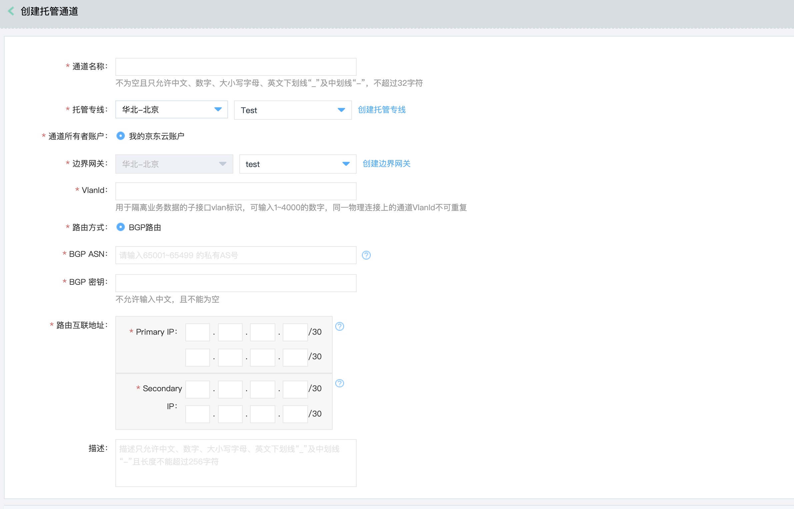
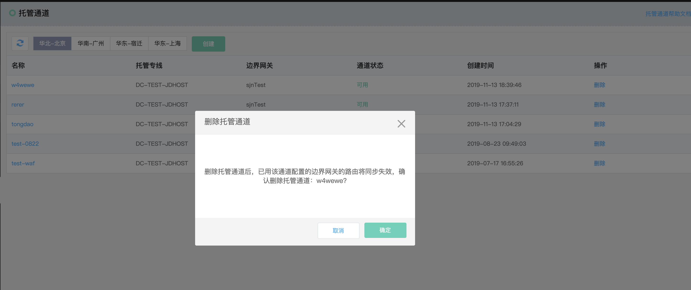

## Hosted Private Virtual Interface
Hosted Private Virtual Interface is the logical channel on Hosted Connection to divide service flow. Different Hosted Private Virtual Interfaces deal with different services. Hosted Private Virtual Interfaces shall be isolated from each other so that they will not affect each other.

```
  Please plan the network segments in the Cabinet Service and the VPC in advance to ensure that the network segments in the Cabinet Service and the network segments in the VPC do not overlap.
```

### Operation Steps
##### 1. Create Hosted Private Virtual Interface
Customers that have a Hosted Connection in the status of "available" can use a Hosted Private Virtual Interface.
a) Log in [JD Cloud & AI Hosted Private Virtual Interface Console](https://cns-console.jdcloud.com/host/hVif/list);  </br>
b) Select region and click **Create**;</br>
c) Enter the name of Hosted Private Virtual Interface, select a Hosted Connection and Border Gateway, allocate vlanId, routing method, BGP ASN of client device, BGP key pair, BGP interconnection address and description, and create a Hosted Private Virtual Interface;</br>
d) After a Hosted Private Virtual Interface is created and a period of configuration distribution, the Hosted Private Virtual Interface shall enter into the status of "available". The configuration distribution process involves the cloud configuration distribution, as well as vlan connection with the client, BGP Session establishment, BGP route learning, etc. Please complete the relevant configuration in the client device in advance;</br>

```
  Only available Hosted Connection supports Hosted Private Virtual Interface creation.
  At present, only the VPC resources of the same account are allowed to be accessed.

  Hosted Private Virtual Interface Parameter Description:
  vlanId: Multiple Hosted Private Virtual Interfaces can be created on the same Hosted Connection; different Hosted Private Virtual Interfaces can be distinguished and isolated by different vlanld, namely vlan number.
  BGP ASN: The protocol running between the Direct Connection device and the client device of JD Cloud & AI is BGP Routing Protocol. The BGP ASN used by JD Cloud & AI is 64512; the range of BGP ASN supported by the client is: 65001~65499.
  BGP Key Pair: The current BGP key pair configuration does not take effect and can be arbitrarily specified here, but please do not configure the BGP key pair when configuring the client.
  Routing Interconnection Address: It is the interconnection address used to establish BGP Session between JD Cloud & AI and the client. From the perspective of high availability, please respectively assign two pairs of /30 addresses, the first of which shall be used by the client, and the second of which shall be used by JD Cloud & AI. The interconnection address supports addresses in three Intranet segments of 10/8, 172.16/12 and 192.168/16.
```

```
  Status instruction for each Hosted Private Virtual Interface:
  Configuring: It is the status of Hosted Private Virtual Interface in the process of configuration delivery. Please synchronize the client configuration;
  Available: It is the status of Hosted Private Virtual Interface upon its configuration delivery and with the BGP Session established with the client. In such a status, normal communication can be conducted;
  Unavailable: It represents the Hosted Private Virtual Interface cannot be used for normal communication. After failures are removed, the Hosted Private Virtual Interface will enter into the status of "available";
  Deleting: The customers can delete the Hosted Private Virtual Interface when they no longer need to use it. When deleting, relevant configuration needs to be cleared, and this period lasts for a while. Upon configuration is cleared, the deletion of Hosted Private Virtual Interface is completed;
```



##### 2. Modify Hosted Private Virtual Interface
You can modify the name and description of Hosted Private Virtual Interface.</br>
a) Log in [JD Cloud & AI Hosted Private Virtual Interface Console](https://cns-console.jdcloud.com/host/hVif/list);  </br>
b) Select corresponding Hosted Private Virtual Interface and log in the details of Hosted Private Virtual Interface;</br>
c) Modification of the name and description of Hosted Private Virtual Interface is supported, and the restriction of each configuration item is the same as the creation of Hosted Private Virtual Interface;</br>


##### 3. Delete Hosted Private Virtual Interface
If you do not need a Hosted Private Virtual Interface anymore, you can delete it.</br>
a) Log in [JD Cloud & AI Hosted Private Virtual Interface Console](https://cns-console.jdcloud.com/host/hVif/list);  </br>
b) Select corresponding Hosted Private Virtual Interface, and click **Delete** on the operation bar;</br>

