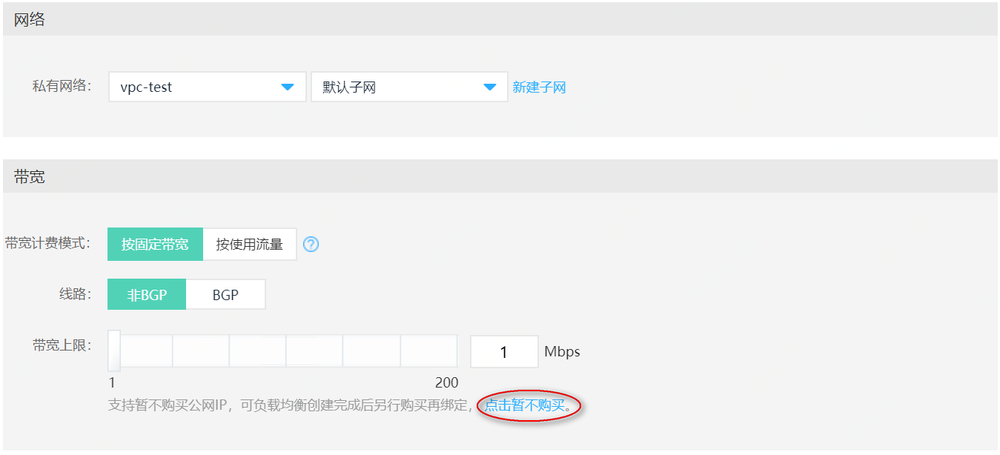
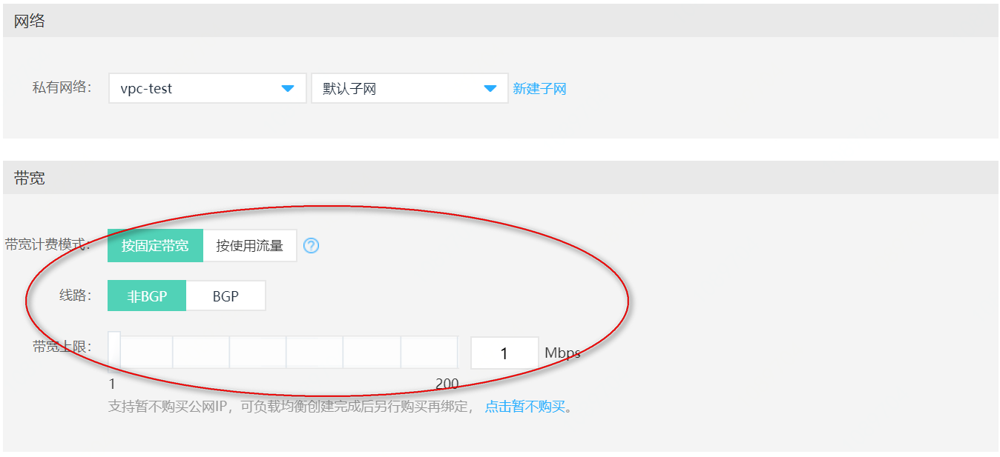

# Conversion of Load Balancers of Private and Public Networks

  The distributed network load balancer of public network or private network type can be configured based on the selection of specific business scenario. Private network load balancer and public network load balancer are mutually convertible.

## Private Network Load Balancer

- Private network load balancer only can be used in JD Cloud Intranet, and can forward client request having access permission to JD Cloud Intranet. Steps for creating private network load balancer are as follows:
  Select**Not Purchase** EIP when creating load balancer, complete relevant resource configuration, and then a private network load balancer instance is created by default.
  
  
## Public Network Load Balancer

- Public network load balancer may forward access request from the public network to backend server; public network load balancer needs to purchase an EIP separately with the following steps:
    Select EIP (not exceeding creation quota of EIP) when buying a load balancer, the system will automatically create and associate EIP for load balancer.
    
  

## Mutual Conversion between Private Network Load Balancer and Public Network Load Balancer

- JD Cloud supports mutual conversion of load balancer type of private network and public network, private network load balancer can be converted to public network load balancer through associating EIP, while the public network load balancer can be converted to private network load balancer through disassociating EIP.

Convert public network load balancer to private network load balancer:
  

Convert private network load balancer to public network load balancer:
  

	

	
