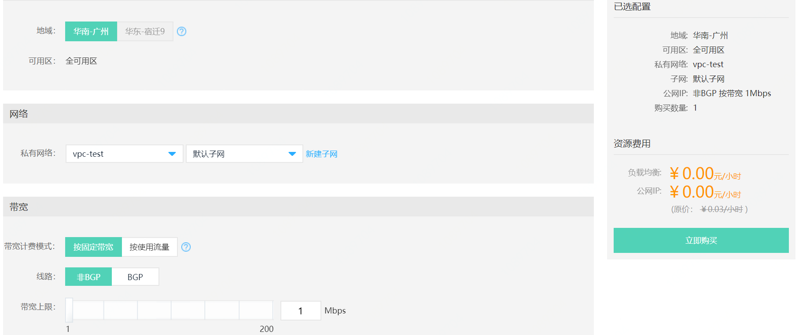

# Create a public network load balancer instance

If you are required to provide Load Balancer services for public network service requests, it is required to create a Load Balancer instance of public network type first.
## Operation Steps

 1. Select ** Networking**>> **Network Load Balancer** at the navigation bar on the left side of the Console to go to the Application Load Balancer List Page.

 2. Select ** Distributed Network Type** tag to go to the Distributed Network Load Balancer List page.

 3. Click **Create** button, select Distributed Network Load Balancer in the pop-up dialog box, click **OK** button.

 4. Configure parameters of Distributed Network Load Balancer based on requirements.
    - Region: Please select the region same with the backend server, Distributed Network Load Balancers do not support cross-region deployment.
    - Availability Zone: The Distributed Network Load Balancers adopts deployment of all AZs by default.
    - Virtual Private Cloud: Please select Virtual Private Cloud same with the backend server, Distributed Network Load Balancers do not support cross-Virtual Private Cloud deployment.
    - Elastic IP: Select Billing by Bandwidth Mode, ISP Line and Bandwidth of Public IP. See [Elastic IP-Pricing](http://docs.jdcloud.com/elastic-ip/billing-overview) for the price of elastic IP in details. After purchasing elastic IP, if the quota that the elastic IP can create, the system will automatically create and associate EIP for Load Balancer.
    
    

 5. Click **Buy Now** to complete payment.

 6. It takes a certain amount of time (usually a few seconds) to create a Distributed Network Load Balancer Instance, please view status by manually refreshing the list page.

	
