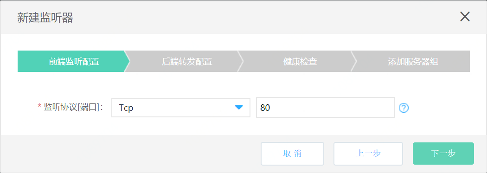
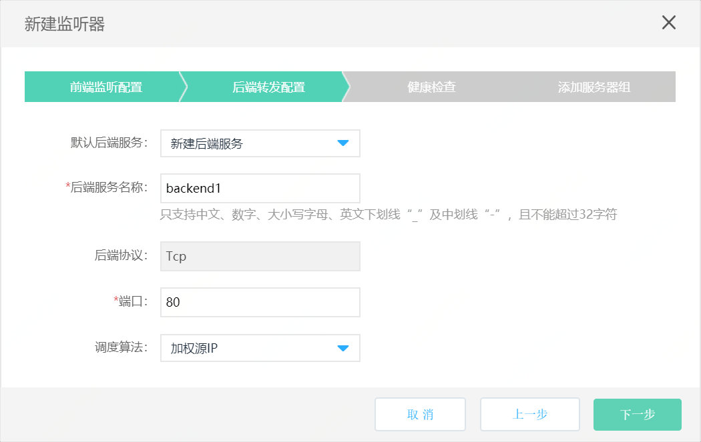

# Distributed Network Load Balancer Management
It is required to at least configure one listener and a backend server to make Distributed Network Load Balancer be able to listen and forward client service requests. The same Distributed Network Load Balancer can be configured with multiple listeners and backend services, and multiple listeners can be corresponded to one backend service.
## Operation Steps
1. You can go to the listener list page with the following two methods on the distributed network load balancer list page.    

   - Click the specified distributed network load balancer under the **Name** bar, and go to the details of the distributed network load balancer. Click the **Listener** tab and go to the listener list page.
   - Click the **Add Listening** link under the **Operation** bar and go to the listener list page.
     
2. Click the **Create Listener** button, and configure the listening protocol and port in the pop-up configuration wizard dialog box.

    Note:
    * Listening ports cannot be repeated under the same DNLB.
    * Listening Protocol and ports cannot be allowed for modification after configuration.
       

3. Click **Next** to go to the Backend Service Configuration tag. Select **Create Backend Service** as the default backend service type. If the existing backend services can meet the business requirements, the existing backend services can be selected, and a backend service is selected to be created in the Guide. Configure Backend Service Parameter:

   - Backend Protocol: Protocol used when the backend server provides services, it is shown as TCP by default.   
   - Port: Backend server’s port used to receive the service request. 
   - Scheduling Algorithm: Algorithm that the Distributed Network Load Balancer distributes service requests to the backend server. Weighted Source IP is hash algorithm made based on source IP Address, distributes service requests of the same source IP to the same backend server, considers weights of backend servers and distributes service requests according to weight proportion; Weighted Quintuple Form is hash algorithm made according to the Packet Quintuple Form (protocol, source IP, source port, destination IP and target port), service requests in same Quintuple Form are distributed to the same backend server, weights of backend server are considered at the same time and service requests are distributed according to weight proportion.    
 
 
4. Click **Next** to go to the Health Check tag. In the Guide, health check parameters are default values.
 
 
5. Click **Next** to go to the Add Server Group tag. Select **Availability Group** as the type of server group, and select the created Availability Group.
 
 
6. Click the **OK** button to complete the operation.
