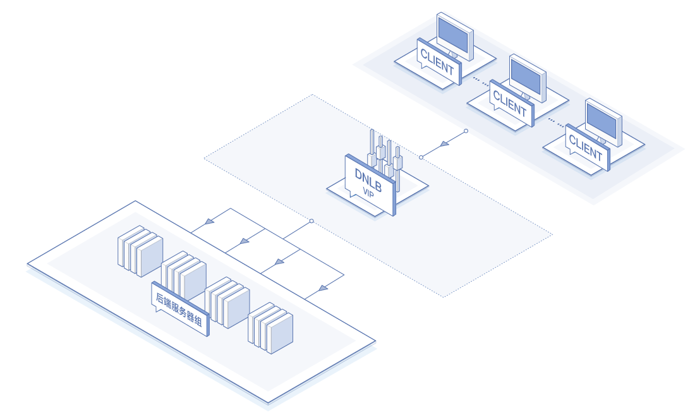
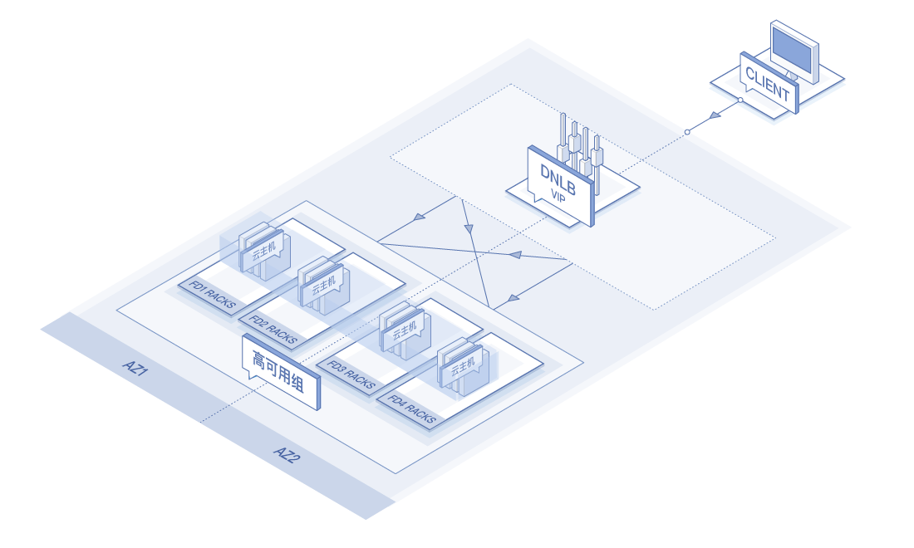
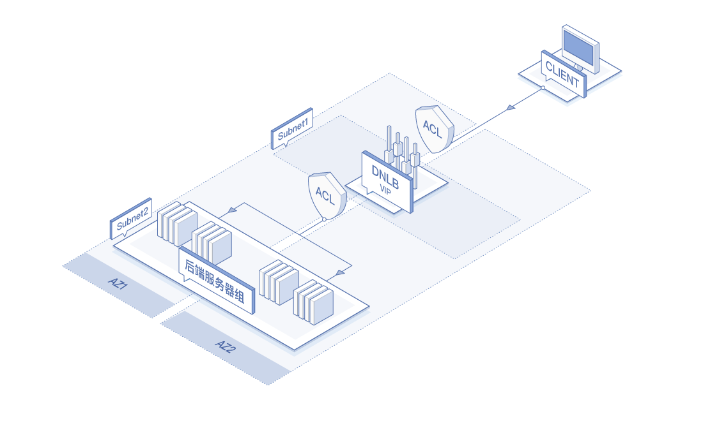

# Application Scenarios

The applicable scenarios for Distributed Network Load Balancer are described as below.

## Super High Performance Scenario
The Distributed Network Load Balancer adopts the all AZs distributed deployment architecture. There isn’t any Load Balancer entity existed. The network devices in the region hosts functions of Load Balancer. When the business is stateless, performance bottleneck free forwarding can be supported to meet the customer’s needs of high performance, large concurrency and low latency. For the Load Balancer in private network, the forwarding bottleneck is mainly the bandwidth of the client and backend servers; for the Internet Load Balancer, the forwarding bottleneck is mainly Public IP and bandwidth of the backend server.

## High Service Availability Scenario
The Distributed Network Load Balancer provides multiple available guarantee mechanisms and is hooked with the deployment architecture of Availability Group, which is applicable to all business scenarios needing stable and high fault-tolerant capability. The Distributed Network Load Balancer adopts the all AZs distributed deployment architecture so as to guarantee uninterrupted Load Balancer Services in Availability Zones and across Availability Zones. The Distributed Network Load Balancer can associate Availability Group as a backend server group, which can support the multi-dimensional automatic Auto Scaling of backend server across racks and across Availability Zones in the same Data Center according to business loads to improve the service capability of the system.

## Decoupling of the Load Balancer and Session Persistence
The Distributed Network Load Balancer decouples the Load Balancer Service and Session Persistence to implement deployment of higher performance and more flexibility. The Distributed Network Load Balancer is only responsible for providing the Load Balancer for four levels of stateless services, after it distributes the business to the backend server, the cache (e.g.: Redis, MongoDB, etc.) connected to the backend server will be used to save the session information to implement session persistence.

## High Security Scenario
Distributed Network Load Balancer provides multiple security protection. Distributed Network Load Balancer supports security identity and access management through ACL. You can separately create a Subnet for the Distributed Network Load Balancer and increase security policy (blacklist or whitelist) based on this Subnet to implement anti-attack. For example, when it is configured according to the whitelist, the Source IP and backend server IP of the client shall be added to the whitelist for inbound; for outbound, it shall all be configured to be put-through; when it is configured according to the blacklist, the Source IP having a suspected attack shall be added to the blacklist for inbound. At the same time, the Public IP associated by Distributed Network Load Balancer is equipped with anti-DDoS attack capacity to ensure multiple securities.

## Related References
- [Product Advantage](../Introduction/Benefits.md)
- [Product Function](../Introduction/Features.md)
- [Product Pricing](../Pricing/Billing-Overview.md)
- [Create DNLB Instance](../Operation-Guide/Create-DNLB-Instance.md)

