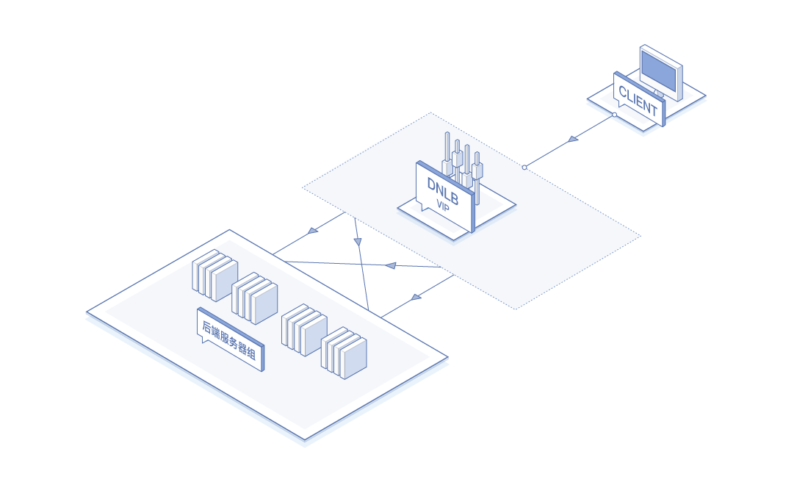

# Product Overview

The Distributed Network Load Balancer (DNLB) is a four-layer distributed Load Balancer product. It automatically distributes the user’s stateless business requests to several backend servers based on some policies, to adjust resource utilization, eliminate influence to systems by a single failed backend server, improve system availability and expand system service capability.

The Distributed Network Load Balancer is a lightweight Load Balancer based on JD Cloud’s SDN technology. Without any entity of the Load Balancer, it provides software-defined Distributed Load Balancer Service to all AZs, aiming to provide you with super high performance and long-term free four-layer stateless Load Balancer Service, mainly for stateless business distribution scenarios with super high performance, large concurrency and low latency.

   

DNLB has the following functions and features:

* Super-high performance: DNLB adopts the distributed deployment architecture in all AZs. There isn’t any Load Balancer entity. There is no case where the Load Balancer resource performance reaches the cap and the forwarding is restricted. The forwarding performance has no bottleneck.
* High availability: DNLB adopts the distributed deployment in all AZs, realizing high availability of the Load Balancer in availability zones and cross availability zones.
* Free in long term: Adopt the free in long term policy, enabling you to enjoy the best performance experience while not considering the cost of the Load Balancer.
* Decoupling the session persistence and providing stateless service: Decouple the Load Balancer service and the session persistence to implement deployment of higher performance and more flexibility.
* Auto scaling: The associated backend server can automatically and smoothly make the Auto Scaling, prevent business from being interrupted and get rid of troubles for business planning and manual upgrade by the user according to business loading conditions.
* Rich backend service server types: Support the Virtual Machines and containers as backend service instances and provide more choices for business deployment of the user.
* Source IP Address pass-through: The user’s source IP Address can be directly passed through to the backend server, requiring no other operations by the user and helping the backend server obtain or count actual IP information of the source end.

## Comparison between Distributed Network Load Balancer & Application Load Balancer

| Comparison Item   |  Application Load Balancer | Network Load Balancer | Distributed Network Load Balancer |
|:-----|  :---- | :---- | :---- |
|Performance 	| Million Level Concurrent Connections and Hundreds of Thousands Level New Connections per Second | Hundreds of Million Level Concurrent Connections and Million Level New Connections per Second | No Forwarding Performance Bottle Neck |
|Service Protocol Layer |   Lay-4/Lay-7 | Lay-4 (stateful)| Lay-4 (Stateless)|
|Protocol Type	| HTTP, HTTPS, TLS and TCP | TCP | TCP |
|Forward based on domain and URL path| ✔ | —— | —— |
|WebSocket Support| ✔ | —— | —— |
|Auto Scaling of Service Instance | ✔ | ✔ | ✔ |
|High-availability deployment of multiple availability zones | ✔ | ✔ | ✔ |
|Scheduling Algorithm	| Weighted Round Robin, Weighting Least Connection Count and Weighted Source IP | Weighted Round Robin, Weighting Least Connection Count and Weighted Source IP | Weighted Source IP and Weighted Quintuple Form |
|SSL Unloading and Certificate Management | ✔ | —— | —— |
|Idle Connection Timeout | ✔ | ✔ | —— |
|Source IP Reservation	| Pass-through based on X-forward-for mechanism of HTTP Header | Pass-through of Three-layer Packet Source IP | Source IP Pass-through of Three-layer Packet |
|Session Persistence | Cookie-based Session Persistence  |  Session Persistence of TCP Connection | —— |
|Connection Draining Overtime | Support connection draining only and do not support configuration time-out period |  ✔ | —— |
|Instance Type Family of Backend Service | Virtual Machines/Native Container/Availability Group| Virtual Machines/Native Container/Availability Group | Virtual Machines/Native Container/Availability Group |
|Health Check | ✔ | ✔ | ✔ |
|Switch Between Intranet and Internet Load Balancer	 | ✔ |	✔ | ✔ |
|Deletion Protection | ✔  | ✔ | ✔ |
|Billing Standard	| Relatively-high Rate (Temporarily Free)| Relatively-low Rate (Temporarily Free) | Free |

## Common Operation

- [Create DNLB Instance](../Operation-Guide/Create-DNLB-Instance.md)
  
- [Create virtual server group](../Operation-Guide/TargetGroup-Management.md)
	
- [Configure Listening Policy （Including Listener and Backend Service）](../Operation-Guide/Listener-Management.md)
	
- [Backend Service Management （including Backend Service Management and Heath Status View of Service Instance）](../Operation-Guide/Backend-Management.md)
