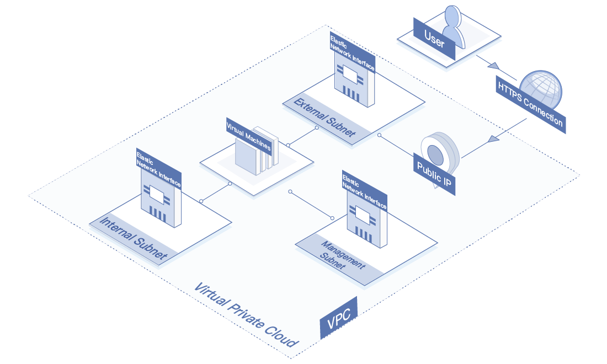

# Traffic Separation of the VM Business

This Tutorial is designed to guide users on how to associate multiple ENIs on the same VM. Each ENI hosts the business traffic of the intranet, public network and management network respectively, thus realizing the separation of the business traffic of a single VM. This Tutorial is applicable to scenarios where the different security policies are applied to different business needs of the VMs and network isolation.

## Business Scenarios Architecture

## Before Operation
- Make a reasonable network plan and create internal subnets, external subnets and management subnets in the same virtual private cloud according to the network plan.
- Apply for one VM with appropriate specification. The primary network interface of the VM belongs to the internal subnet and is configured with appropriate security group policy.
- Apply for 1 elastic IP

## Procedures
- Step 1: Log in to the console of JD Cloud, and enter the list page of ENI, and click Create to create an ENI.

- Step 2: Create one ENI in the external subnet and the management subnet respectively

- Step 3: In the list page of ENI, click Resources Binding respectively to mount the auxiliary ENIs in the external subnet and the management subnet to the VM previously created.

- Step 4: Associate the previously applied elastic IP with the primary IP of the secondary ENI of the external subnet

- Step 5: Log in to the VM through SSH to deploy internal business, external business and management business respectively, and specify different network interface exits according to business type through routing configuration tools.

## Follow-up Tests
- Log in to the VM through SSH and access the other VMs in internal subnet, external subnet and management subnet respectively. Successful configuration can be confirmed by normal access.