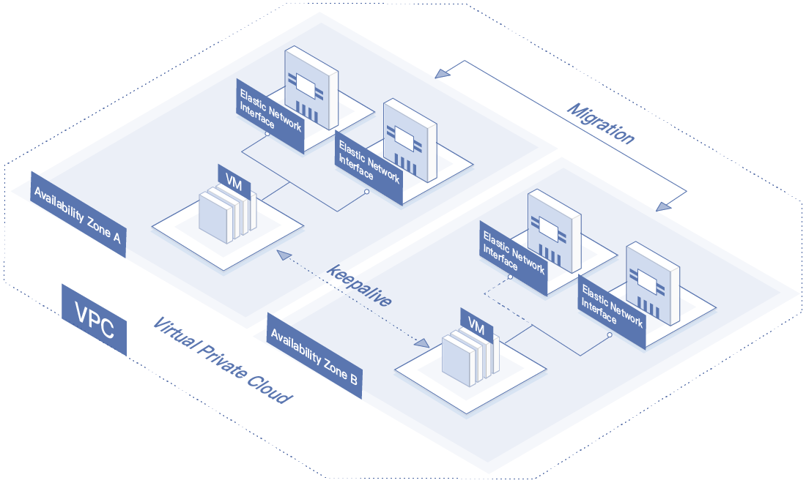

# High Availability Architecture of VM

This Tutorial will guide user in building a high availability application solution across availability zone with keepalived tool. In case of failure, it can be isolated by migrating ENI from the primary server to standby server. This Tutorial is applicable primarily to scenario where the business needs to be deployed with high reliability, especially scenarios where the security policy is strongly associated with the MAC address of the network interface.

## Business Scenarios Architecture

## Before Operation
- Within the same virtual private cloud, create one VM in Availability Zone A and Availability Zone B respectively, and set up appropriate security group policies.
- Within the same virtual private cloud, select one subnet according to the network plan and create one ENI in such subnet.

## Procedures
- Step 1: Log in to the console of JD Cloud & AI, and enter the list page of ENI, then select the previously created secondary ENI to associate it to the VM in Availability Zone A.

- Step 2: Log in to the VM of Availability Zone A and Availability Zone B respectively through SSH, and install and configure keepalived tool and then enable the listen mode of unicast VRRP.

- Step 3: Write a keepalive switch function, and call the ENI of JD Cloud & AI Open API, then disassociate the ENI and re-associate it to the standby server. Call the function to configure the standby machine network interface and route in case of failure.

## Follow-up Tests
- After the deployment of both the primary and standby servers is completed, shut down the primary server to see whether the ENI has been migrated to the standby server in the console. Access the IP of ENI to see if it can be connected; if so, the switchover is completed.