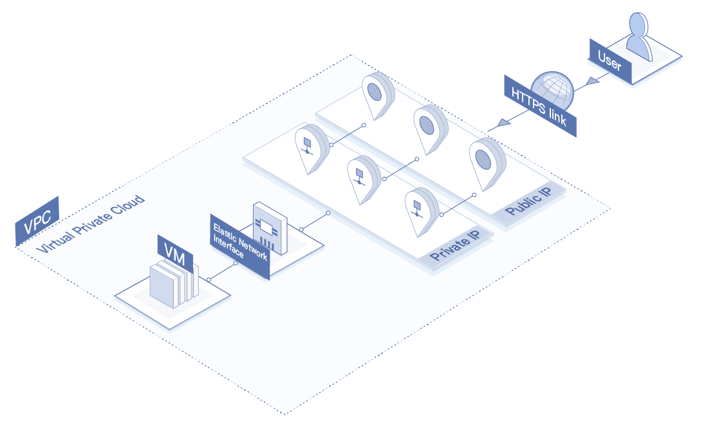

# VM Hosting Multiple Businesses

This Tutorial will guide user to deploy multiple public network services on the same VM and associate an IP address for each business. So that a single VM hosting multiple businesses can be realized to reduce the cost. This Tutorial is applicable primarily to scenarios where a single VM providing multiple HTTPS businesses requires different public IP to associate different certificates.

## Business Scenarios Architecture

## Before Operation
- Apply for a VM with appropriate specifications and configure appropriate security group policy.
- Apply for the required Elastic IP.

## Procedures
- Step 1: Log in to the console of JD Cloud, and enter the instance list page of VM, then click the VM name to enter the VM details.

- Step 2: Enter the VM details, and click the tag page of ENI to switch to the management page of ENI.

- Step 3: Select the ENI that needs to host traffic and enter the IP management page of the ENI.

- Step 4: On the IP management page of the ENI, assign the same number of private IP addresses that match the number of businesses.

- Step 5: Associate one elastic IP address for each private IP address on the IP management page of ENI.

- Step 6: Log in to the VM through SSH to deploy related services, and specify different source IP addresses for different business traffics.

## Follow-up Tests
- The access to specific business can be achieved by accessing a specific public IP address or its corresponding domain.