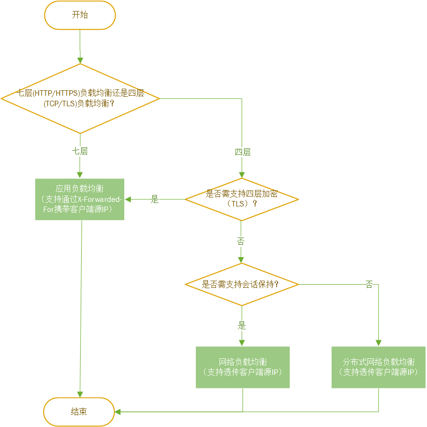

# FAQ

**Q: How to choose among Application Load Balancer, Network Load Balancer or Distributed Network Load Balancer?**

A: We recommend the Load Balancer type as per the following process to maximize the performance experience and minimize the cost of users while satisfying user demands.

**Q: Load balancer quota for a single user? **

A: Support the single user to create up to 5 LBs in the same region now, if you need to increase the quota, please open ticket or contact the customer service staff.

**Q: Quota limit for network load balancer related resource? **

A: 20 listeners, 20 backend services, 20 virtual server groups can be created under one load balancer instance at most, each virtual server group can be added with 100 sets of backend servers at most.

**Q: Network load balancer fails to communicate with backend server instance? **

A: Security Group, ACL of backend VM/container instance must display communication allowed between load balancer and server instance, it is noted that ACL is stateless rule, which needs to configure inflow and outflow load balancing policies separately.

**Q: How does the TCP protocol listening of network load balancer obtain the client real IP?**

A: When the network load balance backend service attaches availability group or the virtual server group of instance type family (adding VM or container object), the default of IP packet head is to support the direct pass-through of the client real source IP without special configuration or operation.
   
**Q: How do multiple availability zones guarantee high availability? **

A: It can only add VM/container in the availability zone where load balancer is located as backend service, and conduct traffic forwarding according to set scheduling algorithm; when one availability zone has an error, traffic will be automatically converted to other availability zone server.

   
**Q: How load balancer backend service to select to associate the virtual server group or availability group? **

A: The virtual server group can add or delete VM instance by the user manually or through associating AS, the manual configuration method is easy to use; the virtual server group can be associated with AS (Auto Scaling) for use to realize high availability across availability zones, but high availability across racks in the same availability zone cannot be ensured. The availability group automatically realizes high availability assignment and auto scaling according to rules for machine instance across AZ, across racks, provides more flexible and more automatic machine assignment service than virtual server group. Therefore, the user can select to associate with virtual server group when requiring simple use, fast command; it is suggested that the user selects to associate with availability group when requiring high availability service.

   
**Q: Intranet ip resource occupied by one load balancer instance? **

A: The load balancer adopts high availability frame architecture in each availability zone, enables two instance resources by default, it also occupies the ip resources of two located subnets, except for vip, thus, the single availability zone will occupy 3 Intranet ips in total, the double availability zone will occupy 5 Intranet ips in total, it needs to occupy 2 more ip resources of two located subnets for supporting one more availability zone, the rest can be done in the same manner.
In addition, when the network load balancer is horizontally elastically extended, more intranet ip resource will be occupied. Therefore, users shall reserve sufficient intranet ip to support sufficient elastic extension capacity. For the time being, it is suggested at least 10 intranet ips should be reserved.
