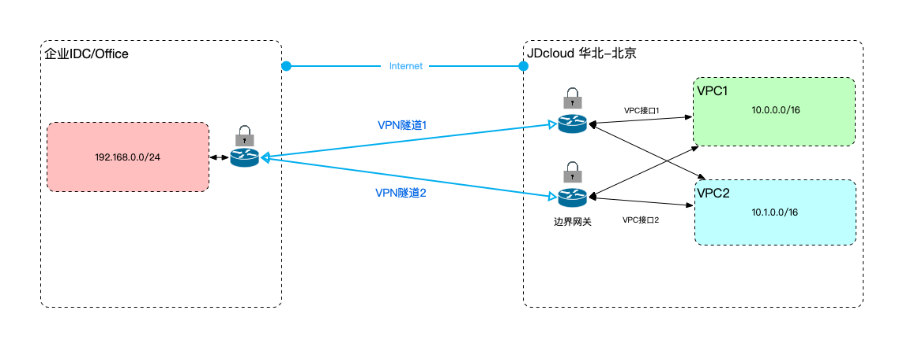

## Basic Architecture

### Overview

VPN products are self-developed by JD Cloud on the basis of standard IPsec Protocol and Site-To-Site mode. Customers can open up intranet between their offices, data centers and other places and public cloud VPN so as to achieve exchange visits among intranets in different environments. Two negotiation stages are supported by VPN, namely, IKE and IPsec, where v1 and v2 are supported by IKE and Route-Based is supported by IPsec, and actually interconnected segments are controlled by Route Table.

Details of logical architecture are as follows:

### Component

Border Gateway(bgw): As the Border Gateway of VPC, BGW supports interconnection through Direct Connection/VPN among VPCs and between VPCs and enterprises’ data centers/offices, and users can create interconnection interfaces and channels/connection by themselves based on demands and realize interconnection among different business networks by configuration of Route Table.

VPN Connection: VPN Connection is an assembly of VPN tunnels established between a group of cloud public network addresses and a group of client public network addresses, which is used as a routing mode to assign VPN public IP on cloud and unify the tunnels (static/BGP and you are recommended to use BGP route).

VPN Tunnel: VPN Tunnel is a business channel established between a cloud public network address and a client public network address, which is applicable for actual business communication. Encryption tunnel is established for businesses so as to ensure transmission security, the establishment of encryption tunnels is consisted of two negotiation stages, namely, IKE and IPsec, and mainstream encryption and authentication algorithms are supported.

Customer Gateway(cgw): Customer Gateway is the logical representation of client device on cloud. Customers can establish VPN Connection and VPN Tunnel based on Border Gateway and Customer Gateway, and operate BGP Routing Protocol to exchange routing information between Border Gateway and Customer Gateway.
