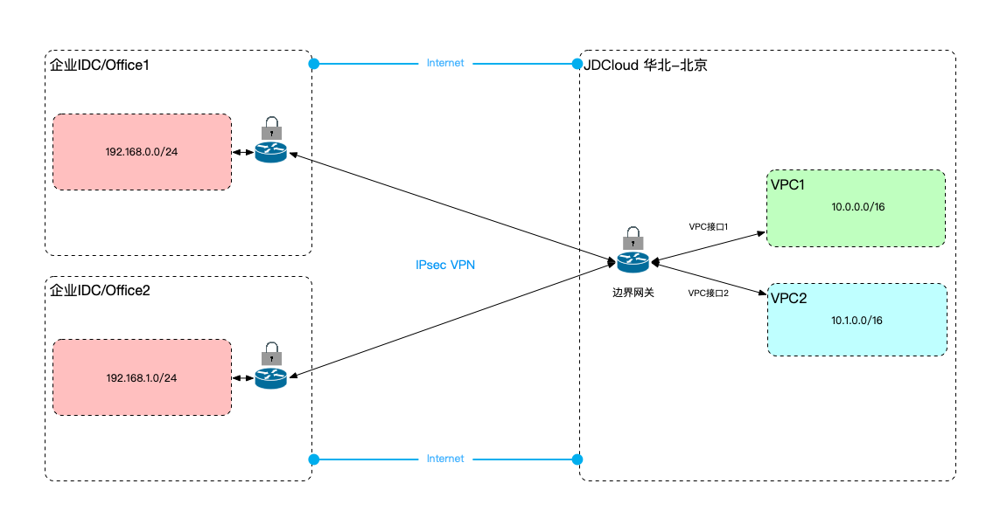

## Product Overview

### VPN Overview

VPN(Virtual Private Network) is a network access service based on Internet and a method for the implementation of hybrid cloud solutions. JD Cloud provides IPsec-based Site-To-Site VPN to realize networking communication based on intranet address between data centers/offices and JD Cloud VPC by establishment of encryption tunnels, and customers can carry out application migration to JD Cloud Onboarding, deploy hybrid cloud based on the encryption tunnel and ensure data security during the communication process.<br/>

```
  At present, the VPN products are in closed beta stage. Please contact your customer manager to subscribe the service if you need to use the VPN products.
```

VPN-related products include: Border Gateway, Customer Gateway, VPN Connection and VPN Tunnel.
Where: VPN Gateway on cloud is carried by Border Gateway, Customer Gateway is the logical representation of client VPN devices on cloud, VPN Connection is established by customers based on Border Gateway and Customer Gateway, and VPN Connection represents an integration of all VPN Tunnels established between a group of cloud public IP and client public IP, achieving high availability of tunnel level. Meanwhile, multiple VPN connections can be established between cloud and client by customers so as to achieve high availability of connection level.

```
  In order to achieve automatic fault switchover among multiple tunnels under VPN connection, you are strongly recommended to use BGP dynamic route for route setting. Because BGP route is supported by Border Gateway and route transmission is supported by VPC route table, the routing clauses can be adjusted dynamically so that automatic removal of routes from fault link can be achieved.
```

### VPN Overall Structure



### Hosted VPN VS Cloud Self-established VPN

|          |                                                                    Hosted VPN  | Cloud Self-established VPN                                          |
|:--------:|:---------------------------------------------------------------------------------------------------------------------------------------------:|:---------------------------------------------------------------------------------------------:|
| Simple Operation | VPN resources are created via console/API to establish VPN Tunnel | VPN software shall be installed into Virtual Machine and corresponding configuration shall be implemented for Virtual Machine to be as a VPN Gateway and establish VPN Tunnel with client.      |
| Simple Operation and Maintenance  | Cloud manufacturers are responsible for maintenance on VPN’s underlayer facility | Cloud manufacturers are responsible for maintenance on VM's underlayer facility and customers are responsible for updating and maintaining VPN software in Virtual Machine.             |
| High Availability | Two cloud public IP are automatically allocated to each VPN connection to establish at least two VPN tunnels with client devices. If fault occurs on certain tunnels, the route will be updated automatically by BGP with businesses being smoothly switched to tunnels available | Multiple virtual machines shall be created to establish multiple VPN tunnels with client devices and BGP Routing Protocol shall be self-realized by customers so as to achieve VPN high availability. |
| Route Management | Routes are controlled by open route tables | The maintenance on routes inside virtual machines on VPN Gateway shall be customers’ responsibility and the route outside virtual machine shall be controlled by route table.               |
