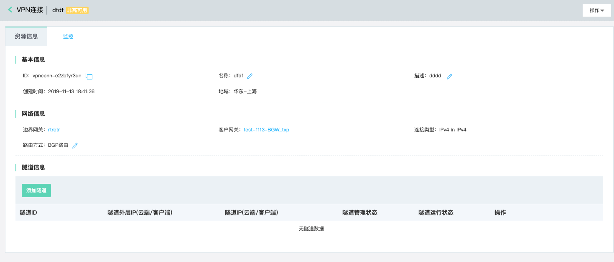
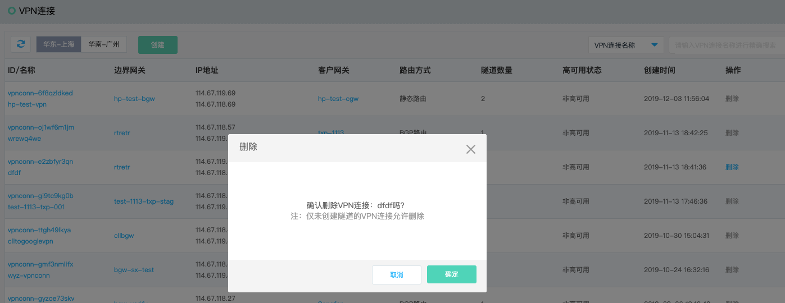

## VPN connection
VPN Connection: VPN Connection is an assembly of multiple VPN tunnels established between a group of cloud public network addresses and a group of client public network addresses.

For more content related to VPN Tunnel, refer to [VPN Tunnel Operation](../../Operation-Guide/Client-Site-Configuration/Cisco-Configuration.md).

### Operation Steps
##### 1. Create VPN Connection
a) Log in [VPN Connection Console](https://cns-console.jdcloud.com/host/vpnConnection/list);  <br />
b) Select region and click **Create**;<br />
c) Enter the name, description, border gateway, customer gateway and routing method of VPN Connection, and create a VPN Connection;<br />

```
Currently, VPN Connection only supports the addresses inside and outside the Tunnel which are all the IPv4 Address Family, and the IPv6 Address Family will be supported in the future.

  The routing method supports Static Route and BGP Route. When using BGP Route, the Tunnel IP of VPN Tunnel will be used as the interconnection address, to establish BGP session by BGP ASN of Border Gateway and BGP ASN of Customer Gateway.
  Even if the customer specifies the use of BGP Route, they can still configure Static Route for data forwarding.

  High availability status of VPN Connection: When the Customer Gateway of VPN Connection has at least two public network addresses, the two public network addresses on the cloud separately create a VPN Tunnel with the different public network addresses of client, and the running status of one tunnel at least in VPN Tunnels created by each public network address on cloud is UP, then the high availability status of VPN Connection is "Highly Available", and otherwise, "Not Highly Available".
```


##### 2. Modify VPN Connection
You can modify the name, description, and routing method of VPN Connection.<br />
a) Log in [VPN Connection Console](https://cns-console.jdcloud.com/host/vpnConnection/list);  <br />
b) Select the corresponding VPN Connection and log in the detail page of VPN Connection;<br />
c) Modification of the name, description and routing method of VPN Connection is supported, and the restriction of each configuration item is the same as the creation of VPN Connection;<br />
```
  When the routing method is modified from enabled BGP to, BGP sessions of all tunnels will be disconnected immediately with cautious operations only.

  When the routing method is modified from static to BGP enabled, the Tunnel IP of VPN Tunnel will be used as the interconnection address, to establish BGP session by BGP ASN of Border Gateway and BGP ASN of Customer Gateway.
```


##### 3. Delete VPN Connection
If you do not need VPN Connection anymore, you can delete it.<br />
a) Log in [VPN Connection Console](https://cns-console.jdcloud.com/host/vpnConnection/list);  <br />
b) Select the corresponding VPN Connections and click **Delete** on the operation bar. The VPN Connection without VPN Tunnel created can be deleted;<br />

