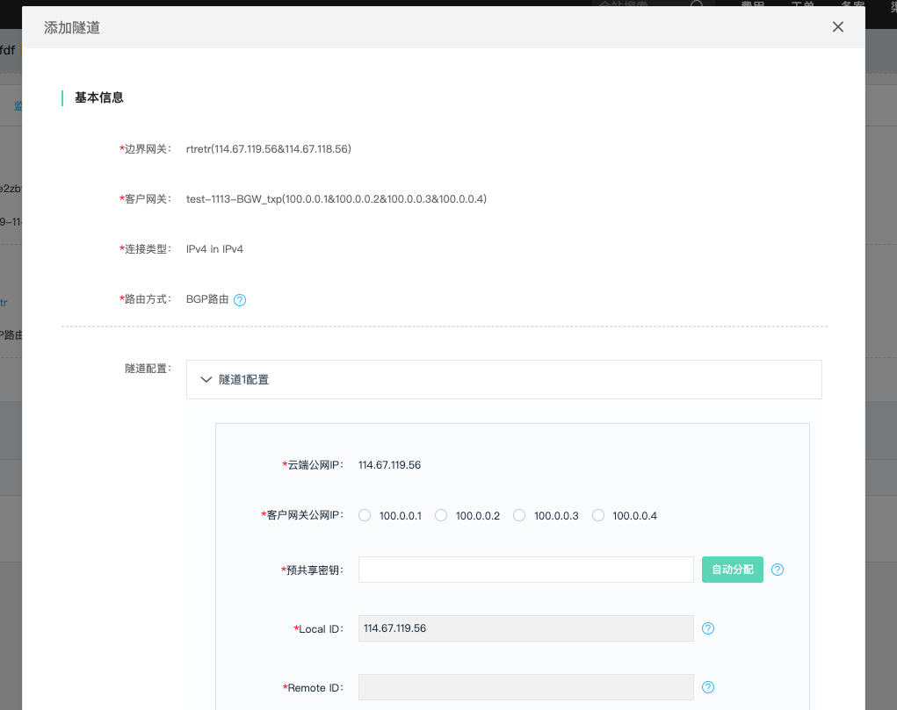
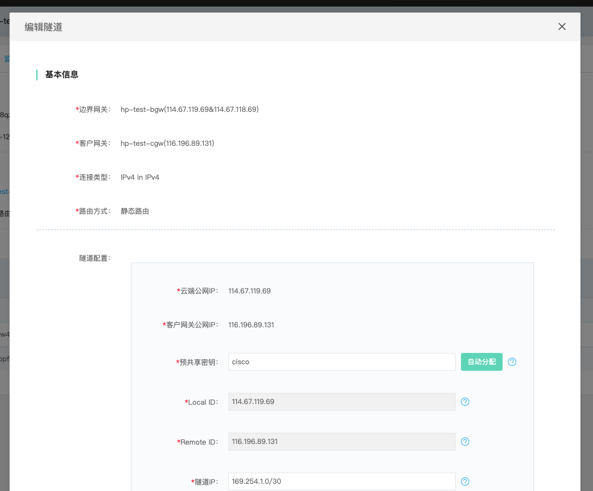
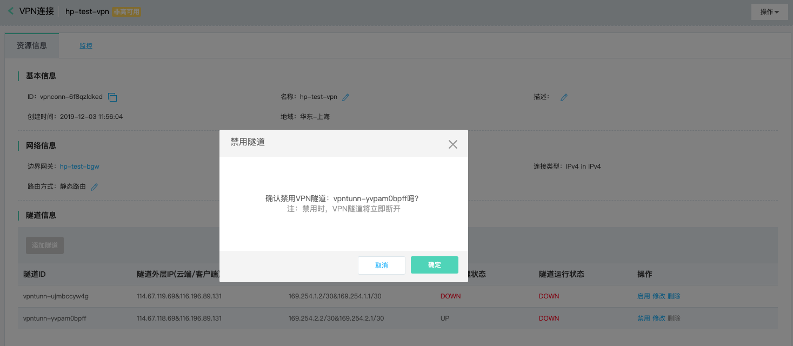
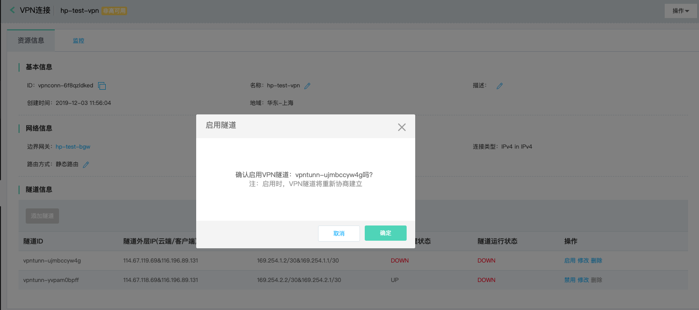
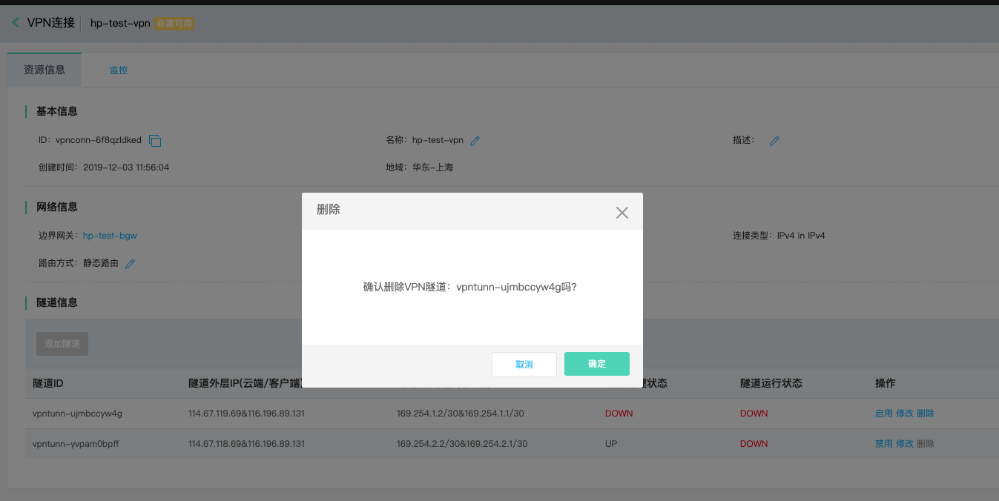
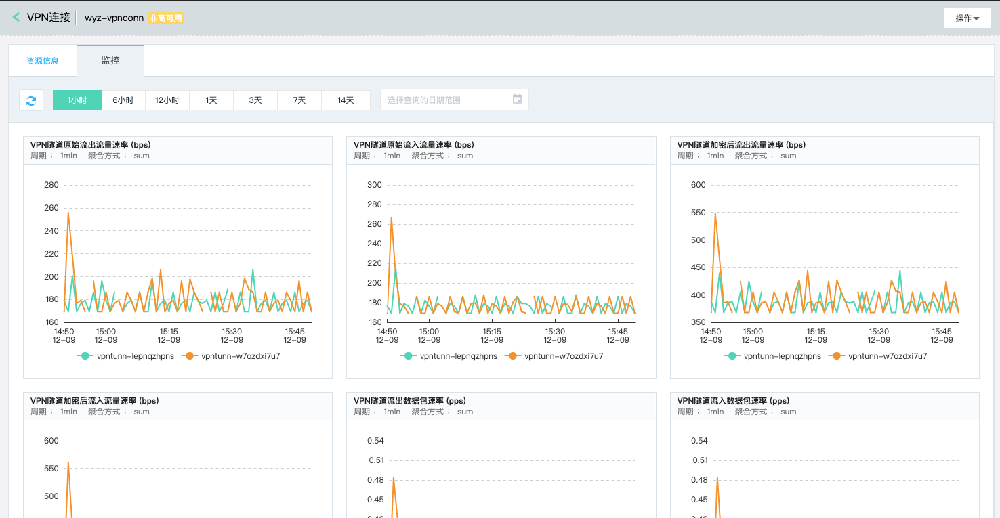

## VPN Tunnel
VPN Tunnel is an IPsec Site-To-Site encryption channel established between a cloud public network address and a client public network address, which is used to ensure secure communication among businesses in different networking environments. The establishment of VPN Tunnel includes two-stage negotiation including IKE and IPsec, supporting high-security encryption and authentication algorithm.    </br>

### Operation Steps
##### 1. Create VPN Tunnel
a) Log in [JD Cloud VPN Connection Console](https://cns-console.jdcloud.com/host/vpnConnection/list);  </br>
b) Select the corresponding VPN Connection and log in the detail page of VPN Connection;</br>
c) Click **Add Tunnel** in "Resource Information" Tab. If it is the first time to create tunnel (no tunnel has been created for the VPN Connection as of now or all created tunnels have been deleted), the page will be initialized based on the configuration of high availability and at least two tunnels (each for the two client public network addresses respectively, which is applicable for the situation in which Customer Gateway has single and double IP) will be defaulted in accordance with the number of Customer Gateway’s public network addresses you have chosen. If Customer Gateway is a four-IP gateway, it is defaulted to initialize four tunnels (two tunnels for each of the two client public network addresses on cloud respectively). If it is not the first time to create tunnel, only one tunnel can be created each time. </br>
d) All VPN tunnels under the same VPN connection use the same routing mode, which is the routing mode set in VPN connection;</br>
e) Configure the parameters used by two-stage negotiation for each VPN tunnel, including IKE version, pre-shared key, gateway identifier at two ends of tunnel, tunnel inner IP (used for routing data package in tunnel), as well as authentication algorithm, encryption algorithm and SA statement cycle at the two stages;</br>


###### Description of VPN Tunnel Parameters:
|        Module         |         Parameter Name          |                                                       Parameter Description                                                       |
|:-------------------:|:-------------------------:|:--------------------------------------------------------------------------------------------------------------------:|
|        General         |        Cloud Public IP         |                                                Cloud Public Network Address of VPN Tunnel                                                 |
|                     |      Customer Gateway Public IP       |                                               Client Public Network Address of VPN Tunnel                                                |
|                     |         Local ID          |                                                    Cloud Identifier of the Tunnel                                                    |
|                     |         Remote ID         |                                                   Client Identifier of the Tunnel                                                   |
|                     |          Tunnel IP           |                                       Address inside the Tunnel used for route configuration and data forwarding                                       |
|  The First-stage Negotiation (IKE)  |        Pre-shared Key         |               Pre-shared Key. It is used as the Key for identity authentication between Border Gateway and Customer Gateway and it can be input by yourself or automatically generated by system               |
|                     |          IKE Version          |               The used IKE version supports v1/v2, and v2 is recommended for your security. For more information, please refer to RFC 2409 and RFC 7296               |
|                     |         Negotiation Mode          |                                  It is required when using IKE v1. The main mode and aggressive mode are supported, and the main mode is recommended                                  |
|                     |         DH Group          |                         About Diffie-Hellman Perfect Forward Secrecy (PFS), please refer to RFC 2409 for more information                          |
|                     |         Authentication Algorithm          |                                       It is used for IKE SA authentication. For more information, please refer to RFC 2404                                       |
|                     |         Encryption Algorithm          |                                    It is used for the security of IKE SA. For more information, please refer to RFC 3602                                    |
|                     |    IKE SA Lifetime(s)     |                           The unit of the life cycle of IKE SA is second, and a new SA will be negotiated for use before the end of the life cycle                           |
| The Second-stage Negotiation (IPsec) |       Packet Encapsulate Mode        |                        It supports the tunnel mode, and under the mode, new data packages can be used to encapsulate original data packages for supporting NAT-Traversal                         |
|                     |         Security Protocol          |                     It supports ESP. The whole data package, including packet header and data payload, shall be encrypted and encapsulated when the encapsulation mode is the tunnel mode                      |
|                     |         DH Group          |                         About Diffie-Hellman Perfect Forward Secrecy (PFS), please refer to RFC 2409 for more information                          |
|                     |         Authentication Algorithm          |                             It is used for IPsec SA and authenticating the integration of data payload. For more information, please refer to RFC 2404                             |
|                     |         Encryption Algorithm          |                                    It is used for maintaining the security of IKE SA and data payload. For more information, please refer to RFC 3602                              |
|                     |   IPsec SA Lifetime(s)    |          The life cycle of IPsec SA (unite: second) means the effective time after a SA is generated, and the new SA will be negotiated for usage before the end of the life cycle          |
|                     |  IPsec SA Lifetime(Byte)  |         The life cycle of IPsec SA (unit: byte) means the number of bytes for communication after a SA is generated, and the new SA will be negotiated for use before the end of the life cycle         |
|                     | IPsec SA Lifetime(Packet) |         The life cycle of IPsec SA (unit: PCs) means the number of data package for communication after a SA is created, and the new SA will be negotiated for use before the end of the life cycle         |
|                     |            DPD            | Dead Peer Detection is disabled by default. If it is enabled, the detection message shall be sent in every ten seconds when there is no business traffic, so as to keep the tunnel activity. For more information, please refer to RFC 3706 |

```
  Many parameters of JD Cloud VPN Tunnel are given default values, and these default values are recommended configurations determined after several practical businesses and security tests, so we recommend that customers do not use options lower than these configurations.
```

##### 2. Modify VPN Tunnel
You can modify the Tunnel IP, Pre-shared Key, IKE version and other parameters of VPN Tunnel.</br>
a) Log in [JD Cloud VPN Connection Console](https://cns-console.jdcloud.com/host/vpnConnection/list);  </br>
b) Select the corresponding VPN Connection and log in the detail page of VPN Connection;</br>
c) Modification of the Tunnel IP, IKE version, IPsec and other parameters of VPN Connection is supported, and the restriction of each configuration item is the same as the creation of VPN Tunnel;</br>
```
  Before modifying the Tunnel Configuration, please first switch your route to another VPN Tunnel and "disable" VPN Tunnel on the cloud, and then "enable" the Tunnel and switch the route back to the Tunnel after the completion of updating configuration of devices on the cloud and client, so as to avoid business interruption caused by routing problems, tunnel disconnection and reconstruction with the new configuration.
```


##### 3. Maintain VPN
When the client VPN Device or cloud VPN Component needs to be upgraded and maintained, a tunnel under VPN Connection will be temporarily disconnected. After the upgrade and maintenance is completed, the tunnel will be renegotiated and established. It is strongly recommended that the customer shall use BGP Route.

```
  When the cloud VPN Component is upgraded and maintained, it will automatically change the route to other tunnels and disable the tunnel to be maintained. After the upgrade and maintenance is completed, the tunnel will be enabled and the route will be automatically switched back to the tunnel.
  When the client VPN device is upgraded and maintained, it is recommended to use the same process and operation steps as for the cloud VPN component upgrade and maintenance.
```




##### 4. Delete VPN Tunnel
If you do not need VPN Tunnel anymore, you can delete it.</br>
a) Log in [JD Cloud VPN Connection Console](https://cns-console.jdcloud.com/host/vpnConnection/list);  </br>
b) Select the corresponding VPN Connection, log in the Details of VPN Connection, select the VPN Tunnel that responds in the "Tunnel Information", and click **Delete** on the operation bar. You shall avoid accidentally deleting the running VPN Tunnel, which can only be deleted when the management status of the VPN Tunnel is "DOWN";</br>


##### 5. View the Monitoring Information of VPN Tunnel
a) Log in [JD Cloud VPN Connection Console](https://cns-console.jdcloud.com/host/vpnConnection/list);  </br>
b) Select the corresponding VPN Connection and log in the detail page of VPN Connection;</br>
c) Click **Monitor** Tab to view the monitoring information of all VPN Tunnels that currently exist under the VPN Connection. Monitoring indicators include: original outflow traffic rate of tunnel, original inflow traffic rate of tunnel, outflow traffic rate of encrypted tunnel, inflow traffic rate of encrypted tunnel, outflow data package rate of tunnel and inflow data package rate of tunnel;</br>


About the method for configuring client VPN device of tunnel, please see: [Client Configuration](../../Operation-Guide/Client-Site-Configuration/Cisco-Configuration.md) for details.
