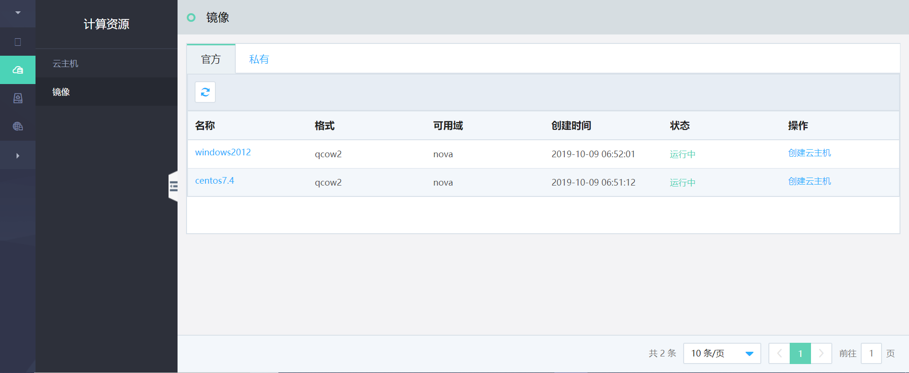
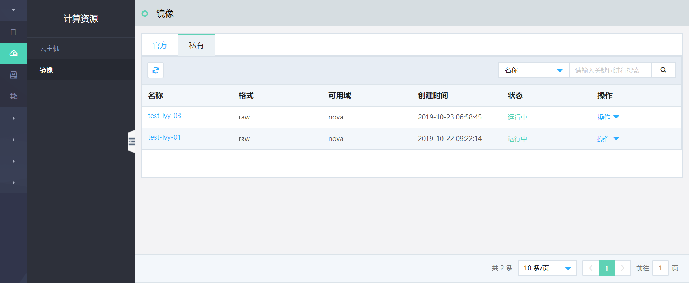

# Image 

Images refer to image template files for use by Virtual Machines, including public images and private images, with built-in operating systems and relevant configurations. By utilizing images, users can realize batch deployment to software environments and backup of server running environments:

1. Deploy software environments in batches:

   Create customized image of the Virtual Machines that have already deployed the environment, and then create the VM instances in batches based on the image. After the  VM instances are created, the software environment is consistent with that of the previous Virtual Machines, so that the software environment can be deployed in batches.

2. Server running environment backup:

   For creating images to a Virtual Machine, if the Virtual Machine fails to run properly during subsequent use due to software image damage, the image can be used to recover the damaged Virtual Machine.

### Image Function Description

#### Image Life Cycle Management
Users can conduct management on private image life cycle in the cloud management platform, including creation (based on Virtual Machines), edition, deletion and son on for private images.

#### Official and Private Image Support
The cloud management platform has many built-in public images, covering mainstream operating system images such as Centos7.4 and Windows-Server2012, which are provided and maintained by JD Cloud.
The platform supports creation of private images based on Virtual Machines by users and private images support deletion and basic information modification. The current version does not support autonomously upload private images on the interface by the user.

#### Image-based VM Instance Creation
Users can directly create VM instances based on public images provided by the platform; or users can create VM instances with specification equal to or greater than this image one by one or in batches based on private images created by existing Virtual Machines, which are suitable for scenarios where the software environments are deployed in batches.