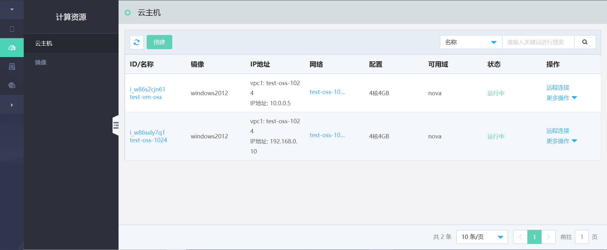

# Virtual Machines

Virtual Machines are core resources of the JD Cloud Swift platform, providing the computing service of auto scaling processing capacity. Virtual Machines refer to the computing instances of Virtual Machines running on physical nodes, including the most basic computing components such as CPU and memories. Compared with physical servers, their management methods are more efficient and simpler. Based on business demands, users can create VM instances and expand disks at any time, run applications and services on Virtual machines and access applications thereon via the independent IP address of Virtual Machines. Others resources such as Cloud Disk Service, images and Security Group can only be used after in combination with instances of Virtual Machines.

### Function Description of Virtual Machines

#### Life Cycle Management of Virtual Machines
JD Cloud Swift platform users can conduct full life cycle management on all Virtual Machines within their permissions, such as creation, edition, restart, shut-down/start, pending/recovery, creating images, resetting passwords, rebuilding, resizing, remote connection, attaching/detaching Cloud Disk, binding/unbinding elastic network interface, associating/disassociating floating IP, associating/disassociating Security Group and deletion and also can conduct common functions such as view details and view monitoring of a single Virtual Machine. With operations above, users can freely and flexibly use services of Virtual Machines, and make adjustment according to actual business demands of upper level at any time, so as to reduce resource cost and improve utilization efficiency.

#### Access Limitation of Virtual Machines

Virtual Machines on the JD Cloud Swift platform can set IAM strategy of VM level via the Security Group, but users can also customizer Security Group access rules, efficiently guaranteeing access security of Virtual Machines.

#### Fault Detection and Migration

The platform supports conventional health check function to Virtual Machines and physical nodes. Users can view monitoring information of a single Virtual Machine on the cloud management platform. For exception of Virtual Machines, business data can be timely backed up under support by operation and maintenance personnel, automatic dispersing of Virtual Machines after node faults, realizing rapid service recovery and re-attaching of Cloud Disk Service.

Cold migration, hot migration and disaster recovery migration of Virtual Machines on a physical node to other nodes, guaranteeing users’ business are not affected during hot migration to the greatest extension.

#### Images of Virtual Machines

The platform supports replication of data in Virtual Machines by creating images in the shut-down status, guaranteeing that Virtual Machines are rapidly recovered in case of faults. In addition, users can create new Virtual Machines based on image replication, so as to improve service efficiency.

#### Remote VNC

In addition to resource management and scheduling on the unified interface, users can also log in each Virtual Machine for management with the Console commands, without installing any third-party tool and such commands can be realized with the Web browser.

#### VM Monitoring

With the unified monitoring system, capture and exhibit on key performance indicator of Virtual Machines can be achieved, covering CPU utilization rate, memory utilization rate, disk IOPS, network traffics, etc. Users can view monitoring information of each Virtual Machine under its name with the independent monitoring interface and set monitoring view period at the same time.

#### Safe and Controllable Adaptation

The underlayer of JD Cloud Swift platform can support secure controllable server (Sugon), secure controllable x86 processor (Hygon) and secure controllable operating system (NeoKylin).