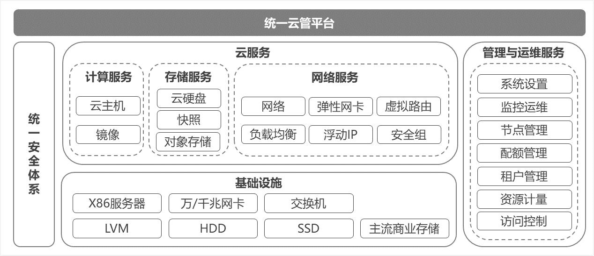

# Cloud Management Platform Function Introduction

Viewed from the functional architecture, JD Cloud Swift mainly consists of the following structures:

### Billing by Node Authorization

### Basic Virtualization Service

#### Computing Service

Computing services provided by Virtual Machines and image resources are adopted, supporting full life cycle management such as creation of Virtual Machines, edition, remote connection, pending/recovery, shutdown/start, restart, creating images, creation based on images, password reset, rebuilding, resizing, associating/disassociating EIP, detaching/attaching cloud disk, binding/unbinding elastic network interface, setting Security Group and deletion as well as common functions such as view details and view monitoring of a single virtual machine.

#### Storage Service

The underlayer adopts the block storage and Object Storage Service provided by the distributed storage technology and the distributed storage pool supports multiple hard disk types. The block storage service supports full life cycle management on Cloud Disk Service such as direct creation, creation from snapshot, attaching, capacity upgrade and delete and common functions such as view details. Meanwhile, functions such as creation and deletion snapshot of Cloud Disk Service is also supported. Object Storage Service supports full life cycle management on buckets such as view, selection, creation and deletion of bucket list as well as common functions such as view details. It also supports permission management, object management, life cycle rule management and space monitoring on a single bucket. The storage service supports automatic fault migration, efficiently guarantee data security and storage stability and reliability.

#### Network Service

The basic virtual network service is provided, including virtual network, subnet, virtual routing, Elastic Network Interface, floating IPs, LB, etc. Establishment of VPC and logical separation between different VPCs is supported, customization of subnet segment and gateways and route policies in VPC is supported, IAM strategy of VM level can be set via the Security Group, independent application for public IP address is supported, dynamic association and disassociation of resources such as Virtual Machines and Load Balancer are supported and Load Balancer policies in customized subnet are also supported.

### Unified Background Management

#### User IAM

The cloud management platform supports unified identity authorization to user access. For users of different permissions, the menu item for unauthorized function will be hidden.

#### Organization Management

Users with permissions can create and view its subordinated organizations in the cloud management platform, with 4-level organization management supported at most. Now, deletion to organization is not supported.

#### User Management

The cloud management platform supports the users with permissions to make user creation, password reset as well as enabling/locking operations for the selected organization. The administrator can apply permission management for users of a lower-level organization. As for the current version, user permission modification and user enabling and locking can take into effect upon another login.

#### Quota Management

The cloud management platform supports the users with permissions to view the total resource quota of its organization and its lower-level organization and remaining distributable quota information, assign quota of its own organization to a lower one as well as recycle quota which is assigned but not used. It also supports distribution and modification to quota of user of its level or lower level.

### Unified Operation and Maintenance Monitoring Platform

#### Unified Monitoring Operation and Maintenance Management

With the unified monitoring visualization screen, users are supported to view monitoring on CPU, memory and disk utilization condition of physical nodes, monitoring on health status and deployed service liveness of physical nodes, related monitoring on storage performance and data, monitoring on resource load and service liveness, etc. Meanwhile, functions including hot migration of Virtual Machines, setting of virtual resource specification, physical machine information view and the like are supported.

#### Alarm Service

The current version does not support customization of alarm rules and alarm notification methods by users on the cloud management platform. The automatic alarm of system is only applicable for JD Cloud operation and maintenance teams, which can be realized via subscription, covering alarms about exceeding threshold values of CPU, memory and disk usage, server system breakdown and stop alarm of various services.