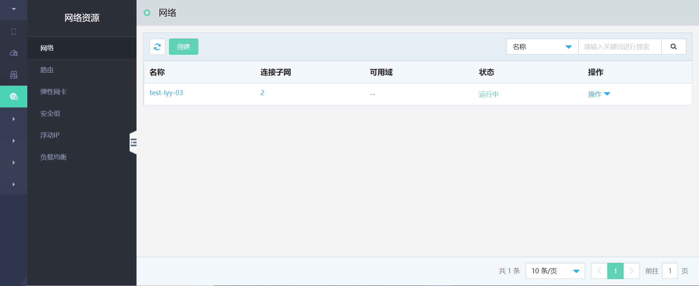

# Virtual Private Cloud

The platform provides users with virtualized network services, including two-layer network and three-layer network. Two-layer virtual private cloud is used to isolate different items so that the business security can be ensured; three-layer network is designed to meet requirements of communication between different items or with the external.

Virtual Private Cloud is a logically isolated network space customized on JD Cloud Swift platform, which is similar to the traditional network set up in the data center. This virtual private cloud space is fully controlled by users and supports customized subnet segment, route policies, etc. Users can create and manage multiple cloud products in the VPC, such as Virtual Machine, Load Balancer, etc., and configure resources within the network to connect to the Internet.

### Function Description of Virtual Private Cloud

#### Support Multiple Network Types
JD Cloud Swift Platform supports the Flat Network and VLAN Network simultaneously. The networks created in the cloud management platform by default are VLAN type networks to provide secured segments for resources in each network, and the internal resources of the network have a private IP address that can only be accessed from the inside of the VLAN. The external network preset into the cloud management platform normally is Flat-type network. Its IP range, namely one IP pool, is provided by users and available to Virtual Machines.

#### Customized Network
Users can create and customize multiple networks that are independent with each other based on their actual businesses, and the virtual private cloud is totally controlled by users themselves for their different communication requirements.
Cloud resources in the current VPC (e.g. Virtual Machines, Load Balancer, etc.) are deployed in subnet. The subnet is located in the VPC and supports subnet segment and gateway, route policies, etc. in the customized network. The subnet segments in the same network cannot overlap, while subnet segments in different networks can overlap. Resources in each subnet are associated with an Elastic Network Interface by default, and the DHCP service is enabled by default to automatically assign a subnet address to the resource.

#### IP Address

JD Cloud Swift platform supports the IP partitioning of the VPC and subnet as a whole by specific CIDR, and the IP addresses that users can use in the VPC are divided into two categories:

* Private IP Address. Resources in the VPC have their automatically assigned IP addresses in the VPC address segment agreed by RFC1918. Private IP can be used in communication between resources in a VPC, but cannot be used to directly communicate with the Internet.
* Floating IP Address. Floating IP is a public IP. It can realize a communication between the VPC and the external network via NAT.