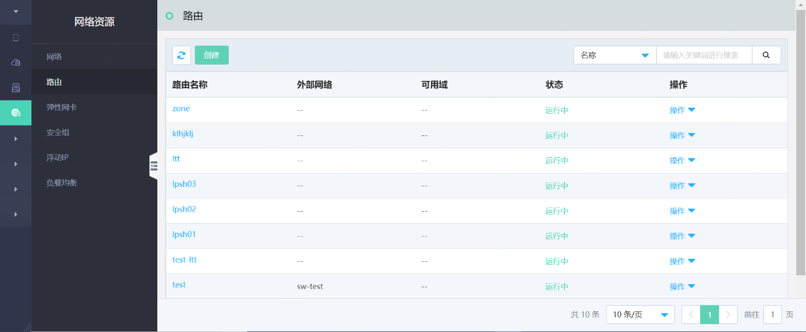

# Routing

JD Cloud Swift Platform supports three-layer networking services via virtual routing. The virtual routing is connected to different subnets to control the outflow direction of traffic of subnets in the VPC so as to realize the communication of resources in different subnets or mutual access between the resources in the VPC and the external network. Users can manage virtual routes, external gateway settings, associated subnet settings and static route table management on the unified interface.

### Features Description Related to Virtual Routes

#### Virtual Route Management
Support users in life cycle management such as creation, editing, deletion of virtual routes and view of route details.

#### External Gateway Setting
Support setting/clearing the external gateway for virtual routes. After setting the external gateway, access to the external network can be realized through SNAT for the Virtual Machine resources in the subnet associated with the virtual route.

#### Connect to Subnet
Multiple subnets can be connected to a virtual route, and the CIDR overlap between subnets is not allowed. By the articulated operation for subnets, the communication between the subnets in the same route can be realized, and the communication between the subnets and the external network can also be realized.

#### Static Route Table Management
The platform supports customized static route table. By setting targeted CIDR and the next-hop IP addresses, users can transmit the data packages matched with the route according to the route path.

