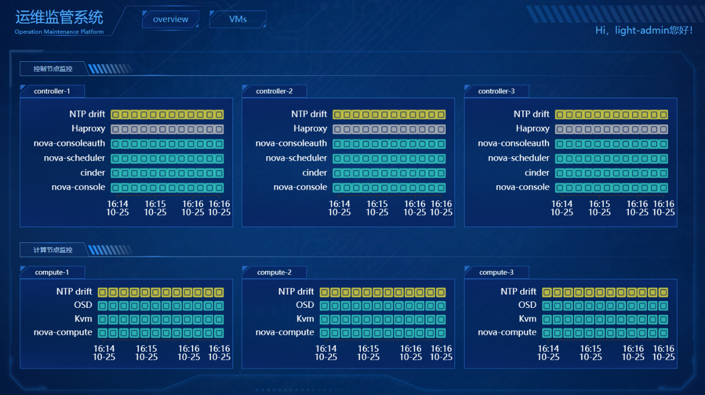
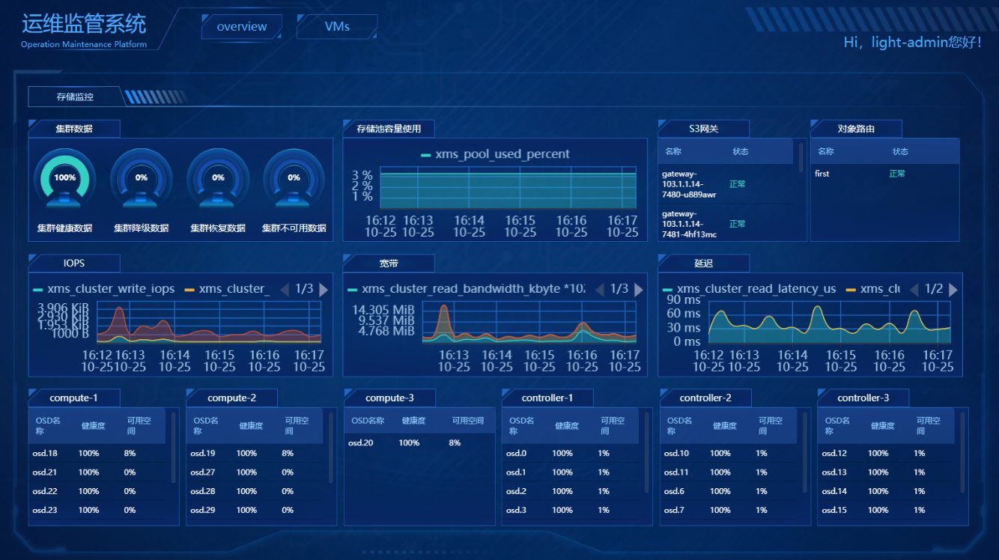
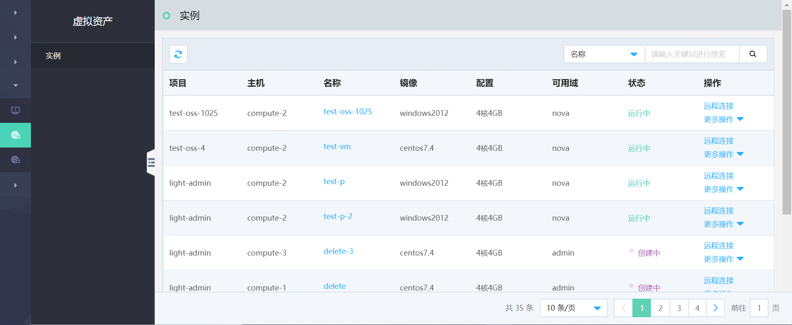
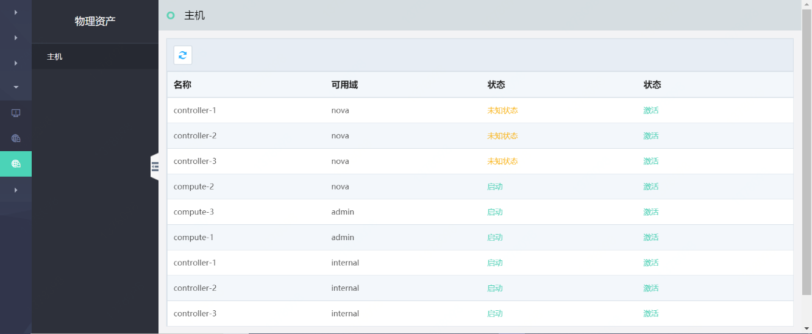

# Operation and Maintenance Monitoring

JD Cloud Swift platform supports users to view CPU, memory and disk usage monitoring throughout the cluster; supports monitoring of physical nodes health status and resource usage; supports monitoring of control service health status and supports management of virtual resource, machine collection, as well as available domains. At the same time, the professional operation and maintenance team of JD Cloud will conduct unified management of platform alarm and log information, providing users with comprehensive operation and maintenance support.

## Resource Monitoring

The resource monitoring of JD Cloud Swift platform is mainly divided into two parts:

* VM Monitoring:

Ordinary users can view the monitoring information that can use Virtual Machines resources within their permission, including CPU Util, Memory Util, disk read/write throughput and network entry/output rate, so as to understand the operation and performance of Virtual Machines in time and find out the abnormal phenomenon in time, and plan the use of resources according to the actual running condition. The platform supports users to select monitoring cycles on their own to view performance of Virtual Machines.

* Platform Overall Resource Monitoring:

The system administrator and the operation and maintenance role of the platform have the permission to view this part. The overall resource monitoring mainly includes load monitoring (CPU, memory, disk capacity, etc.) of physical nodes; service liveness monitoring on all types of physical nodes; storage performance and data-related monitoring; resource load and service liveness monitoring on platform management plane, etc.

### Physical Node Load Monitoring

The platform supports monitoring of load situation of each physical node, mainly including CPU, memory, disk, network and temperature related indicators. Through the multi-dimensional monitoring of the physical nodes, the platform operation and maintenance personnel can adjust the resource scheduling policy according to the actual situation to avoid the overload of the server, so as to ensure that the upper business applications can provide stable services to the public.

### Physical Node Service Liveness Monitoring

The platform has deployed a variety of services to provide underlayer support for the platform, including computing service, storage service, network service and so on. The platform operation and maintenance role can view the monitoring status of all the services deployed on each node; locate problems quickly after the fault occurs, which facilitate the investigation of subsequent problems.

### Storage Performance and Data Related Monitoring

The platform supports the monitoring of the underlayer distributed storage system, mainly including storage performance, the health of storage data, the usage of storage pool capacity, the health status and available capacity of each storage disk, and so on. Through this part of the information, the operation and maintenance role can timely understand the monitoring status of storage disk and storage data, which is convenient to locate the problem quickly.

### Platform Management Plane Monitoring

JD Cloud Swift platform can monitor the Virtual Machines on the platform management plane, including usage conditions of CPU, memory and disk of each Virtual Machine; the network traffic, the liveness status of the service deployed on the Virtual Machines, and the like. The operation and maintenance role can timely find faults of the Virtual Machines according to the monitoring information and quickly locate them.

### Virtual Machines Monitoring

The platform supports the monitoring of resources of Virtual Machines and user’s Virtual Machines of running status, CPU Util, Memory Util, disk IO, network uplink and downlink speed, etc. of Virtual Machines.

## Virtual Asset Management

Virtual asset management enables system administrator and operation and maintenance role to view and manage all virtual resources across the platform. The current version only supports unified operation and maintenance management for virtual computing resources (Virtual Machines), including list view and selection, remote connection, edit, creating image, shutdown/starting, hot migration to another physical node, restart, delete, etc.

## Physical Asset Management

The platform supports the system administrator and the operation and maintenance role to view all the physical assets, including mainly the starting status and service status of the machine node, so as to realize the overall control of the physical resources of the platform.

