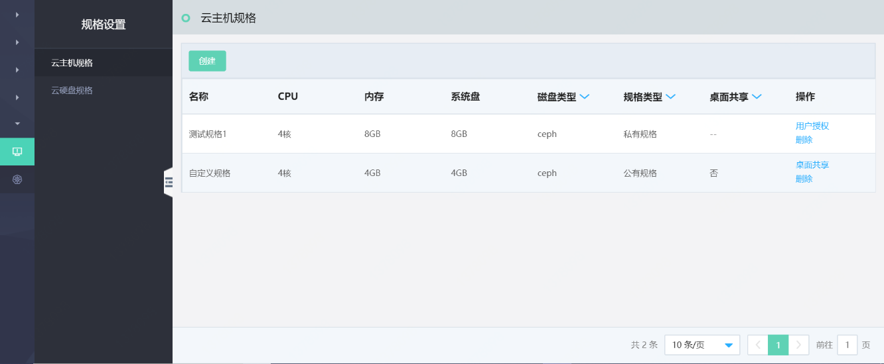
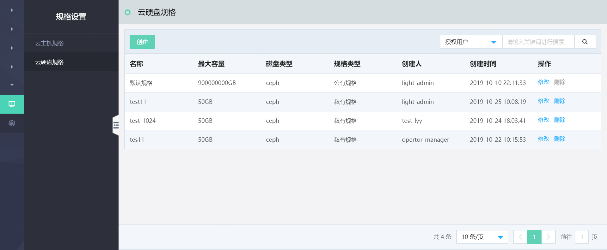
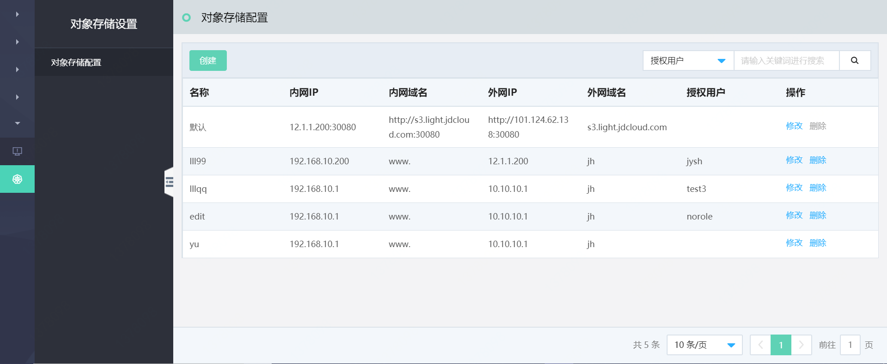

# System Setting

## Specification Setting

The system administrator, operation and maintenance administrator and operation and maintenance personnel can conduct unified configuration and unified management of specification of Virtual Machines and Cloud Disk Service in the platform through specification setting.

### Virtual Machines Specification

Support user to create and manage different specification configurations of Virtual Machines, and set different CPUs, memories, system disk capacities, system disk type and so on; at the same time, support user authorization for each Virtual Machine specification; two types of specifications can be selected for setting, i.e. public and private. Public specification is visible to all users, and private specification can be specified to be visible to some users. The same user can be authorized to multiple Virtual Machines specifications, so that ordinary users can quickly select the applicable Virtual Machines specifications, to fully meet the requirements of different business application systems for computing resources.

### Cloud disk service specification

Support users to configure a variety of Cloud Disk Service specifications on demand, and manage the maximum capacity and hard disk type of Cloud Disk Service, to meet the needs of a variety of business scenarios. The users can customize the private specifications and specify that it is visible to some users; the platform presets a public specification of the Cloud Disk Service that cannot be deleted, which is visible to all users who do not specify the private cloud hard disk specifications. Only one Cloud Disk Service specification can be assigned to each user, which cannot be exceeded by the maximum capacity selected during creating or expansion the Cloud Disk Service.

## Object Storage Service Setting

Support the users to configure the access domain name and access IP of the Intranet and Internet of Object Storage Service. Meanwhile, support the user authorization for each newly created Object Storage Service configuration. The platform presets a default configuration, which is open to all users; this configuration only support modification, and cannot be deleted.

