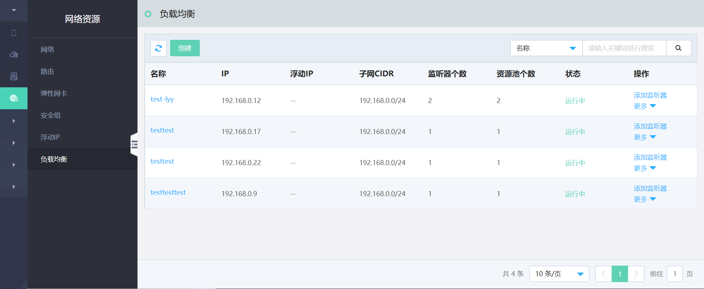

# Load Balancer

JD Cloud Swift platform provides Virtual Load Balancer Service LBaaS (LoadBalanceasaService). The Load Balancer is set up on the existing network structure and provides a cheap, effective and transparent method to expand the bandwidth of network devices and servers, increase throughput, strengthen the network data processing capability, and improve the flexibility and availability of network. JD Cloud Swift platform realizes business-level load balancer function by managing one or more virtual load balancer device(s).

In the face of high-concurrency business scenarios, the external access traffic can be distributed to different Virtual Machines in accordance with certain Load Balancer rules to effectively balance the business load pressure, ensure the Virtual Machines in the resource pool are in their optimal load status and improve the resource utilization rate and service efficiency of the entire cluster.

### Features Description of Load Balancer

#### High Availability of Virtual Load Balancer
The platform supports life cycle management operations such as creation, editing and deletion of virtual Load Balancer and view of its details list. Besides, the platform also adopts high-availability designs to ensure Load Balancer can provide traffic assignment services stably, reliable and continuously.

#### Sound Monitor
A Load Balancer supports defining multiple listeners in many protocol types such as TCP, HTTP and HTTPS; to define the port number of port which is used on listener to receive requests and forward requests to the backend server; and to set the maximum connections for external access so that traffic into resource pool is controllable.

#### Resource Pool Service
In the Load Balancer resource pool provided by the platform, one or more Virtual Machines can be added to provide the same service for the external traffic. The resource pool supports manual Auto Scaling to match the external traffic changes. During the scaling process, its ability to provide services to the external is not affected so that the maximum utilization of resources can be ensured. The platform supports full life cycle operations, such as addition, editing, deletion and view of details list, of Virtual Machines. When adding a Virtual Machine to resource pool, the port and weight information can be set, and the Load Balancer will use this port to weight and forward a packet to the Virtual Machine.
Virtual Machines in the backend resource pool of the virtual Load Balancer are not exposed to the external network. Users can access the virtual Load Balancer only via IP without knowing the resource pool information of services provided by the internal to realize security protection for resources.

#### Health Check
Load Balancer services support periodic health checks on Virtual Machines in resource pool by methods of PING, TCP, HTTP, HTTPS, etc. Once any Virtual Machine operation exception is detected, the traffic will not be assigned to the Virtual Machine with exception, and the traffic forward will be restored until the normal operation is detected. In this way, the service availability is guaranteed.

#### Floating IP Association/Disassociation
The Platform supports Load Balancer in associating floating IP, and users may independently select whether to associate, disassociate EIP, free switch, flexibly set up Intranet and public network load balancer to meet business demands at different scenarios. By associating public IP, the Intranet structure can be hid and system security can be improved.

#### Multiple Load Balancer Policies
Users can choose different Load Balancer methods for different resource pools, and the Load Balancer methods supported by the platform are round robin, minimum connections, Source IP, etc. Users can choose different policies based on the actual business traffic and application scenarios by themselves to realize the optimal traffic allocation assignment.