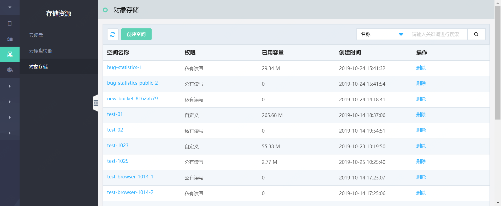

# Object Storage Service

Object Storage Service is an object-based secure, stable, mass and convenient storage service provided by JD Cloud Swift platform. It supports data in multi-replica distributed storage, and the distributed storage is 3 copies by default, which can prevent data unavailability due to component failure. Object Storage Service provides users with the capability of large storage capacity, which is suitable for storing any type of files. Based on AK/SK to identity and access management for users, users can easily manage the data stored on the Object Storage Service on the cloud management platform or using a third-party tool, and develop multiple types of upper layer business applications.

### Function Description of Object Storage Service

#### Life Cycle Management
Support users in full life cycle management on Cloud Disk Service such as bucket creation and deletion, and common functions such as view details. Besides, users can manage the life cycle of objects in buckets by setting space life cycle rules, and automatically delete expired objects or object with specified prefixes in the whole buckets while users do not need to maintain the life cycle of data manually, so as to reduce the maintenance time and costs of buckets in use and improve the utilization rate of buckets.

#### Object Management
Support users in managing objects in a signal bucket through the cloud management platform, including folder creation/deletion, object list view and screening, uploading/downloading/deleting objects, obtaining object external links, shard management, object detail view and other common functions to meet users’ needs for each scenario.

#### Access Permissions Setting
The platform supports flexibly control the permission for each bucket. Through the cloud management platform, users can define access permission for the buckets when or modify the permission after creating the buckets. Currently, three permissions are supported: public read/write, private read/write, and public read and private write.

#### Cross-domain access setting
The platform supports cross-origin resource sharing. Based on the cross-origin resource sharing verification mechanism CORS proposed by the W3C standardization organization, the access of client Web applications loaded in one domain to the resources in another domain is supported so as to enhance the security of cross-origin data transmission. Users can realize cross-origin resource sharing by adding CORS rules on the cloud management platform and setting the sources and request methods that allow cross-origin requests.

#### Bucket Monitoring
The platform realizes to monitor indicators of the bucket such as storage conditions, traffic statistics, and request times through the unified monitoring system. Users can view monitoring information of each bucket under its name with the independent monitoring interface and set monitoring view period at the same time. It is convenient for users to timely understand the current use of resources and make reasonable use plans.