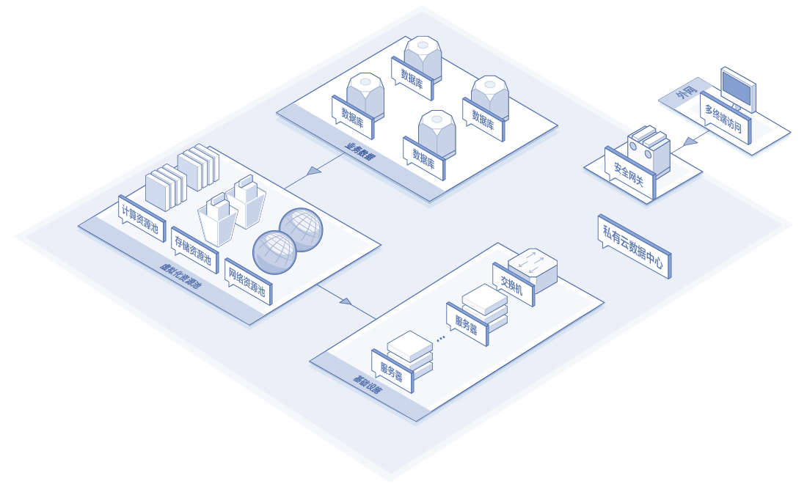
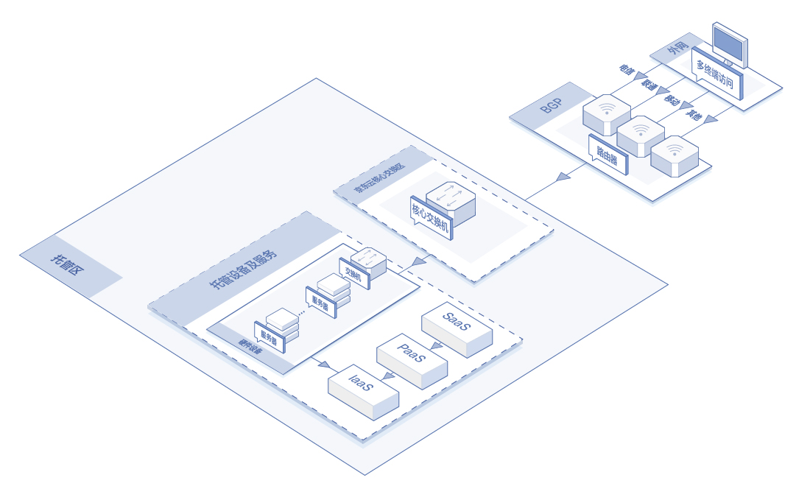
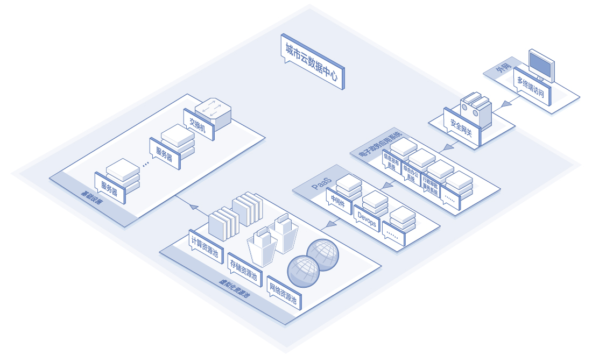
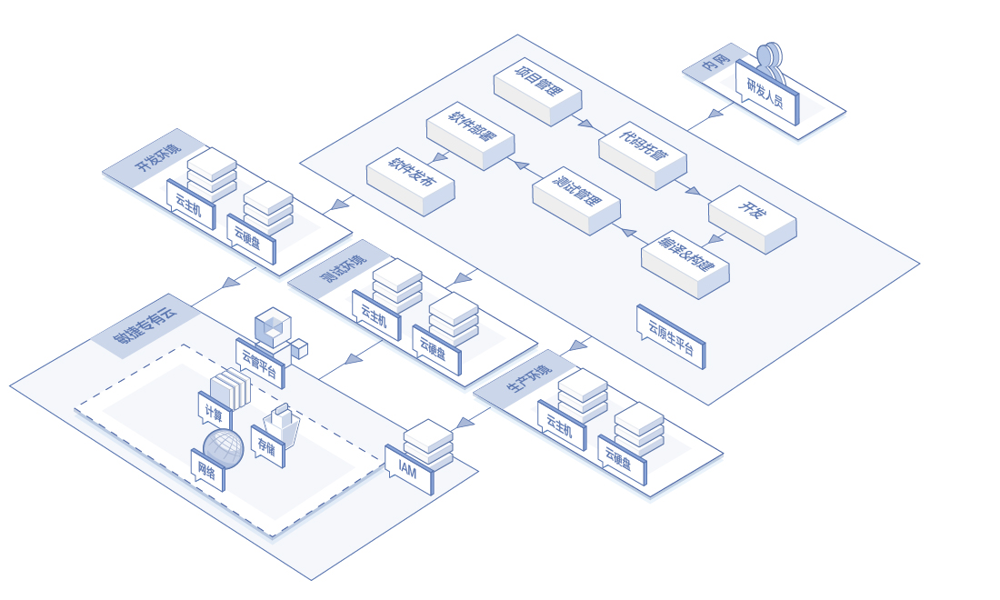

# Application Scenarios

### Private Cloud Data Center

Traditional data centers have fixed resources and are lowly flexible with a high cost of operation and maintenance, and the resource management is inconvenient. JD Cloud Swift Platform implements fully virtualized resource pool for computing, storage, and network based on software defined IT architecture; and support users to reuse hardware resources in existing data centers so as to realize optimization of resources. Based on the new IT architecture, the platform established a new generation of private cloud data center, so as to realize the seamless horizontal expansion of resources and improve the security and reliability of data. Support enterprises to transform IT resources into services and quickly push to users, and allow users to access configurable computing resource sharing pool conveniently and flexibly through the network, so as to realize the rational release of data resources with minimum management cost and workload. Meanwhile, technologies such as unified identity verification, user level system, data disaster recovery backup and digital encryption can be used to effectively ensure the security of enterprise information resources and avoid the security threats of enterprise internal information resources in the public cloud resource pool.

### Cloud Service Cabinet Service

More and more enterprises and units not only want to take advantage of the public cloud’s features of on-demand use and auto scaling to reduce costs, but also desire to use the features of the virtual private cloud’s features of environment isolation to provide better data protection for business. The platform supports cabinet service of user’s servers in JD’s self-support data center and the field DevOps Service is also available, so as to customize the best solutions for users to meet personalized business needs. Cloud service cabinet service has the benefits of both public cloud and private cloud, and empowers users in operation and maintenance management as well as operation control.

### City Cloud
In order to support the rapid development of regional economy and technology, the government has set up a large number of industrial bases. To support such scenarios, JD Cloud provides a kind of city cloud solution to boost the bearing capacity of information system of multiple city industrial bases. Build an JD Cloud Swift Platform based on the new software defined IT architecture using servers and other hardware resources in local data centers. The upper layer can carry database, middleware and other general basic software resources, supporting external users to share PaaS layer resources. Meanwhile, based on the PaaS platform, it supports the development, testing and production integration of all industrial applications, for the joint building of a new generation of city cloud technology service platform with the government departments.

### Cloud Native

The construction or reformation of traditional application system requires a lot of investment in IT resources with high cost, long business launch and transformation cycle, and complex expansion in the later stage. JD Cloud Swift Platform provides agile infrastructure, supports technology based on JD Distributed Service architecture and DevOps, so as to realize dynamic orchestration, scaling on demand, active scheduling and manage of applications, improve the overall flexibility and maintainability of applications, thus optimizing resource utilization rate, so that users delivery team can use repeatable automation and orchestration to iterate quickly. By using cloud native, enterprises can realize faster application launch speed, meticulous fault detection and discovery, automatic fault isolation, automatic fault recovery, lateral elastic expansion and so on, so that the deployment and fault recovery of applications and infrastructure can be more rapid and agile, which can greatly reduce the deployment cost of enterprises in cloud computing, and help enterprises to achieve digital transformation.

