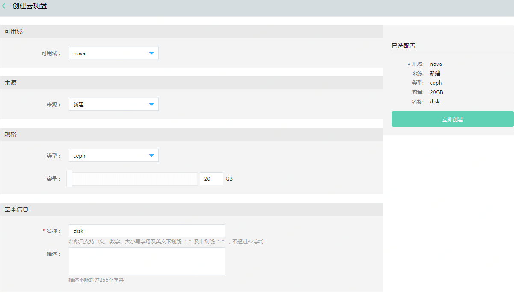
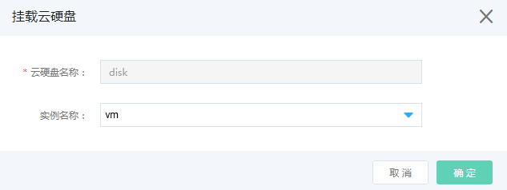
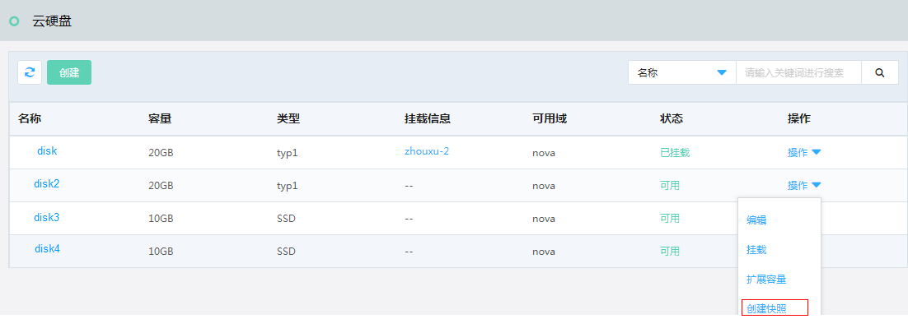

# Cloud Disk Service

## Create Cloud Disk

Access the navigation bar on the left side and click **Basic Cloud**>**Storage Resource**>**Cloud Disk Service** menu to enter the Cloud Disk Service list page, as shown in Figure: Cloud Disk Service List page.

Figure: Cloud Disk Service List page

On this page, click **Create** to pop up the create Cloud Disk Service page, as shown in Figure: Create Cloud Disk Service page.

Figure: Create Cloud Disk Service page

On this page, select the available domain, hard disk type and hard disk capacity, enter the names and click **Create Now**; after the creation succeeded notification pops up, you can see the Cloud Disk Service created on the Cloud Disk Service list page, as shown in Figure: Cloud Disk Service List page.

Figure: Cloud Disk Service List page

## Attach Cloud Disk

On the Cloud Disk Service List page, click **Attach** in the operation list to pop up the "Attach Cloud Disk" page, as shown in Figure: Attach Cloud Disk page.

Figure: Attach Cloud Disk page

On this page, select the name of instance to be attached and click **OK** to pop up the attachment succeeded notification, and then on the Cloud Disk Service List page, you can see the attachment information, as shown in Figure: Cloud Disk Service List page.

Figure: Cloud Disk Service List page

## Create Cloud Disk Snapshot

Snapshot is a data back method provided by JDStack X, which reserves all the data on Cloud Disk Service before a specified time point. Before creating snapshot, you need to detach the Cloud Disk Service and attach to a VM again after creating the snapshot.

Access the navigation bar on the left side and click **Basic Cloud**>**Storage Resource**>**Cloud Disk Service** menu to enter the Cloud Disk Service list page, as shown in Figure: Cloud Disk Service List page.

Figure: Cloud Disk Service List page

On this page, click **Create Snapshot** in the operation list to pop up the "Create Snapshot" page, as shown in Figure: Create Snapshot page.

Figure: Create Snapshot page

On this page, enter the snapshot name and click **OK** to pop up the creation succeeded notification, and then on the Cloud Disk Snapshot List page, you can see the information of snapshot created.

Access the navigation bar on the left side and click **Basic Cloud**>**Storage Resource**>**Cloud Disk Snapshot** menu to enter the Cloud Disk Snapshot list page, as shown in Figure: Cloud Disk Snapshot List page.

Figure: Cloud Disk Snapshot List page

On this page, click **Operation** in the operation list to pop up a pop-up, and then click corresponding operations to edit, create Cloud Disk Service and delete.
