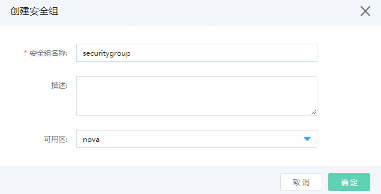
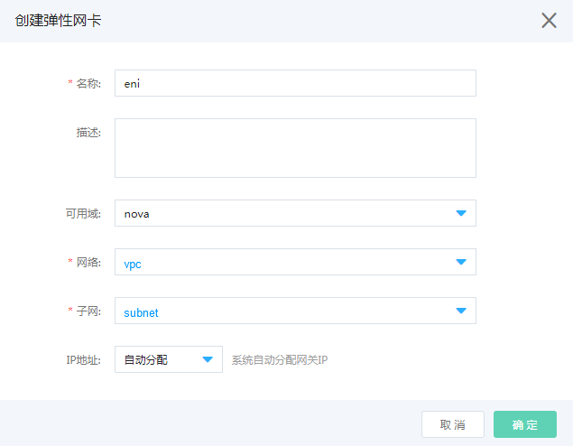
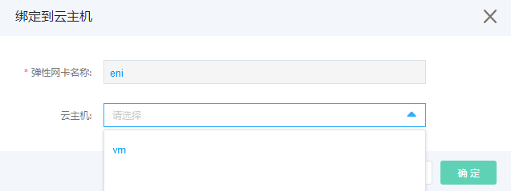

# Networking

## Create Security Group

Access the navigation bar on the left side and click **Basic Cloud**>**Network Resource**>**Security Group** menu to enter the Security Group list page, as shown in Figure: Security Group List page.

Figure: Security Group List page

On this page, click **Create** to pop up the create Security Group page, as shown in Figure: Create Security Group page.

Figure: Create Security Group page

On this page, enter the Security Group Name, select the available domain and click **OK**; after the "Creation Succeeded" notification pops up, you can see the Security Group created on the Security Group list page, as shown in Figure: Security Group List page.

Figure: Security Group List page

On this page, you can click **Manage Security Group Rules** and **Delete Security Group** in the operation list to achieve the management functions for Security Group.

## Create Elastic Network Interface

Elastic Network Interface is a kind of virtual network interface, which can be connected on the Virtual Machines so that the Virtual Machines are connected to different network interfaces. Elastic Network Interface is applicable in building application scenarios such as business traffic separation, multiply businesses hosting and network high availability. Each of the Virtual Machines can be connected to multiple Elastic Network Interfaces.

Access the navigation bar on the left side and click **Basic Cloud**>**Network Resource**>**Elastic Network Interface** menu to enter the Elastic Network Interface list page, as shown in Figure: Elastic Network Interface List page.

Figure: Elastic Network Interface List page

On this page, click **Create** to pop up the Create Elastic Network Interface page, as shown in Figure: Create Elastic Network Interface page.

Figure: Create Elastic Network Interface page

On this page, enter the name and select the available domain, network and Subnet and then click **OK**; after the "Creation Succeeded" notification pops up, you can see the Elastic Network Interface created on the Elastic Network Interface list page, as shown in Figure: Elastic Network Interface List page.

Figure: Elastic Network Interface List page

On this page, click **Operation** in the operation list to pop up a pop-up, and then click corresponding operations to edit, associate with Virtual Machines, disassociate from Virtual Machines and delete.

## Elastic Network Interface Association

On the Elastic Network Interface List page, click **Associate with Virtual Machines** operation item in the operation list to pop up the associate with Virtual Machines page, as shown in Figure: Associate with Virtual Machines page.

Figure: Associate with Virtual Machines page

On this page, select the Virtual Machines to be associated and click **OK**; after the "Association Succeeded" notification pops up, you can see the information of Virtual Machines associated on the Elastic Network Interface list page, as shown in Figure: Elastic Network Interface List page.

Figure: Elastic Network Interface List page

