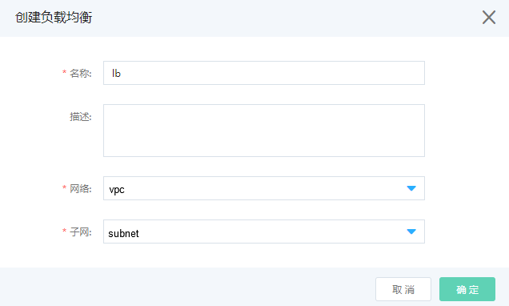
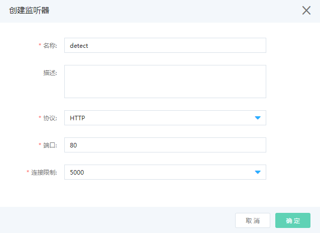
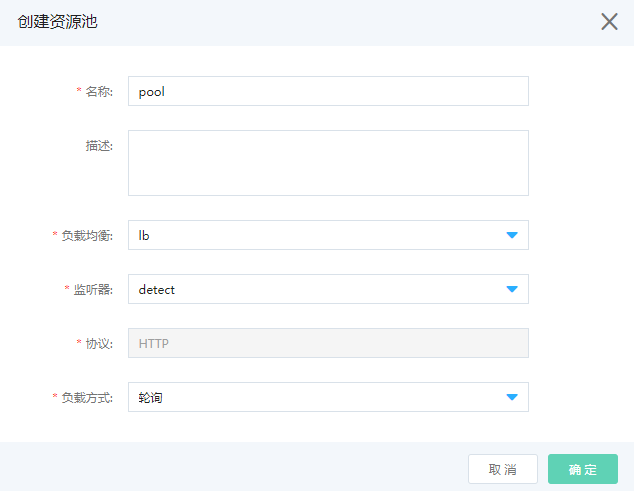
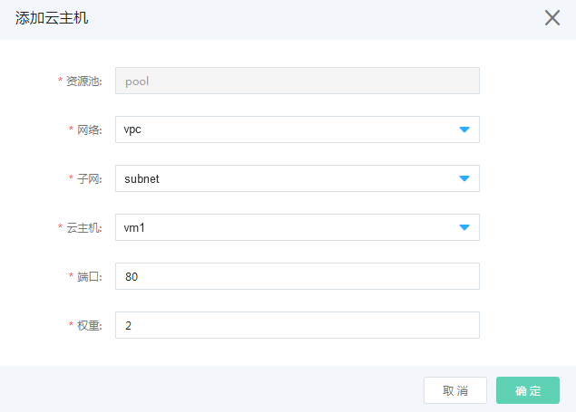
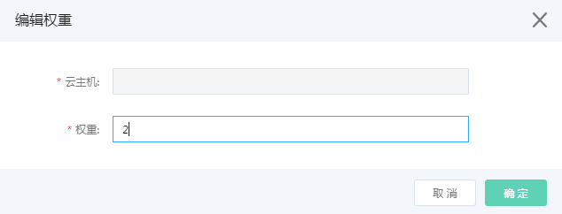

# Load Balancer

Common users of the platform are suggested to build services based on Load Balancer by the following way to quickly get familiar with the Load Balancer functions of the platform.

The specific steps to create a group of Virtual Machine attaching Load Balancer services are as follows:

Step 1, create Load Balancer

Step 2, create listener

Step 3, create resource pool

Step 4, add Virtual Machines to resource pool

Step 5, edit machine weight

## Create Load Balancer

The Load Balancer can distribute large concurrent traffic to multiple backend instances, adjust resource utilization, eliminate influence to systems by fault of single device, improve system availability and expand system serviceability.

Access the navigation bar on the left side and click **Basic Cloud**>**Network Resource**>**Load Balancer** menu to enter the Load Balancer list page, as shown in Figure: Load Balancer List page.

Figure: Load Balancer List page

On this page, click **Create** to pop up the Create Load Balancer page, as shown in Figure: Create Load Balancer page.

Figure: Create Load Balancer page

On this page, enter the name, select the network and Subnet and click **OK**; after the "Creation Succeeded" notification pops up, you can see the information of Load Balancer created on the Load Balancer list page, as shown in Figure: Load Balancer List page.

Figure: Load Balancer List page

On this page, click **Operation** in the operation list to pop up a pop-up, and then click corresponding operations to edit, create listener and delete.

## Create a listener

Listening rules: At present, the protocol types and port number information to be monitored only cover three protocol types, including HTTPS/HTTP/TCP. Users can define multiple listeners in the same Application Load Balancer. Different protocol types or the same protocol type and different port number definition can be selected by the listener.

On the Load Balancer List page, click **Create Listener** in the right operation list to pop up the create listener page, as shown in Figure: Create Listener page.

Figure: Create Listener page

On this page, enter the name, select the protocol, connection restriction and input port number and then click **OK**; after the "Creation Succeeded" notification pops up, you can see the information of listener created on the Load Balancer Details, as shown in Figure: Load Balancer Listener Details.

Figure: Load Balancer Listener Details

Note: The listening port under the same Load Balancer cannot be duplicated, after creating the listener, the listening protocol and port are not allowed to modify.

## Create Resource Pool

Access the navigation bar on the left side and click **Basic Cloud**>**Network Resource**>**Resource Pool** menu to enter the resource pool list page, as shown in Figure: Resource Pool List page.

Figure: Resource Pool List page

On this page, click **Create** to pop up the create resource pool page, as shown in Figure: Create Resource Pool page.

Figure: Create Resource Pool page

On this page, enter the names and select the Load Balancer, listener and load method and then click **OK**; after the "Creation Succeeded" notification pops up, you can see the information of resource pool created on the resource pool list page, as shown in Figure: Resource Pool List page.

Figure: Resource Pool List page

## Add Virtual Machines

On the resource pool list page, click **Add Virtual Machines** in the right operation list to pop up the add Virtual Machines page, as shown in Figure: Add Virtual Machines page.

Figure: Add Virtual Machines page

On this page, enter the name and select the network, Subnet, Virtual Machines, input port number and weight and then click **OK**; after the "Addition Succeeded" notification pops up, you can see the information of resource pool created on the resource pool machine list details, as shown in Figure: Resource Pool Machine List Details.

Figure: Resource Pool Machine List Details

With reference to the operation methods for adding Virtual Machines, add successively the Virtual Machines needing attachment of Load Balancer service backend.

## Modify Machine Weight

On the resource pool machine list details, click **Modify Weight** in the operation list to pop up the edit weight page, as shown in Figure: Edit Weight page.

Figure: Edit Weight page

On this page, enter the weight value to be modified and click **OK**; after the "Edit Succeeded" notification pops up, you can see the weight information edited on the resource pool machine list details.
