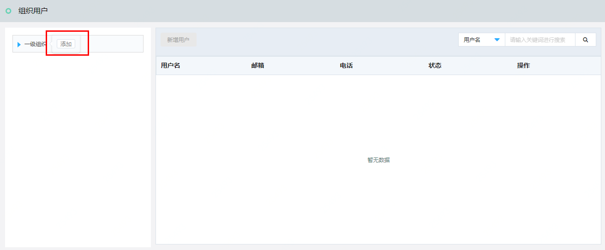
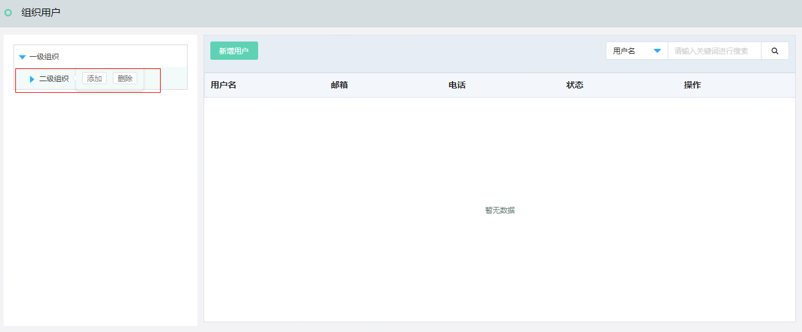
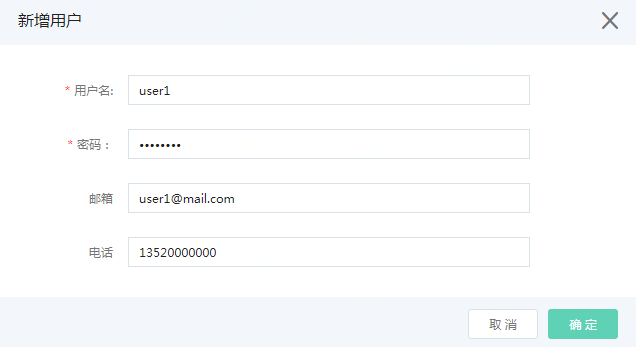
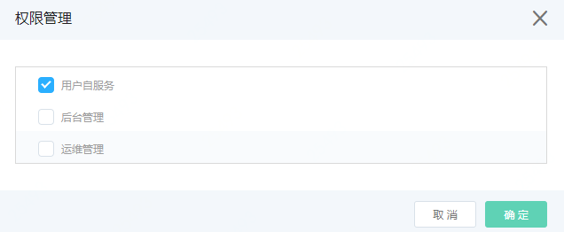
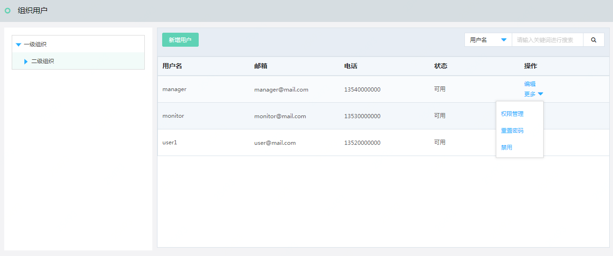
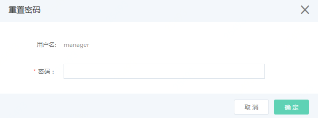
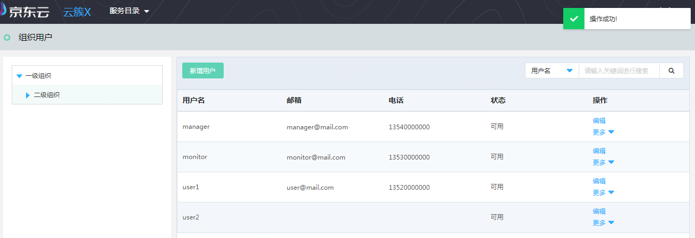
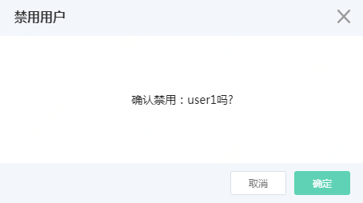
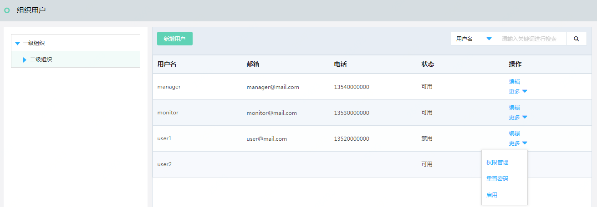
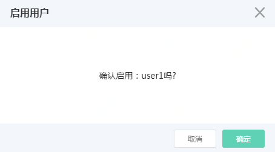

# Management of Organization Users

## Create Organization

After logging in JDStack platform, Access the navigation bar on the left side and click **Background Management**>**Organization User Management** menu to enter the organization user list page, as shown in Figure: Organization User List page.

Figure: Organization User List page

On this page, move the mouse to the root organization name and **Add** pops up on the page, and then click **Add** to pop up the add organization page, as shown in Figure: Add Organization page.

Figure: Add Organization page

On this page, enter the name of organization to be added and click **OK**; after addition succeeded, you can see the organization created on the organization user list page, as shown in Figure: Organization User List page.

Figure: Organization User List page

On this page, you can add and delete organization, add user, edit user information, assign user permission, enable user, disable user, and delete user.

## Add User

The method of operation is as follows: On the Figure: Organization User List page, click **Add User** on the top left corner to pop up the add user page, as shown in Figure: Add User page

Figure: Add User page

On this page, enter the user name, password, e-mail (optional) and phone (optional) and click **OK** to pop up the permission management page, as shown in Figure 206: Permission Management page.

Figure: Permission Management page

On this page, select the permission granted to this added user and click **OK**; after addition succeeded, you can see the user added on the organization user list page, as shown in Figure: Organization User List page.

Figure: Organization User List page

## Permission Management

The method of operation is as follows: On the Figure: Organization User List page, click **Permission Management** in the designated user operation list to pop up the permission management page, as shown in Figure: Permission Management page

Figure: Permission Management page

On this page, you can view and edit user permission; click **OK** and the "Empowerment Succeeded" notification pops up on the page, as shown in Figure: User Permission Empowerment Succeeded Notification.

Figure: User Permission Empowerment Succeeded Notification

On this page, the "Empowerment Succeeded" notification popped up means that the user permission edited by you has taken effect.

## Reset Password

The method of operation is as follows: On the Figure: Organization User List page, click **Reset Password** in the designated user operation list to pop up the reset password page, as shown in Figure: Reset Password page

Figure: Reset Password page

On this page, click **OK** and the "Operation Succeeded" notification pops up on the page, as shown in Figure: User Reset Password Operation Succeeded Notification.

Figure: User Reset Password Operation Succeeded Notification

On this page, the "Operation Succeeded" notification popped up means that your password setting has taken effect.

## Disable/Activate

The method of operation is as follows: On the Figure: Organization User List page, click **Disabling** in the designated user operation list to pop up the disable user page, as shown in Figure: Disable User page

Figure: Disable User page

On this page, click **OK** and then the user platform access permission is disabled; after disabling, the user cannot log in the platform any more. **Enabling** is shown in the operation list, as shown in Figure: Organization User List page

Figure: Organization User List page

Click **Enabling** to pop up the enable user page, as shown in Figure: Enable User page

Figure: Enable User page

On this page, click **OK** and then the user platform access permission is enabled; after enabling, the user's permission to log in platform is recovered and the user can log in the platform.
