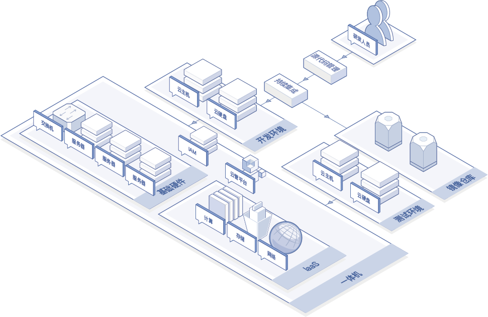
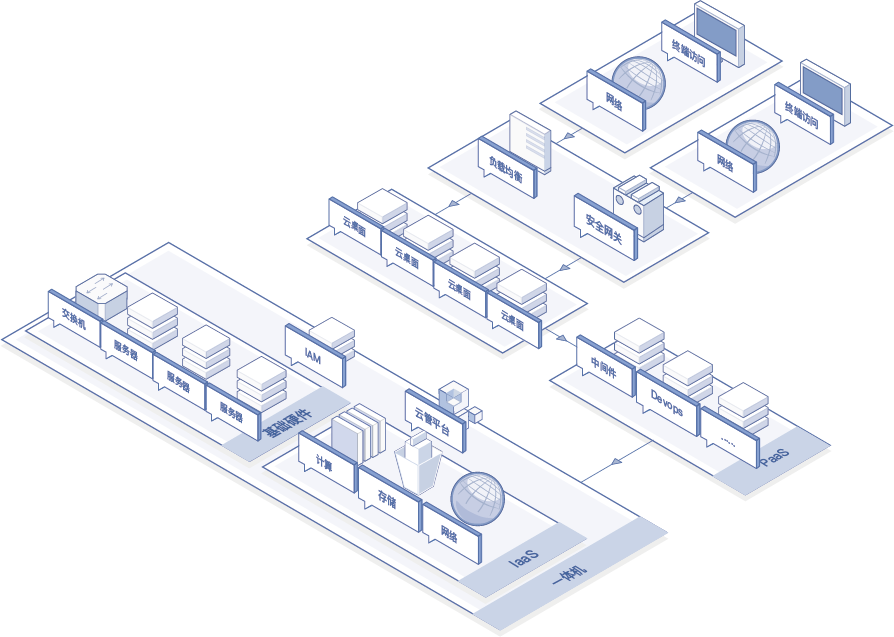
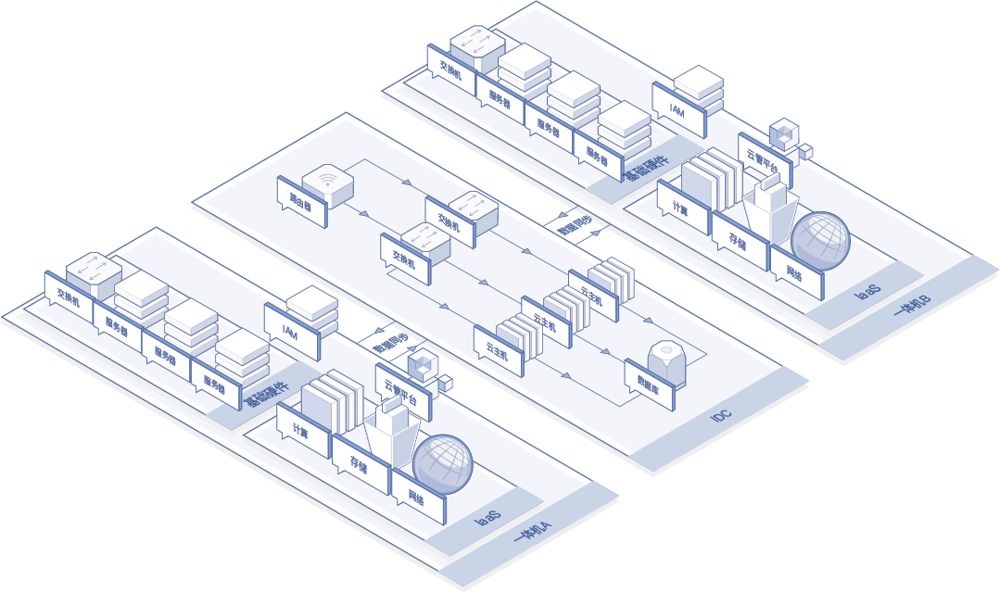
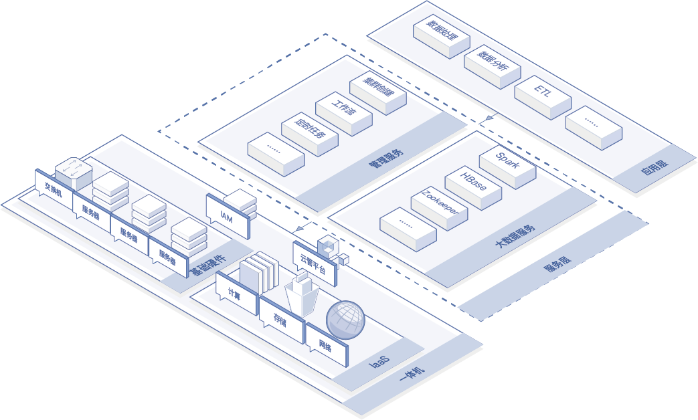
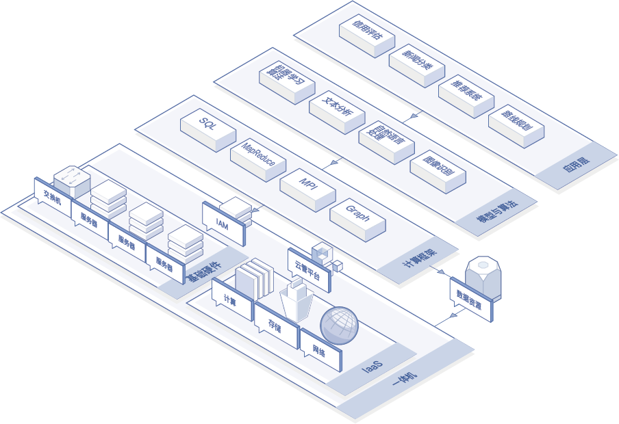

# Application Scenarios

### Support to Development and Test Environment

The development and test scenarios of traditional applications have problems such as rigid resource configuration, low utilization rate, scattered development and test cycle, low environment deployment efficiency, high cost and others. Based on the hyper-converged infrastructure, the JDStack HCI product builds the shared virtual resource pool and provides elastic cloud resources which are scheduled on demand for research, development and test personnel. The product, with minimum 3-node deployment, is lightweight and flexible, supports 24U cabinet encapsulation and can be placed in the office area of enterprise, facilitating nearby debugging by R&D personnel, having rapid iteration and agile development and saving network configuration, environment deployment and data center maintenance cost. Supporting creation of more than 200 Virtual Machines, 3 nodes meet middle-size development team demands and support horizontal extension of a single physical node or complete machine. Therefore, they realize smooth transition from the development environment to formal production environment, reduce research and development cost for enterprises and improve research and development efficiency.

### JD Cloud WorkSpaces Office for Branches

Where any enterprise or government has multiple branches, there are problems that the management architecture is scattered, the unified portal is unavailable and rapid extension cannot be made. Based on the deeply-converged architecture, JDStack HCI can provide JD Cloud WorkSpaces with the barrier platform. By creating the all-in-one machine of JD Cloud WorkSpaces, the JD Cloud WorkSpaces architecture comparable to PC desktop experiences is set up, meeting demands for remote access to office environments and access to office environments anytime and anywhere by staff of branches. 3 nodes can support more than 200 JD Cloud WorkSpaces. With the cost of less than RMB 3,000, a stable and reliable office computer applicable for live migration can be obtained. Meanwhile, via control and network isolation to access permission, it reinforces data security for branches and helps users build the IT office system of security, convenience, high performance and low cost.

### Low Cost Disaster Recovery

The infrastructure deployment speed of traditional data center cannot fit to high speed business growth. Therefore, convenient and quick solutions are required for backup and disaster recovery for key applications and business data of data centers. With the hyper-converged infrastructure, JD Cloud provides users’ key applications with disaster recovery solutions across data centers and application-level availability solutions. The hyper-converged infrastructure realizes secure data storage and management with a more economical way. Based on the high availability mechanism of virtual software level of platform, it eliminates business risks caused by fault of a single data center and greatly reduces disaster recovery cost.

### Big Data Application Scenarios

The small and mediate enterprise will produce a large number of business data and need to decompose, count and summarize these data. Based on the hyper-converged infrastructure and supported by distributed process, distributed database, Cloud Storage and virtualization technology of cloud computing, JDStack HCI provides elastic and expandable virtual resources, supports integration of big data platform to cloud platform, provides service externally as the PaaS level and helps users realize unified collection, storage and calculation of enterprise data. Meanwhile, it provides flexible resources to big data calculation, provides maximum data management, development and computation capacities with minimum physical resources, supports enterprise-level data warehouse, user profiling, knowledge graph, deep learning and text analysis and builds more enterprise-level applications.

### AI Application Scenarios

With the global growth trend of AI, AI application demands are growing among enterprises of all industries. Based on the hyper-converged infrastructure, it supports integration of AI application services to upper level and creates integrated solutions for AI software and hardware. It meets enterprises’ frequent demands for mass data governance, large-scale training samples and high-dimensional machine learning and provides enterprises with out-of-box AI capacities. Meanwhile, the hyper-converged AI all-in-one machine can serve as the application development platform, eliminating basic configuration and debugging steps of AI underlayer infrastructure and reducing AI application development threshold for enterprises.

