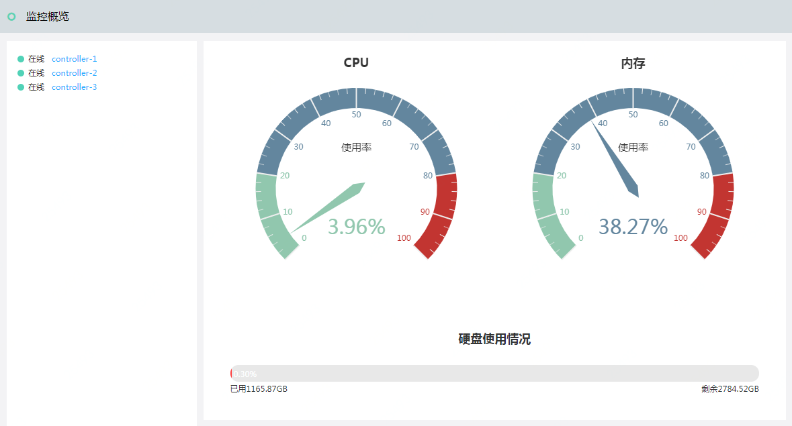
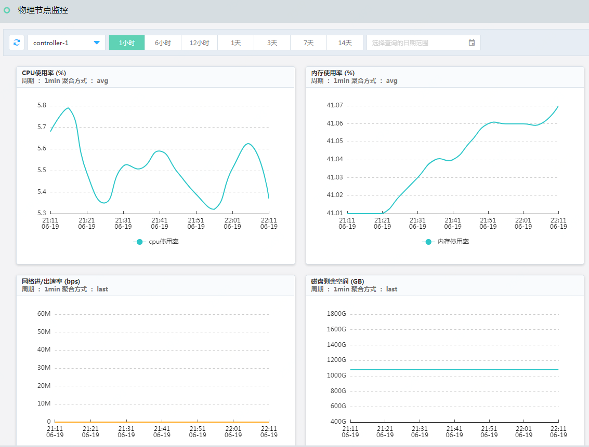
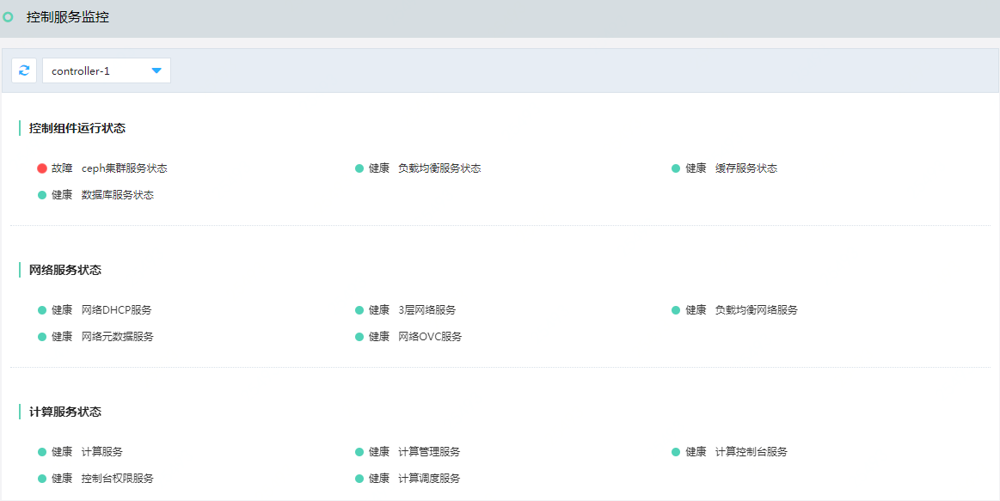
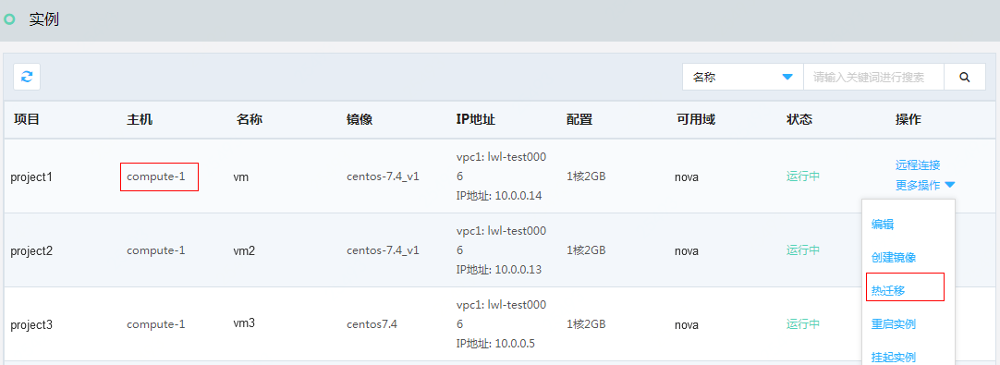
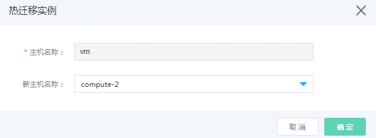
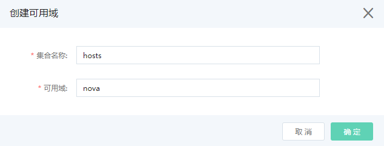
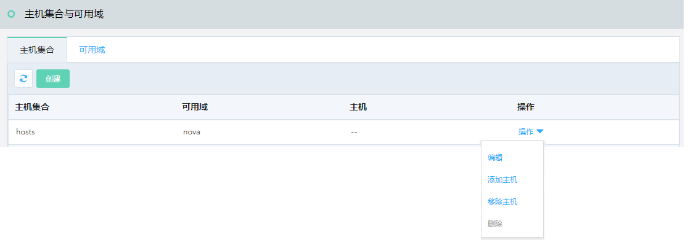
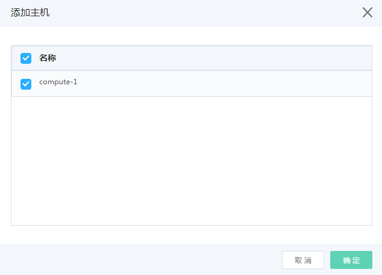
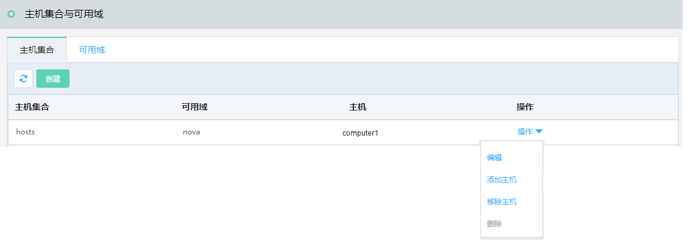

# Operation and Maintenance Monitoring

Operation and maintenance administrator is created by system administrator or superior organization background administrator. After logging in the platform as an operation and maintenance administrator, it has permissions to view resource monitoring information, virtual assets and physical asset management.

The common features are described as follows:

## Resource Monitoring

### Monitoring Overview

Access the navigation bar on the left side and click **Operation and Maintenance Monitoring**>**Resource Monitoring**>**Monitoring Overview** to enter the monitoring overview page, as shown in Figure: Monitoring Overview page.

Figure: Monitoring Overview page

On this page, you can view the online status, platform CPU, memory and disk utilization of all nodes.

### Physical Node Monitoring

Access the navigation bar on the left side and click **Operation and Maintenance Monitoring**>**Resource Monitoring**>**Physical Node Monitoring** to enter the physical node monitoring page, as shown in Figure: Physical Node Monitoring page.

Figure: Physical Node Monitoring page

### Control Service Monitoring

Access the navigation bar on the left side and click **Operation and Maintenance Monitoring**>**Resource Monitoring**>**Control Service Monitoring** to enter the control service monitoring page, as shown in Figure: Control Service Monitoring page.

Figure: Control Service Monitoring page

On this page, you can view monitoring details of every control service.

## Virtual Asset Management

### Instance Management

Access the navigation bar on the left side and click **Operation and Maintenance Monitoring**>**Virtual Assets**, then you can view the virtual resource usage served by JDStack platform, including the Virtual Machines list of every physical node, as shown in Figure: Instance List page.

Figure: Instance List page

On this page, you can conduct remote connect, edit, create image, hot migration, reboot instance, suspend instance and delete to virtual asset instances.

### Virtual Machines Hot Migration

Access the navigation bar on the left side and click **Operation and Maintenance Monitoring**>**Virtual Assets**>**Instance** to enter the instance page, as shown in Figure: Instance List page.

Figure: Instance List page

On this page, you can see that the machine name of instance vm is computer-1; click **Hot Migration** in the right operation list to pop up the hot migration page, as shown in Figure: Hot Migration page.

Figure: Hot Migration page

On this page, select the target machine of hot migration and click **OK** to pop up the migration succeeded notification, and then on the instance list page, you can see the new machine information, as shown in Figure: Instance List page.

Figure: Instance List page

On this page, you can see that the instance vm is transferred from machine computer-1 to machine computer-2 by hot migration, that is, you have completed the hot migration.

## Physical Asset Management

### Machine Management

Access the navigation bar on the left side and click **Operation and Maintenance Monitoring**>**Physical Assets**, then you can view the physical resource served by JDStack platform, as shown in Figure: Machine List page.

Figure: Machine List page

On this page, you can enable and disable services of machine nodes. If the service is disabled, the original Virtual Machines will not be affected and the new Virtual Machines will be scheduled to other machine nodes.

### Machine Aggregate Management

The machine aggregate and available domain functions are used to manage the machine nodes. You can designate the associated available domain by creating machine aggregate. In the machine aggregate created, you can add machine nodes that can be attached to multiple machine aggregates at the same time. As shown in Figure: Machine Aggregate and Available Domain List page.

Figure: Machine Aggregate and Available Domain List page

The machine aggregate and the available domain are managed by switching tags. The below text describes how to create machine aggregate.

On the machine aggregate list page, click **Create** to pop up the create machine aggregate page, as shown in Figure: Create Machine Aggregate page.

Figure: Create Machine Aggregate page

On this page, enter the names of machine aggregate and available domain and click **OK**; after the "Creation Succeeded" notification pops up, you can see the machine aggregate and available domain created on the machine aggregate list page, as shown in Figure: Machine Aggregate List page.

Figure: Machine Aggregate List page

On this page, click **Add Machine** operation item in the operation list to pop up the add machine page, as shown in Figure: Add Machine page.

Figure: Add Machine page

On this page, select the information of machine to be added and click **OK**; after the addition succeeded notification pops up, on the machine aggregate and available domain list page, you can see the added machine information, as shown in Figure: Machine Aggregate List page.

Figure: Machine Aggregate List page

On this page, you can also edit, remove machine and delete the machine aggregate.

### Available Domain

Access the navigation bar on the left side and click **Operation and Maintenance Monitoring**>**Physical Assets**>**Available Domain**, then you can view the available domain information, as shown in Figure: Available Domain List page.

Figure: Available Domain List page

