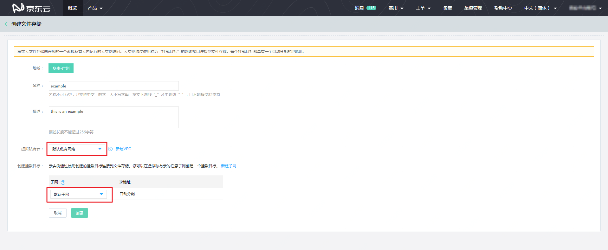
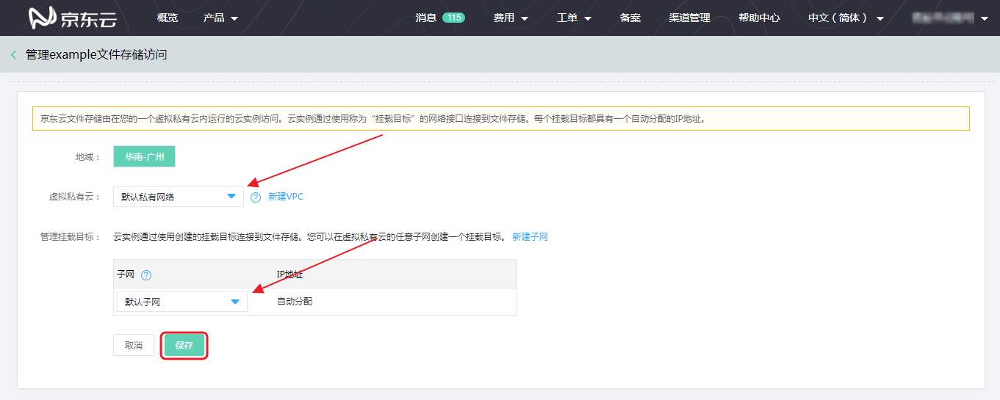

# Creating Mount Target

When your Cloud Instance uses File Storage, it needs to connect to the File Storage through a network interface called "Mount Target." Each mount target is provided with an automatically-allocated IP address.

There are two methods to create a mount target:

1. Create while creating File Storage;
2. Create by “Manage File Storage Access”.

**Create while creating File Storage:**

In **Create File Storage**, you need to select **Virtual Private Cloud** and **Subnet** in **Create Mount Target**. After completing the selection of these two items, an attached target was created within the selected **Virtual Private Cloud** and **Subnet** while creating File Storage for the File Storage.

Create in Manage File Storage Access:

on the file storage list page or file storage information page to enter the mount target management page of the File Storage. An existing **Virtual Private Cloud** and **Subnet** have been selected by default on the page. Please select the same Virtual Private Cloud as your VM instances in which are going to mount this file storage. When the selection is complete, click **Save** to create a mount target for the File Storage.

