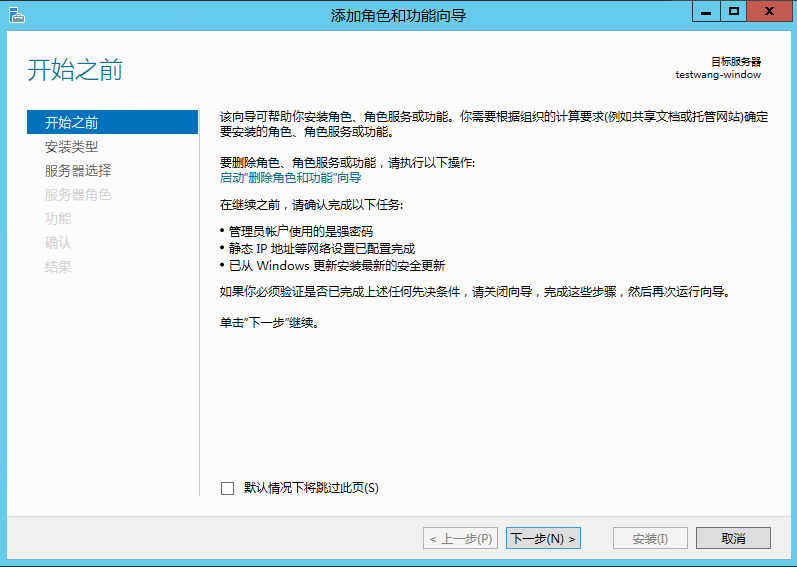
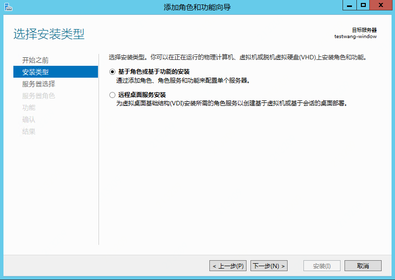
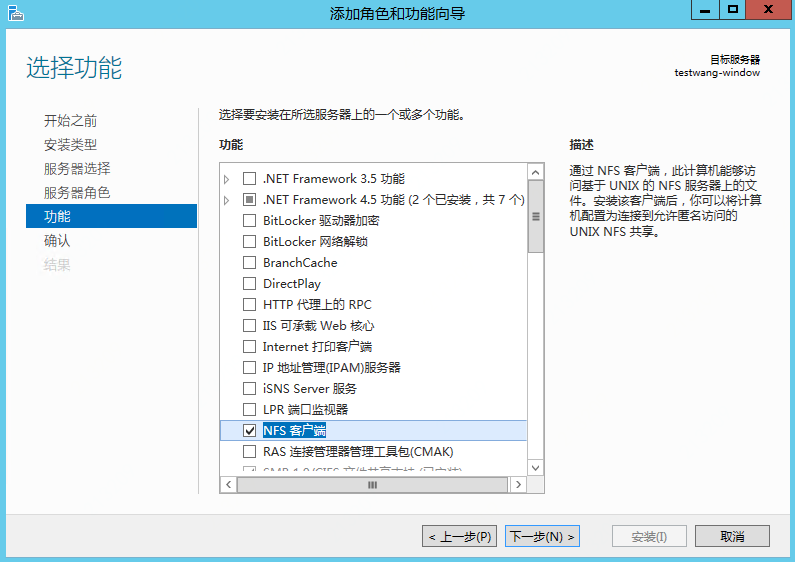
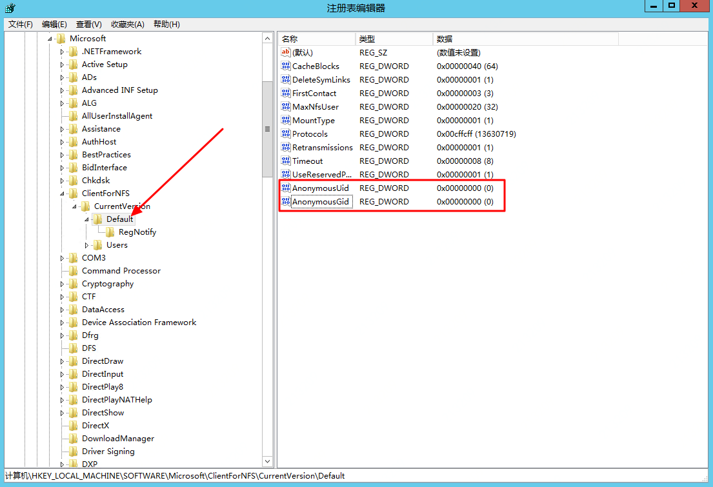
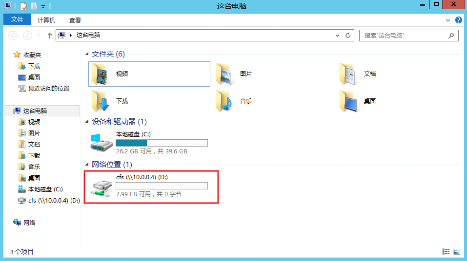

# windows Attach Cloud File Service (Beta)

Windows Server 2008, Windows Server 2012 R2 and Windows Server 2016 are supported to use NFS 3.0 Protocol. You can attach JD Cloud File Service (CFS) by installing the NFS client on the operating systems of the above versions.

## Operation Steps

Here's an example of Windows Server 2012 to describe the steps to attach the Cloud File Service (CFS) in the Windows Server operating system. The operation steps of Windows Server 2008 and Windows Server 2016 are similar.

1. Log in JD Cloud, and create the Virtual Machine of Windows operating system on the Control Console. To create operations, you can refer to https://docs.jdcloud.com/en/virtual-machines/create-windows-instances

2. After VM instance Creation succeeded, connect and log in to the Virtual Machine via a Console or remote desktop. Install NFS client function.

   You can choose to install using PowerShell or server manager.

   2.1 Server Manager Installation

   1) Open the "Server Manager" function, click **Add a Role and Function**, and then click **Next**;

	2) Enter "Installation Type", choose "Role-based or Function-based Installation" by default, and click **Next** without modification;

	3) Enter "Server Selection", choose the current server by default, and click **Next** without modification;

	4) Check "NFS Client" in "Function" and click **Next**;

	5) Click the **Install** button in the "OK" window to start the installation.

2.2 windows PowerShell Installation

Open windows PowerShell and execute:

 `install-windowsfeature nfs-Client` 

2.3 Regardless of which method is used to install the NFS client, **Reboot is needed** after installation to complete the installation of the NFS client.

3. After the Reboot, you need to modify the registry to get root permission to read and write the directories and files in the CFS, and the method is as follows:

   3.1 Press win+R, enter regedit or find regedit in application search, and run the registry editor.

   

   3.2 Find the item of HKEY_LOCAL_MACHINE\SOFTWARE\Microsoft\ClientForNFS\CurrentVersion\Default in the registry, and add two REG_DWORD values of AnonymousUid and AnonymousGid to 0.

   After the modification is completed, the virtual machine will be rebooted so as that the registry modification can take effect.

   

4. Reboot the Virtual Machine to complete the installation of nfs-client and make the modified registry take effect.

5. After rebooting the virtual machine, open cmd and execute:

    `mount -o mtype=hard \\10.0.0.4\cfs d:` 

   Wherein 10.0.0.4\ CFS is an attached target, please adjust according to your actual attached target address; d: is a target drive, which can be adjusted according to the drive you need to attach; the recovery behavior is hard when -o mtype=hard is specified as an exception, that is, when the CFS service exception occurs, nfs-client will continue to retry until the connection is reconnected.

   After successfully attaching, as shown in the figure below, you can also see the attached CFS service in "Resource Manager".

   

   

   
