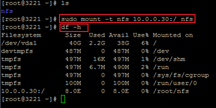

# Attach File Storage

1. To attach the File Storage in the JD VM Instance, you need to log in to your VM Instance terminal first. See: [Login to Linux Instance](https://docs.jdcloud.com/en/virtual-machines/connect-to-linux-instance)

2. Install utils client:

Run the commands below under CentOS terminal:

`sudo yum install –y nfs-utils`

Run the commands below under Ubuntu terminal:

`sudo apt-get install nfs-common`

3. Create directory, such as creating directory named as nfs:

`sudo mkdir nfs`

Ubuntu system runs the commands below:
`mkdir nfs`

4. Attach the File Storage by the IP address of the mount target. The IP address of the mount target can be viewed on "Console-Storage and CDN-Cloud File Service-File Storage" page after clicking the ID of the File Storage.

For example, the directory of the Mount target is 10.0.0.30:/cfs, which is attached to the nfs directory created in the previous step. **Note: The attach command defaults NFS agreement to be 4.0 Version, and mounting via NFS v3 Version is suggested. In case of attaching, the relevant parameters can be added depending on different requirements for version, performance and consistency. For more details, please see the descriptions at the end of the text.**

`mount -t nfs -o vers=3 -o noresvport 10.0.0.30:/cfs nfs`

Run the commands below under Ubuntu terminal:

`mount -t nfs -o noresvport 10.0.0.30:/cfs nfs`

5. Verify if the attachment is successful by running commands below:

`df -h`

After the attach is successful, "Filesystem" will appear as the mount target IP:/cfs, and "Mounted on" will be the record of the specified directory in the previous step.

**Note**

1. The Cloud File Service does not support the use of data encryption during transmission. That is, the following commands are not supported for attaching the file system.

mount -t nfs -o tls 10.0.0.30:/cfs nfs

2. When attaching the File Storage, the default values for the attach options are as follows. In most cases, avoid modifying the default parameter values to avoid performance or stability impact:
- -o lookupcache=all : When setting to cache the directory on files storage or not, the value can be set as: all,none,pos. The default all means you trust the data in the cache. When the value is none, the directory shall not be cached, which is conducive to the data consistency when different nodes attach files for storage at the same time, but the performance of readdir operation will be affected. When the value is pos (or positive), the nfs client will verify cache the cache on read.
- -o ac: set to cache the attribute data of files or not. The default ac means to cache the file attribute. The value set as noac is conducive to the data consistency when different nodes attach files for storage, but the performance to read files will be affected.
- rw: attach in read/write mode. When the value is set as -ro, attach in read mode only.
- relatime: When accessing a file, atime is updated only when atime is earlier than the file's change time.
- vers=3: NFS protocol version is 3.0
- rsize=1048576 : Set the maximum number of bytes of data that the NFS client can receive for each network READ request. This value is applied when reading data from a file on the File Storage. It is set to the maximum value by default: 1048576.
- wsize=1048576: Set the maximum number of bytes of data that the NFS client can send for each network WRITE request. This value is applied when reading data from a file on the File Storage. It is set to the maximum value by default: 1048576.
- namlen=255: Set the longest file name allowed by the remote server to be 255 bytes.
- hard: Set the recovery behavior of the NFS client after the NFS request times out. When set to hard, the NFS request will continue to try again before the server replies. To ensure data integrity, a hard attach option (hard) is recommended.
- proto=tcp: Attach using the TCP protocol.
- timeo=600: Waiting response time for NFS request retry, which is set to 600 deciseconds (60 seconds) by default. Too small timeo parameter value may cause performance degradation.
- retrans=2: The number of NFS client retry requests, which is set to 2 by default.
- noresvport: The NFS client uses the new Transmission Control Protocol (TCP) source port each time the network connection is re-established. It helps ensure that the CFS file system has uninterrupted availability after a network recovery event.

# Configure automatic attaching

1. By editing /etc/fstab files, automatic attaching of CFS file systems in the Linux system can be realized. Execute
  `vi /etc/fstab`

2. Press the key "i" and enter the edition mode. Add the following characters at the last row of the document:

   `10.0.0.66:/cfs /mnt nfs nfsvers=3,noresvport,_netdev 0 0`

  Where,
   `10.0.0.66:/cfs` is the target attaching address of file storage; please replace it with the target attaching address of file storage to be attached;
  `/mnt` refers to the position expected to be attached and can be replaced depending on demands;
  `nfsvers=3` refers to that the protocol version nfs v3 is designated for attaching. It is suggested to attach this version now, so as to avoid some known issues of NFS client. If you need the version nfs v4, please replace with: `nfsvers=4.0`
  `noresvport` helps ensure that the CFS file system has uninterrupted availability after a network recovery event.
  `_netdev` makes sure that the nfs mount operation is conducted after the network is ready and reduces failure risks of automatic attaching.
  
3. Press the "ESC" key, enter "wq" (save and equit) and press the "Enter" key. Then the fstab configuration file is updated and automatic attaching configuration is completed. In such case, current file storage can be unmounted and `mount -a` is executed for checking whether the configuration succeeds. 
