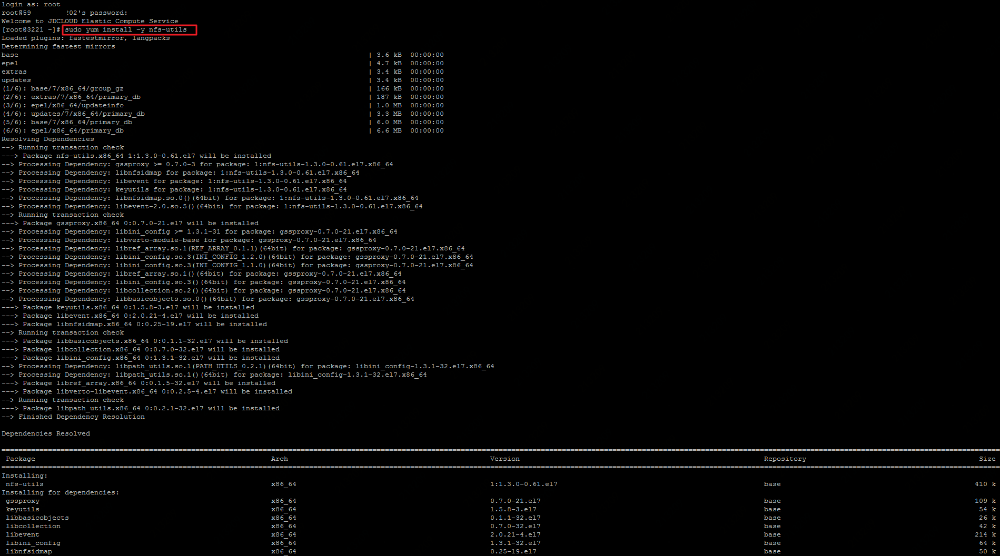

# Attach File Storage

1. To attach the File Storage in the JD VM Instance, you need to log in to your VM Instance terminal first. See: [Login to Linux Instance](https://docs.jdcloud.com/en/virtual-machines/connect-to-linux-instance)

2. Install utils client:

Run the commands below under CentOS terminal:

`sudo yum install –y nfs-utils`

Run the commands below under Ubuntu terminal:

`sudo apt-get install nfs-common`

3. Create directory, such as creating directory named as nfs:

`sudo mkdir nfs`
Ubuntu system runs the commands below:
`mkdir nfs`

4. Attach the File Storage by the IP address of the mount target. The IP address of the mount target can be viewed on "Console-Storage and CDN-Cloud File Service-File Storage" page after clicking the ID of the File Storage.

For example, the IP address of the Mount target is 10.0.0.30, which is attached to the nfs directory created in the previous step. **Note that the default NFS protocol for the attach tool is 4.1 version, so the attach commands for CentOS 7.2 and below are slightly different:**

**CentOS 6.9 to CentOS 7.2 versions run commands below:**

`sudo mount -t nfs,nfsvers=4.0 10.0.0.30:/ nfs`

CentOS 7.3 and above versions run commands below:

`sudo mount -t nfs 10.0.0.30:/ nfs`

Run the commands below under Ubuntu terminal:

`mount -t nfs 10.0.0.30:/ nfs`

5. Verify if the attachment is successful by running commands below:

`df -h`

After the attach is successful, "Filesystem" will appear as the mount target IP, and "Mounted on" will be the record of the specified directory in the previous step.

**Note**

1. The Cloud File Service does not support the use of data encryption during transmission. That is, the following commands are not supported for attaching the file system.

sudo mount -t nfs -o tls 10.0.0.30:/ nfs

2. When attaching the File Storage, the default values for the attach options are as follows. In most cases, avoid modifying the default parameter values to avoid performance or stability impact:

- rw: load in read/write mode
- relatime: When accessing a file, atime is updated only when atime is earlier than the file's change time.
- vers=4.1: NFS protocol version is 4.1
- rsize=1048576 : Set the maximum number of bytes of data that the NFS client can receive for each network READ request. This value is applied when reading data from a file on the File Storage. It is set to the maximum value by default: 1048576.
- wsize=1048576: Set the maximum number of bytes of data that the NFS client can send for each network WRITE request. This value is applied when reading data from a file on the File Storage. It is set to the maximum value by default: 1048576.
- namlen=255: Set the longest file name allowed by the remote server to be 255 bytes.
- hard: Set the recovery behavior of the NFS client after the NFS request times out. When set to hard, the NFS request will continue to try again before the server replies. To ensure data integrity, a hard attach option (hard) is recommended.
- proto=tcp: Attach using the TCP protocol.
- timeo=600: Waiting response time for NFS request retry, which is set to 600 deciseconds (60 seconds) by default. Too small timeo parameter value may cause performance degradation.
- retrans=2: The number of NFS client retry requests, which is set to 2 by default.
- noresvport: The NFS client uses the new Transmission Control Protocol (TCP) source port each time the network connection is re-established. It helps ensure that the EFS file system has uninterrupted availability after a network recovery event.

