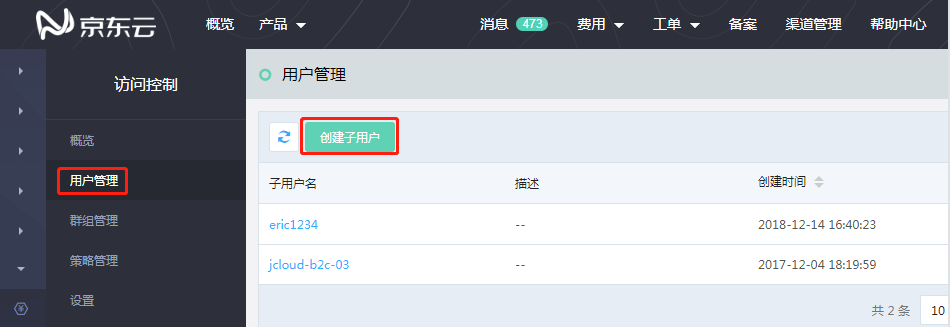
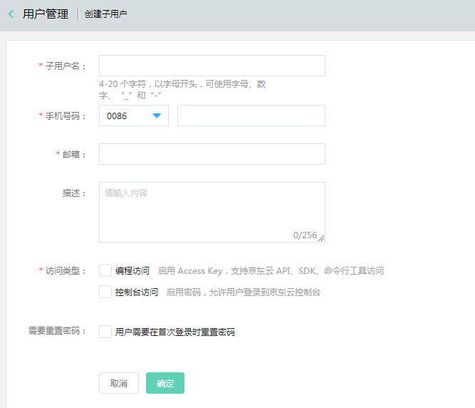
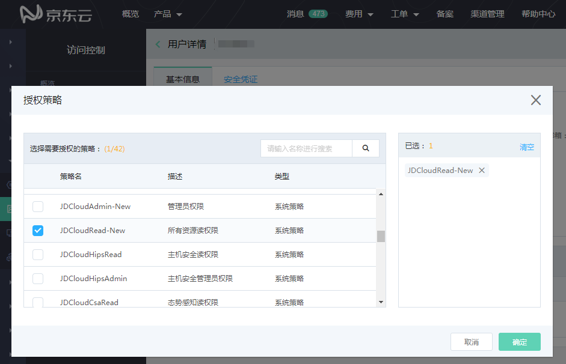
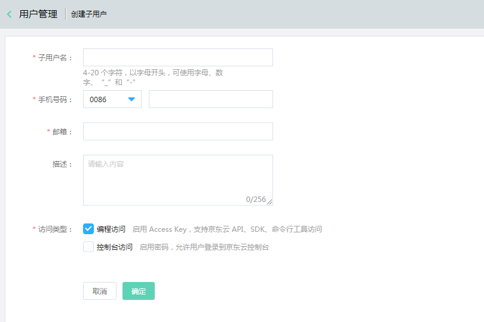
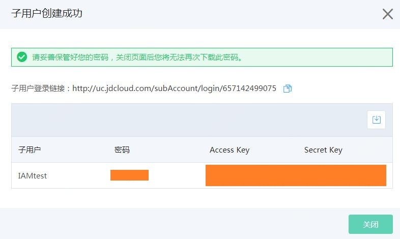
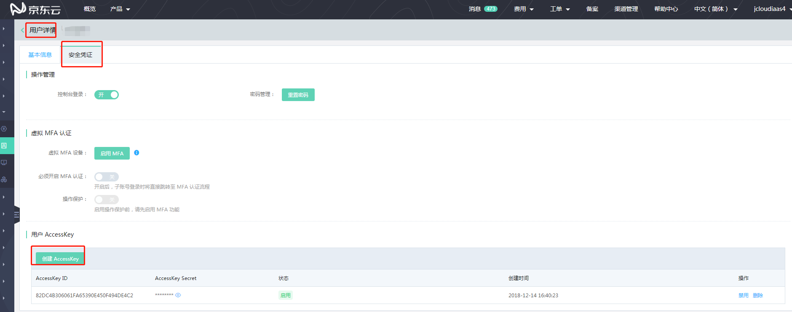

# Authorize the sub-account to access OSS
### Glossary
For detailed IAM introduction, please go to [IAM Overview](https://docs.jdcloud.com/cn/iam/product-overview).

### Relevant Terms of Identity Management
#### Primary Account
The primary account is also known as root account, which is the subject of the ownership and billing of JD Cloud resources. It is created by the system when the user registers and activates JD Cloud. The primary account pays for all resources under its name and has full access to all JD Cloud services and resources.

#### Sub-user
Sub-user, also called as sub-account, is a kind of entity identity that has a definite user name, password and AK/SK and it is usually corresponding to a certain definite entity. The user name of the sub-user is created by the primary account. The sub-user is not a unique JD Cloud account,
it belongs to primary account and can be seen under the space of the primary account. It only has resource use right, but ownership of resources.
The sub-user has no independent metering and billing, the using charge of resources will be recorded in the bill of the primary account uniformly. The sub-user must be granted by the primary account to login console or use Open API to operate resources granted by the primary account.
#### Group
It is sub-user group that is a collection of sub-users. The primary account can use group to conveniently manage multiple sub-users with same permissions and also change user permissions by adding in or remove sub-users from a group.

# Sub-account Permission Configuration Process

- Step 1: Create a sub-account

 A sub-account can be created at the IAM console, and configured and granted with sub-account access permissions. The specific actions are as follows:
 
 1. Log in to the [IAM Console](https://iam-console.jdcloud.com/summary), click **User Management** in the left menu bar, and click **Create a Sub-user**:
 
 
 
2. Fill in the user related information as required.

- Step 2: Grant permissions to the sub-account

In accordance with the policy selection provided by the system, simple policy [System Policy] can configures, for example, OSS administrator permissions, read and write permissions, etc. To configure more complicated policies, please use [Policy Management] - [Create a Customized Policy].

3. Method 1: Access the sub-user list, click **Authorization** to quickly grant the appropriate [System Policy] to the sub-user.

Method 2: Use a customized policy as the responsible policy, click **Policy Management** in the left menu bar, and click **Create a Policy

Support visual policy generator and policy editor

If policy editor is used, enter the policy name, enter json in the edit box, and specify the IAM policy.

4. After creating the customized policy succeeds, go back to the access sub-user list, click **Authorization**, grant the [Customized Policy], and complete the association between the sub-account and the policy.

This document also describes several typical scenarios with the following policy examples. See details in [IAM Policy-based Permission Control - IAM Policy Example](../../Operation-Guide/Access-Control/Access-Control-Base-On-IAM-Policy.md). You can directly replicate the customized policy to the editor.

- Step 3: Use the sub-account to access the primary account OSS resource (the current OSS console does not support the sub-account)
OSS access (API or SDK) needs the following resources: AccessKeyId, and AccessKeySecret.
When the sub-account is used to access OSS resources, using AccessKeyId and AccessKeySecret of the sub-account is required. You can select to create an (Access Key) for the sub-account when creating the sub-account or log in to the access management console to create the AccessKeyId(Access Key) and AccessKeySecret(Secret Key) of the sub-account.

Method 1: Select to create a sub-account (Access Key) when creating a sub-account

Method 2: Log in to the access management console to create or view the Access Key and Secret Key of the sub-account.

Then use the sub-account AccessKeyID and AccessKeySecret, and utilize OSS API or SDK to access OSS. The action is the same as that of the primary account.

### Use the Bucket policy to authorize the sub-account

In addition to IAM policy, you can also use the Bucket policy authorize the sub-account. For specific authorization steps, please see [Bucket policy - Access Permission Setting](../../Operation-Guide/Manage-Bucket/Set-Bucket-Policy-2.md).

