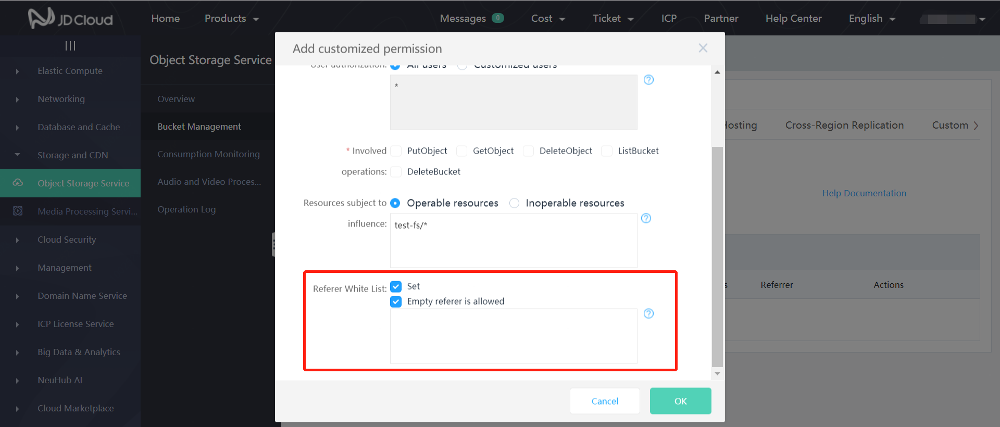

# Best Practices of Bucket Policy

Due to the space permission management upgrade of Object Storage Service, to protect your business and use against influence and to guarantee the understanding to the permission and function of the new version (Bucket Policy), relevant descriptions will be listed in this document.

Once the Bucket Policy function is launched, the original Bucket ACL will be expanded from "Private" and "Public Read" to support "Private", "Public Read", "Public Read and Private Write" and "Customized Permission". In which, the "Customized Permission" is used as the senior permission setting of Bucket and you can carry out the permission management to the user and resource in the customized permission;

Once the function is upgraded, the original Referer in the console must be set in the Bucket Policy of the "Customized Permission". For specific details, please refer to the figure below:



To ensure that the system acts consistently (with the semantic rules unchanged) before and after the Bucket with the Bucket ACL and  Referer setting is launched, please smoothly migrate the permission policy, if the Referer is set before. The authentication logics for different conditions are as follows:

|Original Bucket ACL|Original Referer rules| Processing method after launch of Bucket Policy|Rule description|
|-|-|-|-|
|Public Read and Private Write|Blank Referer is allowed<br>No Referer is added in the White List|The system will automatically add one Policy for you, with the format: Statement: [ {"Action":["s3:GetObject"], "Effect":"Allow", "Principal":"*", "Condition":{"StringLike":{"aws:Referer":[""]}} } ]|The semantic is that only the request access with blank Referer is allowed|
|Public Read and Private Write|Blank Referer is allowed<br> One or more Referers are added in the White List<br>for example, www.test.com|The system will automatically add one Policy, with the format: Statement:[ {"Action":["s3:GetObject"], "Effect":"Allow", "Principal":"*", "Condition":{"StringLike":{"aws:Referer":["", "www.test.com"]}} } ]|The semantic is that the blank Referer or the request access with assigned Referer in the hit White List is allowed|
|Public Read and Private Write|Blank Referer is not allowed<br>No Referer is added in the White List|The system will not add any Policy rules for you|The Bucket permission will be set as the default permission of the system (namely, Private) and the semantic is that all requests are denied by default|
|Public Read and Private Write|Blank Referer is not allowed <br>One or more Referers are added in the White List<br>for example, www.test.com|The system will automatically add one Policy for you, with the format: {"Action":["s3:GetObject"], "Effect":"Allow", "Principal":"*", "Condition":{"StringLike":{"aws:Referer":["www.test.com"]}} }]|The semantic is that the request access with the assigned Referer in the hit White List is allowed only|
|Public Read and Private Write|Blank Referer is allowed<br>One or more Referers are added in the blacklist<br>, for example, www.test.com|The system will automatically add one Policy for you, with format: {"Action":"s3:GetObject", "Effect":"Allow", "Principal": "*", "Condition": { "NotStringLike": {"Referer": "www.test.com"}}}|The semantic is that request from one Refer is denied|
|Private Read and Private Write|As the original anti-leech chain rule is only valid to the public read and private write storage pace, the original rule can be omitted here|The system will not add any Policy statement for you|The Bucket permission will be set as the default permission by the system (namely, Private) and the semantic is that all requests are denied by default|

At present, all authorities are set at the Bucket level. We are able to set several statements for each Bucket; each statement will produce two results to one request, including Allow and Deny; each Policy may have several statements; and at most 10 Statements are allowed under one Policy. Examples and semantic interpretation are listed as below:
```
{
    "Statement":[
        {
            "Condition":{
                "StringLike":{
                    "aws:Referer":[
                        "",
                        "www.abc.com",
                        "*.123.com"
                    ]
                }
            },
            "Resource":[
                "arn:aws:s3:::ztctest1/*"
            ],
            "Action":[
                "s3:GetObject"
            ],
            "Principal":{
                "AWS":"*"
            },
            "Sid":"Refereracl",
            "Effect":"Allow"
        }
    ],
    "Id":"referer-acl",
    "Version":"2012-10-17"
}
```

Detail Specification:

Version: Fields are optional; Version, as the Policy revision number, has no specific format and content limit. The example is the version with the time identification.

Id: Fields are optional; Id, as the Policy identification, has no specific format and content limit.

Statement: It is the compulsory field and the main content of the Policy, with the paraphrasing of each sub-item as below:

|Element|Meaning|Compulsory|
|-|-|-|
|Sid|Annotation Character String of the Statement|No|
|Effect|Refer to the effect produced when matching the statement, and the option is Allow or Deny, with the annotation is "actions allowed" or "action denied"|Yes|
|Principal|Refer to the user affected by the Policy. It needs to fill in the user ID, the default value is * (i.e., it is effective to all users)|Yes|
|Action|Refer to the actions making the statement effective and the options include s3:GetObject、s3:PutObject, s3:DeleteObject, s3:ListBucket and s3:DeleteBucket|Yes|
|Resource|Refer to the resource name or resource range subject to influence, with the format of arn:aws:s3::examplebucket/*, and the semantic that it is valid for all resources under examplebucket|Yes|
|Condition|Refer to the condition making the statement effective, support Referer and SourceIP only at present|No|

The final interpretation for the semantic in the above example: For all users, the request assigning Referer (i.e. www.example.com) in the hit White List is allowed to access all resourced under this Bucket.
