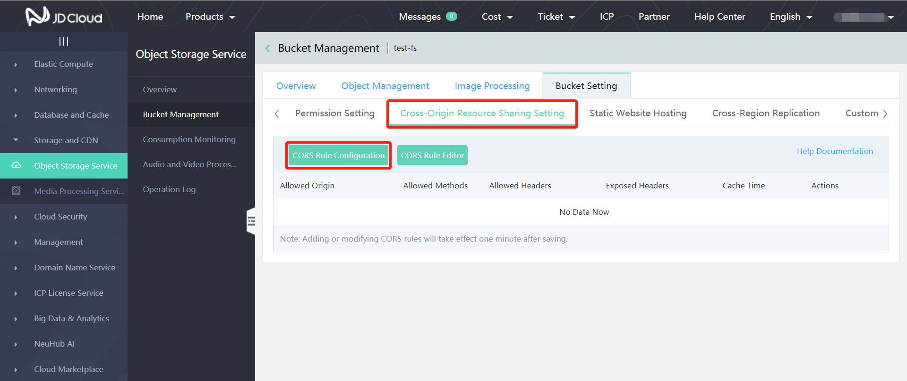
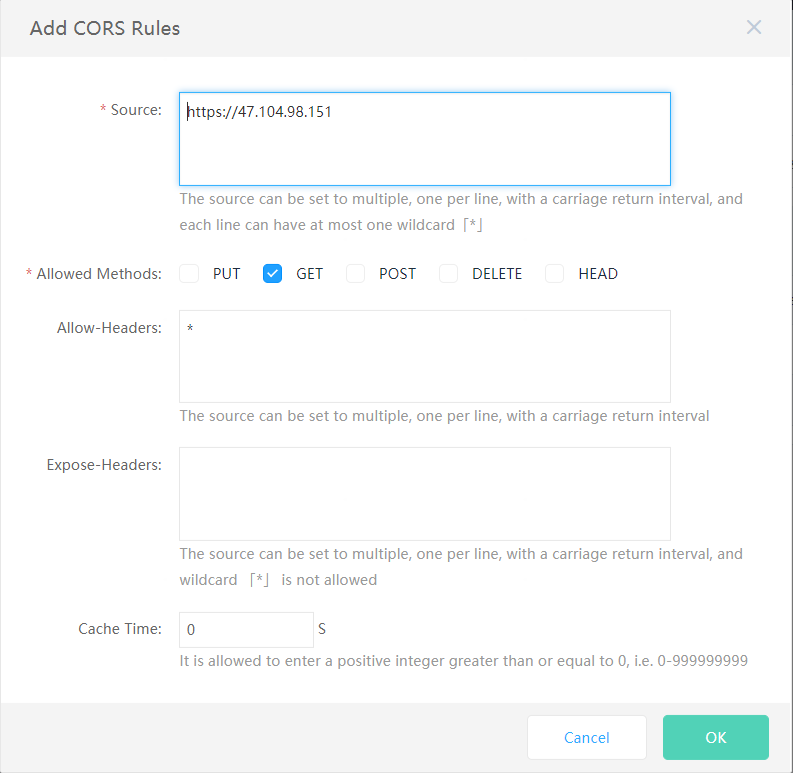

# Best Practices of Cross-region Resource Sharing

## Same-origin Policy

The same-origin policy is a method preventing a document or script loaded from one source from being interacted with resources of another source and is a key security mechanism isolating the potential malicious files. The same protocol, the same domain name (or IP) and the same port shall be deemed as the same domain; scripts within the same domain only have the permission of the domain, i.e. scripts in the same domain only can read resources of such domain and cannot access resources of other domains. The security limit is called as the same-origin policy.

The called same origin refers to the same domain name, the same protocol and the same port. The examples are as follows:

Different domain names: http://www.jd.com and http://www.jd.cn are from different sources;

Different protocols: http://www.jd.com and https://www.jd.com are from different sources;

Different ports: http://www.jd.com:80 and http://www.jd.com:81 are from different sources;

Others: http://www.jd.com/a and http://www.jd.com/b are from the same origin, because they have the same domain name protocol and port.

## Cross-origin Resource Sharing

The cross-origin resource sharing (CORS) defines the interaction method between a client Web application program loaded in one domain and resources in another domain. When any one of the protocol, domain name and port requesting URL is different from the current page address, it is cross-origin.

For example, the most common one is to call a resource in one domain name in the webpage under another domain name, such as a JavaScript script, Web fonts, etc. The browser limits cross-origin HTTP requests originating from scripts usually out of security reasons, and the default security limit is the same-origin policy. As a result, a cross-origin access check mechanism is recommended by W3C, i.e., CORS. With the mechanism, the Web application server is able to support the cross-station identity and access management, make the cross-station data transmission safer and relieve risk of cross-origin HTTP request.

## CORS Practice and Cases

Configuration steps for obtaining data from OSS by AJAX are introduced by the following simple examples. The storage bucket name used by the example is test-cors and the storage bucket access permission is public read and private write.

**Preparation Conditions**

1.Upload the file cors.html with the content of "successful request" in the test-cors storage bucket. Click **Obtaining Address** and the access address of the object, cors.html, is displayed: http://test-cors.oss.cn-east-1.jcloudcs.com/cors.html.

2.Disable the browser’s cache function, to prevent the mismatch to the CORS requirements due to the reason that the browser caches the heater content returned by the server last time and to prevent influence to request result. Taking chrome for example, open the "Developer Tools" and check "Disable cache".


**Cross-origin Request Practice**

1.Confirm if the file is addressable

Access cors.html via curl, display the file content "Request Successful" and ensure that the object is able to be accessed normally.
```
curl http://test-cors.oss.cn-east-1.jcloudcs.com/cors.html
```


2.Use AJAX access file

Directly access the cors.html file with the AJAX technique

Write a simple HTML file at first, copy the following codes into the local, save the same as the HTML file, host the webpage in the virtual machines with the IP address of 47.104.98.151. Therefore the address of the webpage is http://47.104.98.151/cors-test.html (The test address does not support the access. If you need access the test address, please configure such address by yourself).

```
<!DOCTYPE html>
<html>
<head>
<meta charset="utf-8">
<script>
function loadXMLDoc() {
        var xmlhttp;
        if (window.XMLHttpRequest) {
                xmlhttp=new XMLHttpRequest();
        }
        else {
                xmlhttp=new ActiveXObject("Microsoft.XMLHTTP");
        }
        
        xmlhttp.onreadystatechange=function()
        if (xmlhttp.readyState==4 && xmlhttp.status==200) {
              document.getElementById("myDiv").innerHTML=xmlhttp.responseText;
        }
        
        xmlhttp.open("GET","http://test-cors.oss.cn-east-1.jcloudcs.com/cors.html",true);
        xmlhttp.setRequestHeader('test','GET');
        xmlhttp.send("");
}
</script>
</head>

<body>
<h2>Test CORS</h2>
<button type="button" onclick="loadXMLDoc()">Request Data</button>
<div id="myDiv"></div>
</body>
</html>
```

3.Page Access

Enter "http://47.104.98.151/cors-test.html" in the Chrome browser to log into the test page, click **Data Request** button and the following error is shown. Error notification: You have no access permission and the reason is the Header, Access-Control-Allow-Origin, is not found.


When logging in the Header page to check request again, the Request with Origin, sent by the browser, is found. Thus, this is a cross-origin request. There, the error is due to the reason that the server is not configured with CORS.


4.Setting CORS

Log in console -> Object Storage Service -> Space Management -> Log in bucket test-cors -> Space Setting -> Cross-origin resource sharing setting.Clicking CORS statement configuration to log in the configuration page.



Adopt the loosest configuration in the configuration page: the Origin is http://47.104.98.151, the operation method is GET, the Allow-Headers are * and the cache Max Age is 0, as shown in the figure below.



5.Verification Result

Please try to access the cors.html file again after completing configuration. Cross-origin access to success.


