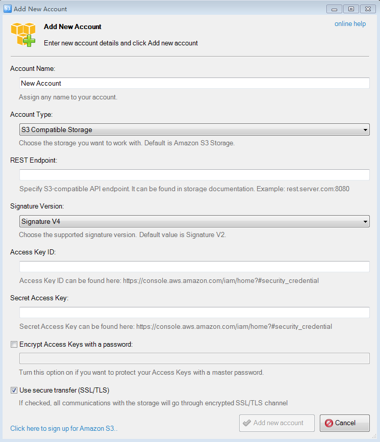
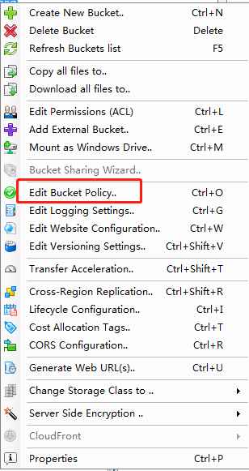
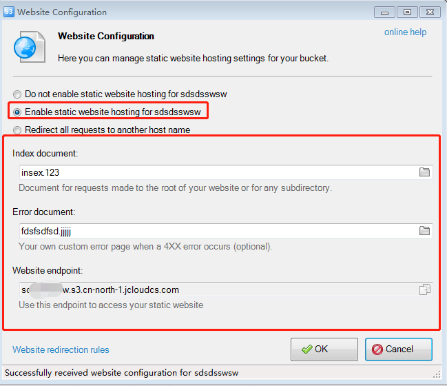
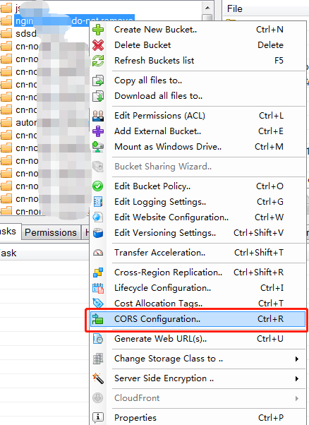
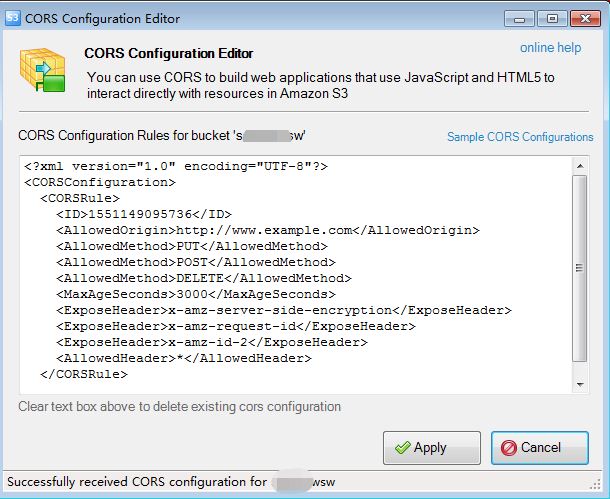
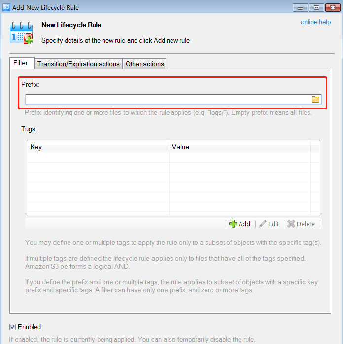
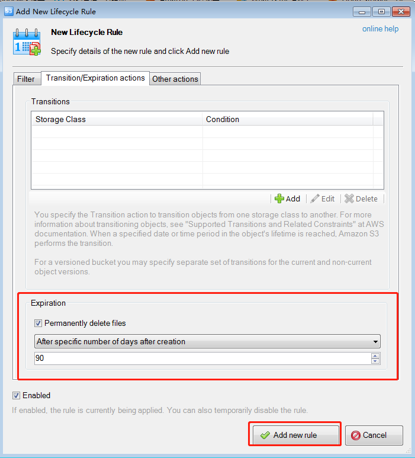
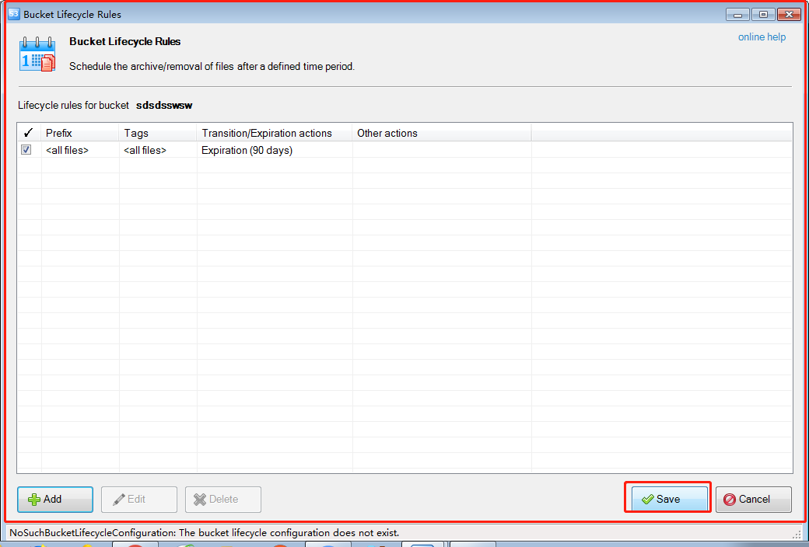
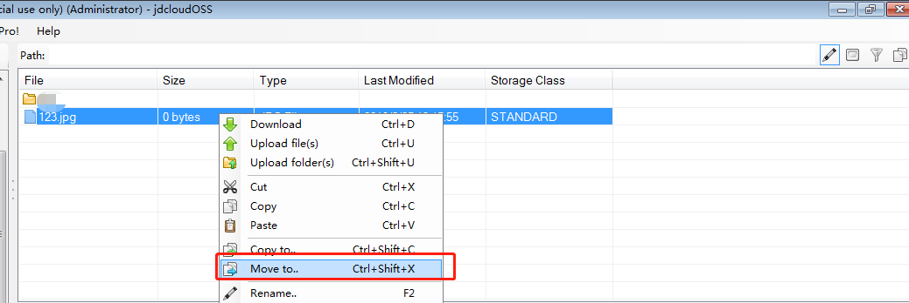

# Use s3browser to Manage OSS
s3browser is an easy to use client that manages S3. JD Cloud OSS is compatible with Amazon S3 API, you can use s3browser to manage JD Cloud OSS. For details, see [Compatible APIs](https://docs.jdcloud.com/cn/object-storage-service/compatibility-api-overview). 

* Installation: [Install s3browser](Manage-OSS-With-s3browser#user-content-1)
* Use s3browser to Access OSS: [Use s3browser to Access OSS-Add Users](Manage-OSS-With-s3browser#user-content-2)
## List of Supported Functions
* Create Bucket: [Bucket Operations-Create Bucket](Manage-OSS-With-s3browser#user-content-3)
* Set Bucket Acl: [ Bucket Operations-Set Bucket Acl](Manage-OSS-With-s3browser#user-content-4)
* Set Bucket policy: [ Bucket Operations-Set Bucket policy](Manage-OSS-With-s3browser#user-content-5)
* Set Static Website Hosting (Website): [ Bucket Operations-Static Website Hosting (Website) Setting](Manage-OSS-With-s3browser#user-content-17)
* Delete Bucket: [Bucket Operations-Delete Bucket](Manage-OSS-With-s3browser#user-content-6)
* Set CORS: [Bucket Operations-CORS Setting](Manage-OSS-With-s3browser#user-content-15)
* Set Life Cycle Management (lifecycle): [Bucket Operations-Life Cycle Management (lifecycle) Setting](Manage-OSS-With-s3browser#user-content-16)
* Add Bucket or File Path with Permissions: [Bucket Operations-Add Bucket or File Path with Permissions](Manage-OSS-With-s3browser#user-content-7)
* List All Objects: [Object Operations-List All Objects](Manage-OSS-With-s3browser#user-content-8)
* Upload Objects: [Object Operations-Upload Objects](Manage-OSS-With-s3browser#user-content-9)
* Download Objects: [Object Operations-Download Objects](Manage-OSS-With-s3browser#user-content-10)
* Replicate Objects to OSS Bucket: [Object Operations-Replicate Objects to OSS Bucket](Manage-OSS-With-s3browser#user-content-11)
* Rename Objects: [Object Operations-Rename Objects](Manage-OSS-With-s3browser#user-content-12)
* Move Objects: [Object Operations-Move Objects](Manage-OSS-With-s3browser#user-content-13)
* Delete Objects: [Object Operations-Delete Objects](Manage-OSS-With-s3browser#user-content-14)

## Installation

1. Download Installation Package

Download Link: https://s3browser.com/download.aspx

2. Install

Just click **Install

## Use s3browser to Access OSS

###  Add Users

#### Step 1 Click **add new account** in the account drop-down list on the left

#### Step 2: Fill in corresponding parameters in the pop-up dialog box:

* Account Name: Name to display, filling in your user name will usually do;
* Account Type: S3 Compatible Storage；
* REST Endpoint:Fill in JD Cloud[Service Domain Compatible with S3](https://docs.jdcloud.com/cn/object-storage-service/regions-and-endpoints)；
* Signature Version: Select Version 4;
* Access Key ID: JD Cloud AK;
* Secret Access Key: JD Cloud SK;
* Whether to use HTTPS: OSS supports http and https, the ticked option is recommended to stay default for more security of your data, use https.

## Use s3browser to Manage OSS

### Bucket Operations

**OSS does not support [Server Access Log Management] and [Version Control] in the Bucket Operations. The cross-region replication function cannot be set because the tool can only select bucket of the same region. For [[Image Back-to-origin]](https://docs.jdcloud.com/cn/object-storage-service/manage-origin-retrieval-settings-2) and [[Customized Domain]](https://docs.jdcloud.com/cn/object-storage-service/set-custom-domain-name-2) that are not compatible with S3, please [Go to Console] (https://oss-console.jdcloud.com/space) for settings, some advanced configurations for this tool can be used after they are purchased.**

#### Create Bucket (bucket)

1. Click **New Bucket** to create bucket

2. Enter bucket name in the creation pop-up window

**Description**

* The bucket name is globally unique. If the name is already used by other users, the creation will not succeed. Please follow the [OSS Naming Specification](https://docs.jdcloud.com/cn/object-storage-service/put-bucket -2), and enter the appropriate name that identifies your business.
* When the bucket is created, the default ACL is Private Read/Write. You can change the space access permissions after creation according to your needs. Refer to[[Set Bucket Acl]](Manage-OSS-With-s3browser#user-content-4)
And[[Set Bucket policy]](Manage-OSS-With-s3browser#user-content-5)。

#### Set Bucket Acl

##### Operation Steps

1. In the Bucket list, select the bucket name you want to set, right-click and select **edit Permissions(ACL)**. It is shown in the figure below:

2. Complete the settings according to the rules supported by OSS.

##### Only Support Setting Rules:

* Private Read/Write, the corresponding setting is as in the figure:

* Public Read and Private Write, the corresponding setting is as in the figure:

* Public Read/Write, the corresponding setting is as in the figure:

* If you want to implement the refined authorization to other users, you can use JD Cloud IAM to complete the settings through the JD Cloud Console. If you only need to authorize the OSS resources permission for other JD Cloud accounts (including the primary accounts and sub-accounts) and achieve fine-grained flexible authorization, please refer to [Set Bucket policy]

**Description**

When setting up Bucket ACL, it is recommended that you use the OSS Console or SDK Settings, which is more convenient and efficient than using s3browsers.
At the same time, you need to be aware that for OSS, Bucket ACL and Bucket policy, currently you can only manage Bucket permissions through one of them, and they cannot coexist. If set at the same time, s3browsers will report an error and display an exception.

#### Set Bucket policy

1. In the Bucket list, select the bucket name you want to set, right-click and select **edit Bucket policy**. It is shown in the figure below:

2.Refer to [Bucket policy Specification](https://docs.jdcloud.com/cn/object-storage-service/access-control-base-on-bucket-policy), complete settings in the following form.

#### Static Website Hosting (Website) Setting

**Description:**

-  Do Not Currently Support **All Request Redirects**.
-  For details, refer to [Static Website Hosting Setting](https://docs.jdcloud.com/cn/object-storage-service/set-bucket-website-2), for API, please refer to[put bucket website](https://docs.jdcloud.com/cn/object-storage-service/put-bucket-website-2)。

##### Operation Steps

1. In the Bucket list, select the bucket name you want to set, right-click and select **Website Configuration**.

2. In the [Website Configuration] pop-up window, select the second radio button as shown below, and you must configure [Index document], and the configuration of [Error document ]is optional. It is shown in the figure below:

3. Click **OK** to save.

#### Deleting a Bucket

**Description:**

To delete OSS Bucket, currently the following conditions must be met:

* The bucket is empty, that is, there are no files, including unfinished shard of complete.
* The bucket does not enable cross-region replication, that is, it is not the target bucket or source bucket in cross-region replication
* There is no image style in the bucket.

##### Operation Steps

1. In the bucket list, select the bucket name to be deleted, right-click, and select **delete policy**.

2. Click **Confirm to Delete** the figure below to complete the deletion, as shown in the figure:

#### Cross-Origin Resource Sharing (CORS) Setting

**Description:**

You can use CORS to build web applications and use javaScript and HTML5 to access resources directly in OSS. For details, see [Cross-Origin Resource Sharing Setting](https://docs.jdcloud.com/cn/object-storage-service/set-bucket-cors-2), for API please refer to [put bucket cors](http://docs.jdcloud.com/cn/object-storage-service/put-bucket-website-2)。

##### Operation Steps

1. In the Bucket list, select the bucket name you want to set, right-click and select **CORS Configuration**.

2. Enter the CORS configuration in the figure below. You can click **Sample CORS Configuration** text link in the figure below to select a template in the web page, modify it according to your needs, and click **Apply** to complete the setting.

#### Life Cycle Management (lifecycle) Setting

**Description:**

* Expired Objects can be automatically deleted to facilitate maintenance and reduce cost during the use of Bucket. For details, see [Life Cycle Management](https://docs.jdcloud.com/cn/object-storage-service/lifecycle), for API please refer to[put bucket lifecycle](../API-Reference-S3-Compatible/Compatibility-API/Operations-On-Bucket/put-bucket-lifecycle.md).
* Currently only support deleting objects, and do not support **the automatic deletion of converted storage type and unsynthesized expired shard**.

##### Operation Steps

1. In the Bucket list, select the bucket name you want to set, right-click and select **lifecycle Configuration**.

2. In the [Filter] tab, you can enter or click the folder icon on the right to select the file prefix. If you need to apply all the files, you may not fill in this item. It is shown in the figure below:

3. Then, in the **Transition/Expiration actions** tab, complete the time configuration item for the expired deletion. **Transitions** to convert Object Storage Service type is currently not supported, [other actions] to complete the configuration of all request redirection is currently not supported either; then click **Add new rule** to add rules, as shown below:

4. On the **Bucket lifecycle rules** management page, click **Save** to complete the rule addition.
You can also click on the existing rules to complete the modification.

#### Add Bucket or File Path

**Description**

##### Application Scenarios:

When the primary account or sub-account is granted read permission to a bucket or a prefix file, you can manage the file and bucket in s3browser by adding external bucket.

##### Operation Steps

1. After logging in to s3browser with your account, click **Buckets** in the menu bar and select **Add External Buckets** from the drop-down box.

2. Add a file path in the **Add External Buckets** pop-up box, support adding a bucket or a folder in the bucket, save the options, as shown in the figure:

### Object Operations

**Setting object acl and customized header, tag are not supported currently.**

#### List All Objects

Click the corresponding bucket name.

As show in the figure: You can create folders, upload, download, delete files, etc.

#### Upload Objects

Click **Upload** option in the above figure to support file and folder upload. The file list will be automatically refreshed after the upload is completed.

**The free version of s3browser** supports multipart upload. It is suggested to upload the file greater than 1GB to OSS. 

#### Download Objects

* Method 1: Select the file or folder to be downloaded, click the **Download** option in the above figure, and select the storage path to complete the download.
* Method 2: Select the file or folder to be downloaded, and select **Download** in the pop-up menu.

It is shown in the figure below:

#### Replicate Objects to OSS Bucket

#####  Operation Steps

1. Right-click on the object to be replicated, support file and folder replication

2. Click **Copy to**

3. Select target bucket, then click **OK**.

#### Rename Objects

1. Right-click the object

2. Select **Rename**, enter the name in the Rename pop-up window, click **Rename**.

#### Move Objects

**Description**

This operation will delete the original objects.

#####  Operation Steps
1. Right-click the object

2. Select **Move to**

3. Select target bucket, and click **OK**.

#### Delete Objects

Support the deletion of files and folders.

#####  Operation Steps

* Method 1: Click the object, and right-click **Delete**

* Method 2: Click the object, click **Delete** under the object frame

