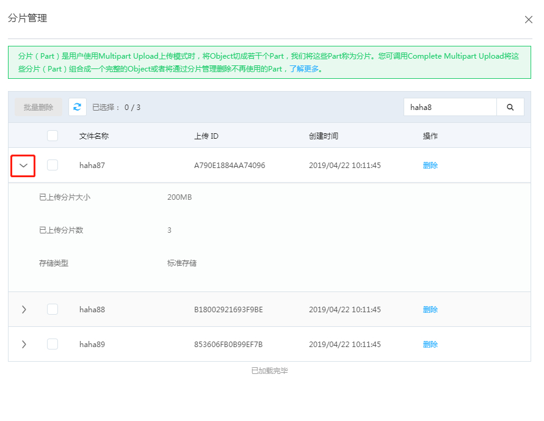

# Shard Management

In case of multipart upload, Object will be cut into several Parts, and these Parts are called shards. After you upload these Parts to OSS server, you can call CompleteMultipartUpload to combine these Parts into a complete Object.

**Description**

* Parts will be generated in case of uploading large files with the Console.
* When files are transmitted with OSS management tool supporting breakpoint upload, parts will also be generated.
* You can also realize multipart upload by direct calling of API. Please refer to [Multipart Upload](https://docs.jdcloud.com/en/object-storage-service/initiate-multipart-upload-2)
* You can call CompleteMultipartUpload to combine Parts into a complete Object. See details in [CompleteMultipartUpload](https://docs.jdcloud.com/en/object-storage-service/complete-multipart-upload-2).
* Parts cannot be read before the completion of Object. In case of Bucket deletion, the Objects and Parts in the Bucket must all be deleted first.
* Shards are mainly generated by multipart upload operation, and you can directly call to [Abort Multipart Upload](https://docs.jdcloud.com/en/object-storage-service/abort-multipart-upload-2). For deletion of uncompleted Parts, you can also delete Parts through Console shard management.

## Console - Shard Management

### Operation Steps

1. Enter [OSS Console](https://oss-console.jdcloud.com/space).

2. In the left bucket list, click the target bucket name to open the overview page of the bucket.

3. Click [Object Management] tab.

4. Click **Shard Management**, to open shard management page.

 

5. Select the uncompleted shard files, and click **Delete** or **Batch Delete**, complete deletion.

**Description**

* If all shard files in the bucket are to be deleted, you can click **Load More** to list all shard tasks, and click **Select All** and then click **Batch Delete**.
* If parts of shard files are to be deleted, you can select one by one or search the shard files with specified file name prefix, and then batch delete them.

6. In the pop-up deletion confirmation dialog box, click **OK**.

### You can view the shard details in each multipart upload task

to display the shard details in the multipart upload task. As shown in the figure:

