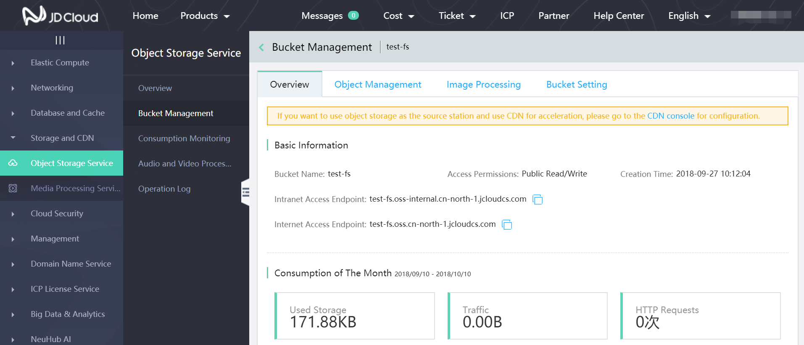

# Bucket Overview

All objects in the Object Storage Service must be stored in the bucket. Bucket is the unit that you use to manage your stored objects, and all objects must belong to a certain bucket. You can set access permissions, Anti-Leech rules, etc. for the bucket; these attributes are applied to all objects in the bucket, so you can flexibly create different bucket to complete different management functions.

The space inside the same bucket is flat, namely there is no concept of a directory of a file system, and all files directly belong to their corresponding buckets. However, you can use folders to group, classify and manage relevant files.

To access and view a bucket, select Object Storage Service->Space Management after logging in to the JD Cloud console; after entering the bucket management page, click on the bucket to be accessed, and you will enter the overview page of the bucket with the following effects:

The description related to the contents shown on this page is as follows:

1. The basic information of each bucket will include the bucket name, current access permissions, creation time, intranet access domain name and Internet access domain name;

2. Below the basic information is the utilization within one month before the current date of the Bucket, including the Bucket capacity, the downlink traffic generated through the Internet access domain name, and the number of http requests.
