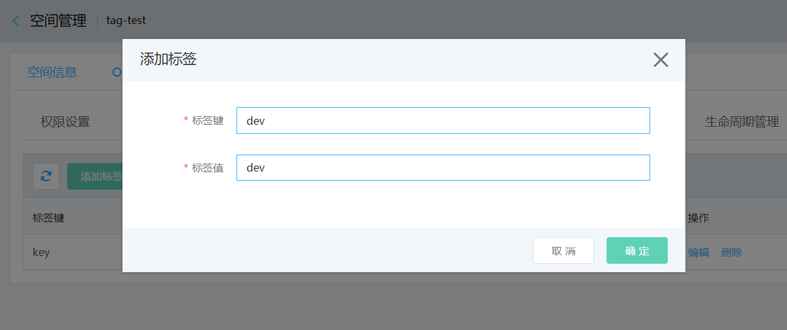

# Bucket Tag Service

## Tag Introduction

Bucket tag is a key-value pair used to identify Bucket in OSS. It can be used as an identifier managing the Bucket for users to conduct group management of Bucket.

Rules Description:
- A Bucket can set at most 50 tags;
- Tag key: Case sensitive, 128 Unicode characters at most, cannot be null;
- Tag value: Case sensitive, 256 Unicode characters at most;
- The tag key in the Bucket tag set is unique.

## Set Tag

The Object Storage Service supports adding tags through the Console. For setting steps, please refer to the following contents. For setting tags with APIs, please refer to [Put Bucket tagging](../../API-Reference-S3-Compatible/Compatibility-API/Operations-On-Bucket/Put-Bucket-Tagging.md).

1. Log in to the Console->Object Storage Service->Space Management->Enter into a Bucket->Space Setting->Tag Service. Under the page, you can view the current Bucket tag, and can add and delete tags.

2. Click **Add Tag** and enter the Add Tag page.

