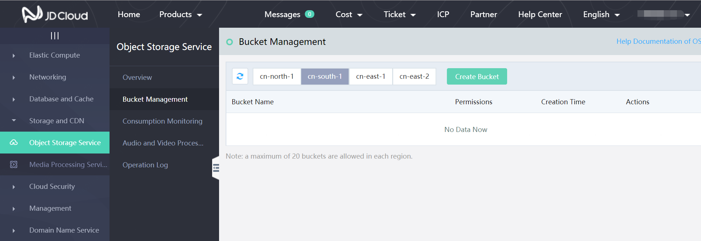
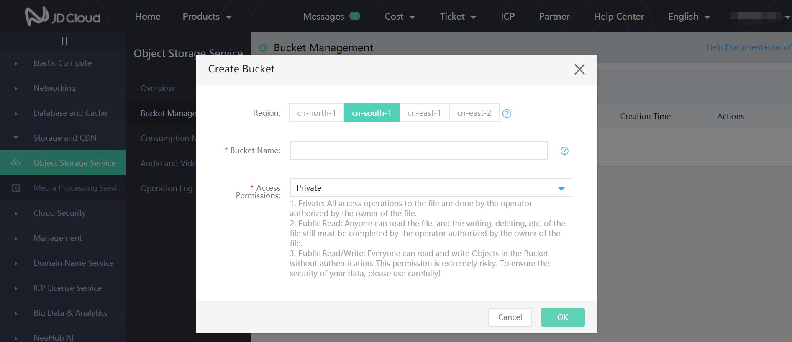

# Create Bucket

Once the Object Storage Service is provided, you need to create a bucket to save objects. The bucket creating steps are as follows:

1.Log in the JD Cloud console, select Object Storage Service -> bucket Management to log in the space management page and click the Create a new bucket:

2.Click the new Bucket and the following popup will be shown,

3.The Bucket can be created by choosing and switching different regions. At present, JD Cloud only supports four regions, including cn-north-1, cn-south-1, cn-east-1 and cn-east-2. The resource intranets of different regions can't be connected to each other, and the regions can't be changed after being created. If you need to access the Object Storage Service via the virtual machine intranet, please select the region as the same as that of your virtual machine.

4.In the bucket name text box, the naming of bucket must conform to naming specification (relevant notifications after ? of the text box). The selected bucket name must be globally universe among all current bucket names of the Object Storage Service. The Bucket name can’t be changed after being created.

5.JD Cloud's bucket supports four access permissions, “Public Read”, “Private”, “Public Readand Public Write” and “Customized Permissions” respectively

* Public Readand Public Write: Only the creator of the bucket can carry out the write action to files in the bucket, anyone (including anonymous access) can carry out the read operation to files in the bucket.

* Private Read/Write: Only the creator of the bucket can carry out the write and read actions to files in the bucket, and others can’t access objects in the bucket.

* Public Readand Public Write: Anyone (including anonymous access) can carry out write and read actions to files in the bucket.

* Customized Permissions: The permissions of GetObject, PutObject, DeleteObject, ListObjects, DeleteBucket for the assigned users can be set, the resources that the permissions can access can be assigned, and the IP addresses and Referer White List with the permissions can be assigned.

6.Click **OK** to finish creation of bucket.
