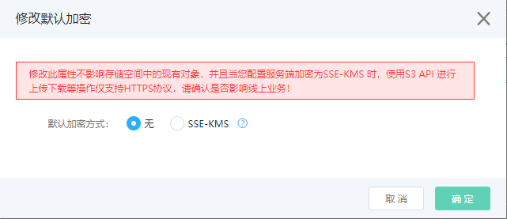

# Default Encryption in Bucket

To protect data while it is stored on the disk in OSS data center, you can set default encryption for the bucket so as to server-side encrypt objects that are stored during the validity period of default encryption. These objects are encrypted on the server side using JD Cloud's KMS (Key Management System) hosting Key Pair (SSE-KMS). When encrypting on server-side, OSS encrypts objects before saving them to the data center disk and decrypts them when downloading. As long as your request is verified and you have access permission, there is no difference between you accessing encrypted and unencrypted objects.

The default encryption is applicable to all OSS buckets. If you change the default encryption setting of the existing bucket, it will not affect the files already saved in the bucket, and will only be valid for the data stored during the validity period of default encryption setting. The default encryption of the bucket makes it convenient to encrypt objects in the entire bucket. It currently does not support to encrypt your files using the KMS Customer Masker Key (CMK), and only supports the service secret key encryption provided by KMS.

## Main Application Scenarios of OSS Static Encryption 

OSS provides static data protection through a server-side encryption mechanism. It is applicable to the application scenarios where users have high security or compliance requirements for file storage. For example, the storage of deep learning sample files.

## Default Encryption Setting

You can enable default encryption using our compatible S3 API, or the AWS development toolkit or OSS console. The easiest way is to use the OSS management console. After you complete the bucket default encryption settings, if files are uploaded during the validity period of default encryption, KMS service Key Pair will be automatically created for you to encrypt your files. Using default encryption for OSS bucket will not cause extra fees. Using S3 API to request to configure the default encryption function will cause standard OSS request fee. For specific request pricing, please refer to [OSS Billing Rules](https://docs.jdcloud.com/en/object-storage-service/billing-rules) For SSE-KMS encryption Key Pair storage, Key Management Service (KMS) is currently free.

Please note that the following encryption behaviors will be applied when the default encryption is enabled for the bucket:

 *  The encryption of objects that already exist in the bucket will not be changed before the default encryption is enabled.

 *  Currently only bucket-level encryption is supported. If you create an Object with the put object in the S3 API, then even if the request carries HTTP header of x-aws-server-side-encryption, it is still invalid setting.

 *  Please pay extra attention to that when you need to use the compatible S3 API, upload and download operations only support the HTTPS protocol.

At the same time, for the Object encrypted and stored by the server side, if you request this encrypted object with the following s3 API, it will return x-aws-server-side-encryption head:

PutObject

CopyObject

PostObject

InitiateMultipartUpload

UploadPart

UploadPartCopy

CompleteMultipartUpload

GetObject

HeadObject

##### Meta Information
Encrypting the Object stored in the KMS hosting master Key Pair mode by the server side, the Meta information of the object will add the following fields:

|Name|Description|Example|
|:-|:-|:-|
|x-aws-server-side-encryption|Specified Server Encryption Mode|x-aws-server-side-encryption：aws:kms|

##  Set the default encryption using OSS management console

1. Log in Console->Object Storage Service->Space Management->Enter into a Bucket->Basic Setting, and then go to "Default Encryption" functional region.

2. Click **Set** to set the default encryption method for this bucket.

Details:

   - If you do not set the bucket default encryption mode, then all existing or newly created buckets will not have the default encryption enabled. The bucket default encryption mode only supports the SSE-KMS mode.

   - Setting default encryption will only be valid for newly added files. Files that have been saved in the bucket will not be affected by the change of encryption mode.

   - If you set to use the SSE-KMS default encryption, please ensure to sign all PUT and GET object requests with signature version 4, and
      send them to OSS by SSL connection. If you have set the SSE-KMS default encryption, pay attention to whether there are PUT and GET requests in the client that had not failed before the change but now fail. If there is such
      a case, it is most likely that you are not using the HTTPS protocol.

3. Click **OK** to complete the settings.

## Default Encryption Used for Data Synchronization
After enabling default encryption for data synchronization target bucket, the following encryption behaviors will be applied:

If the target bucket you set has enabled the default encryption, then no matter the objects in the source bucket are encrypted or not, OSS will encrypt the replication objects in the target bucket.

**Relevant API Reference**

-  Set Default Encryption in Bucket  [PUT Bucket encryption](https://docs.jdcloud.com/en/object-storage-service/put-bucket-encryption-2)
-  Delete Default Encryption in Bucket  [DELETE Bucket encryption](https://docs.jdcloud.com/en/object-storage-service/delete-bucket-encryption-2)
-  Acquire the Setting of Default Encryption in Bucket  [GET Bucket encryption](https://docs.jdcloud.com/en/object-storage-service/get-bucket-encryption-2)
