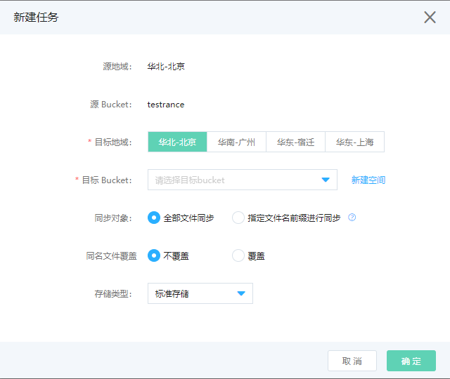

# : Historical Data Synchronization Setting 

By using the historical data synchronization, the existing files in the original Bucket can be replicated to the targeted Bucket once to complete data migration or implement cross-regional and co-region disaster recovery.

## Customer Scenario

Cooperative use of Historical Data Synchronization and [Incremental Data Synchronization](../../Operation-Guide/Manage-Bucket/Set-Bucket-Cross-Region-Replication-2.md) can implement the following requirements:

* Data replication: For business reasons, data need to be migrated from one space to another.

* Compliance requirement: A backup copy of data required by compliance requirement needs to be saved across a certain distance.

* Data backup and disaster recovery: If you want to save or maintain a backup copy of all written data in the long-distance storage area, in case of damage caused to the storage area by catastrophes such as tsunamis or earthquakes, you can enable backup data of the long-distance off-site storage area.

* Minimize latency: Users are in two geographic locations. To minimize the latency in accessing objects, a backup copy of the object can be maintained in a storage area that is geographically closer to the user.

## Use the Console to create historical data synchronization task

1. Log in Console->Object Storage Service->Space Management->Enter into a Bucket->Advanced Configuration, and then go to "Data  Synchronization->Historical Data Synchronization" functional region.

2. Click **Create Task** to open the dialog box of historical data synchronization rules configuration.

3. Select the region the target storage space is located and the storage space name.

4. Select Synchronization Objects.

* Synchronize all files: Synchronize all files in the source bucket to the target storage space.

* Assign file name prefixes for synchronization: Synchronize files with the assigned prefixes in the source bucket to the target bucket.

   a. You can add at most 1000 prefixes. Each prefix can be at most 1022 bytes.

   b. File prefixes do not support overlapping prefixes, for example, test and test/01 are not allowed.
   

5. Choose Replacement or Not.  

* When a file existing in the targeted space having the same name as a file in the original space, you can choose to replace it or not. 
  

6. Select Storage Type.

* Standard storage, infrequent access storage, archival storage and reduced redundancy storage (not recommended) are now supported.

7. Click **Execute** to Start Synchronization.

## View historical data synchronization task

Log in Console->Object Storage Service->Space Management->Enter into a Bucket->Advanced Configuration, and then go to "Data  Synchronization->Historical Data Synchronization" functional region.

Once a task is created, the task progress and status can be viewed in the historical data synchronization list, and operations such as task cancellation can be performed.

Description:

* Difference from the incremental data synchronization: incremental data synchronization is a spacial attribute. After it is enabled, files meeting the requirements shall be automatically synchronized to another space. While the historical data synchronization is a kind of task. After creation, the task will be implemented for once and will not be able to be restarted after the implementation.

* The newly created task is generally in its initialized status. If a new file is uploaded to the original space in the initialized status, the file may not be synchronized to the targeted space.

* The historical data synchronization tasks can be canceled, but after the cancellation, it cannot be restarted anymore, and the synchronized files upon the cancellation cannot be deleted as well.
