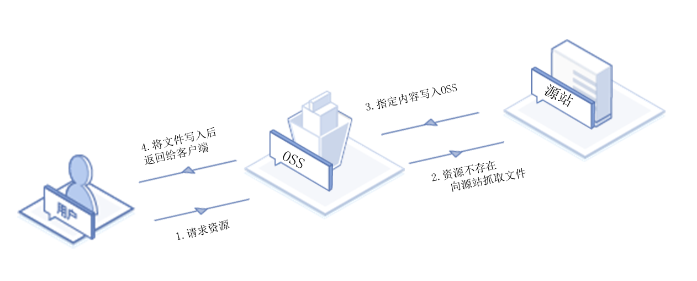
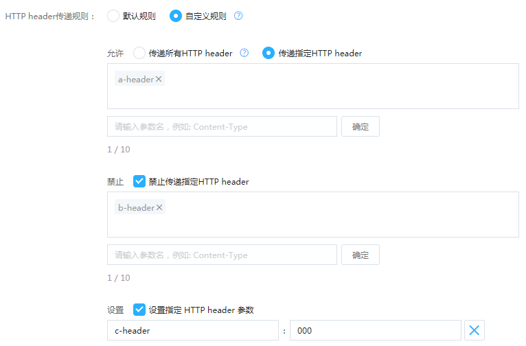

#  Image Back-to-origin Setting

Via back-to-origin setting, the back-to-origin reading is applied to the data getting request via the image method, to meet your hot migration demand of data.

After configuring the image back-to-origin rule, you need to match each Get request URL to OSS and conduct back-to-origin according to the rules set by you. At most 5 rules can be configured. Please match the rules in order,
until an effective one is matched.

## Back-to-origin of Image


If the image write-back function is configured, when the Get operation is made to an absent file, OSS will request such file from the source address. Then the file will be returned to the user and written to OSS at the same time.

## Customer Scenario  
The image back-to-origin is mainly used for seamlessly migrating data to JD Cloud OSS. In other words, if the service is running in the self-built origin server or other cloud products, when it needs to migrate such service to JD Cloud OSS without interrupting the service, the migration can be implemented by using the image write-back function. The specific scenario analysis is as follows:

The origin server has a batch of cold data, while continuously producing new hot data.

The cold data can be migrated to OSS via a migration tool at first, while the image back-to-origin can be configured and the origin server address can be configured to OSS. After the domain is switched to JD Cloud OSS (or JD Cloud CDN, or back-to-origin OSS), even if a part of the newly-produced data are not migrated, they can still be normally accessed on OSS, and the file will be saved in OSS upon one access. After the domain is switched, the origin server will produce no data. In such case, please scan again, import the data which have not been imported yet into OSS at one time and then delete the image write-back configuration.

If the IP address is used as the back-to-origin of configuration, then the domain can be migrated to OSS first and then imaged to the origin server. However, if a domain is configured, as the domain itself will be resolved in OSS or CDN, then the image will be out of action. In such case, you can apply for using another domain as the origin server of the image and such domain and the domain in service will be resolved to the same IP address. By doing so, the service domain can be continuously imaged to the origin server when being migrated.

Only a part of the origin server traffic is switched to OSS or CDN, and the origin server itself is producing data continually.

The migration method is similar to the method above. When the traffic is switched to OSS, do not delete the image back-to-origin configuration. In such case, the traffic switched to OSS or CDN can still get the origin server data.

Detail Analysis:

* OSS will carry out the image back-to-origin, request a file from the origin server and save the same in OSS only when 404 is returned by GetObject().
* The URL requested by the origin server is MirrorURL+object and the file name “object” is written back to OSS. For example, if the bucket is example-bucket, it is configured with the image write-back, the MirrorURL is http://www.example-domain.com/, and the file image/example_object.jpg is not in the bucket. In such case, when such file is downloading, OSS will initiate the GET request to http://www.example-domain.com/image/example_object.jpg, return results to the user while writing results into OSS. When the downloading is completed, such file has been already saved on OSS, and the file is image/example_object.jpg. In such case, the file of origin server will be migrated to OSS with the same name. If MirrorURL carries the path information, for example http://www.example-domain.com/dir1/, then as the same as the last example, the back-to-origin URL of OSS is http://www.example-domain.com/dir1/image/example_object.jpg and image/example_object.jpg will be still written in object of OSS. In such case, the file under a directory of the origin server will be migrated on OSS.
* The header information transmitted to OSS will not be transmitted to the origin server by default. However, the user is allowed to specify a header according to the real business.
* Whether the querystring information is transmitted to the origin server depends on the user’s configuration.
* If the chunked code is returned by the origin server, then OSS will return the chunked code to the user.
* The files read from the origin server will be saved in OSS as the standard storage type.
* OSS will return the follow header information of the origin server and saved the same as the header information of OSS:

 ``` 
Content-Type
Content-Encoding
Content-Disposition
Cache-Control
Expires
```

* Where the file is written back to OSS via the image method, when the same file of the origin server is changed, then OSS will not update the file saved in OSS. This is because the file saved in OSS for the time being does not conform to the image write-back conditions.
* If the file is not contained by the image origin server, i.e. http status returned by the image source to OSS is 404, then OSS will return 404 to the user. In case of the status code other than 200 (including the error situation that file getting failure due to the network reason), 424 will be returned by OSS to the user and the error code is “MirrorFailed”.


## Setting of Image Back-to-origin Rules 
**Description**
Back-to-origin address does not support to configure OSS Intranet domain.

### 1. Set the image back-to-origin by virtue of using OSS Open API.
Reference: [Set Image Back-to-origin](https://docs.jdcloud.com/cn/object-storage-service/api/putbacksourceconfiguration?content=API)
### 2. Set the image back-to-origin by virtue of using OSS management console.

1. Login to the Console->Object Storage Service->Space Management->Enter a Bucket->Space Settings->Image back-to-origin


2. Click a setting rule to enter the image back-to-origin rule list page.


3. Click **Create Rules**, set back-to-origin conditions and back-to-origin address in the creation pop-up. You can set whether carry request character string or not and set whether the 3xx request response is followed with the origin server re-direction request or not according to real demands
   Meanwhile, customized pass-through, filtering or modification is supported by setting HTTP header transmission rules.
                           
   Note:
    - The image back-to-origin will be normally charged as per the Internet traffic.
    - The back-to-origin address is the required item, and domain, IP and port are supported.
    - The character string carrying requests will transmit queryString in the OSS requests to the origin server
    - The 3xx request response setting will get resources with the origin server re-direction request by default and save the resource on OSS. If no item is checked, OSS will pass through 3XX response, without acquiring resources.
    - HTTP header Transmission Rules:
      The header information transmitted to OSS by default will not be transmitted to the origin server
      You are allowed to specify the header parameters to be enabled, disabled and set by customizing rules,
  The configuration example is as follows:
  
    Based on the above configuration, requests (the HTTP header part) sent to OSS by the user are as follows:
    ```
    GET /object
    host : bucket.s3.cn-north-1.jcloudcs.com
    a-header : 111
    b-header : 222
    c-header : 333
    ```
    After the image back-to-origin is triggered, the request sent by OSS to the origin server is as follows:
    ```
    GET /object
    host : source.com
    a-header : 111
    c-header : 000
    ```
    Note:
    
    1. In case of transmitting all HTTP Headers, all headers will be passed through,
    including the host header (generally, it is bucketname.endpoint, such as bucketname.s3.cn-north-1.jcloudcs.com),
    Since most origin servers will verify the host header, the origin servers may not recognize the request, so you shall check carefully. If you confirm to pass-through all headers,
    please configure as much as possible in [Prohibit Transmitting Designated HTTP header] to prohibit transmitting host header and other header which may affect origin server recognition.
    
    2. The setting of HTTP header transmission rule is not supported by the following HTTP header types:
    
        - header with the following prefixes:
            - x-oss-
        - All standard HTTP headers, for example:
            - authorization2
            - authorization
            - content-length
            - range
            - date
             
4. Click **OK** and submit rules.

### After successfully keeping rules, you can view the back-to-origin rules set in the image back-to-origin rule list, and carry out operation such as editing, deletion or sorting.

1. Login to the Console->Object Storage Service->Space Management->Enter a Bucket->Space Settings->Image back-to-origin


