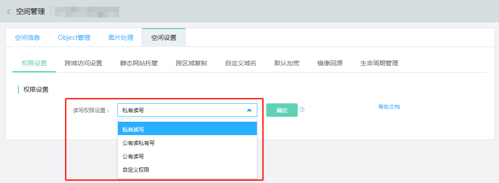
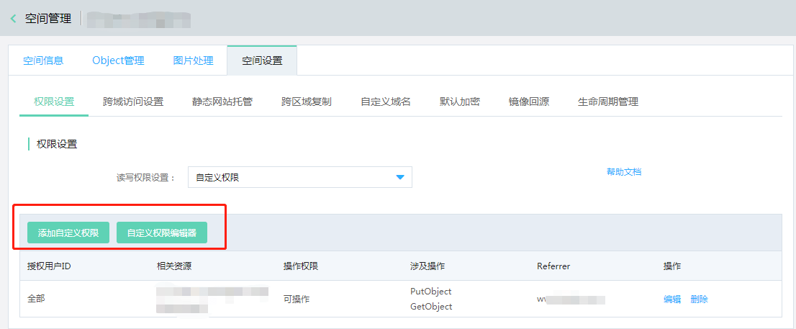
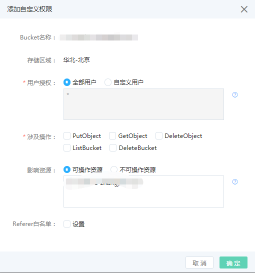
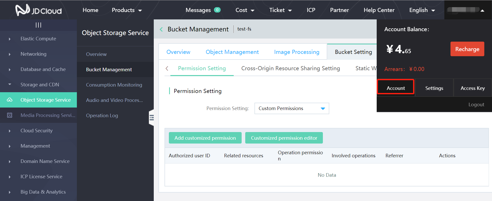
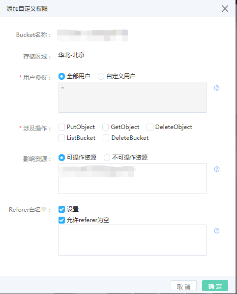

# Set bucket policy

JD Cloud object storage service provides flexible permission control mechanism. You can set the access permission of the storage space when creating the bucket in the console, or modify the space permission after creation. In addition to providing the access permission control of storage space level, you can also conduct flexible permission access configuration to the files and the directory levels. There are currently four access permissions for the Bucket level:

|Permission Name|Permission English Value|Permission Description|
|-|-|-|
|Private Read/Write|Private|Bucket Owner obtains all executable action permissions. Only the Owner of the Bucket can read/write/delete the Object stored in it; others have no permission, and cannot access the Object in the Bucket without authorization|
|Public Read and Private Write|Public-Read|Bucket Owner obtains all executable action permissions. Only the Owner of the Bucket can write/delete the Object stored in it; others (including anonymous access) can read the Object. |
|Public Readand Public Write|Public-Read-Write|Bucket Owner obtains all executable action permissions, others obtain READ and WRITE permissions; all the costs incurred by these actions are borne by the Owner of the Bucket, please use the permission carefully. |
Customized permissions|User-Defined|The permissions of GetObject, PutObject, DeleteObject, listBucket(getObjects), DeleteBucket for the assigned users can be set, the resources that the permissions can access can be assigned, and the IP addresses and Referer White List with the permissions can be assigned.|

Detail Specification:
If you are creating a Bucket through API or SDK, and you do not specify the Bucket permissions when creating, the system will give the Bucket the default Private Read/Write permission. You can modify the bucket permissions according to your own business situation.

### Operation Steps in Console

1. Log in the JD Cloud console, select Object Storage Service -> Space Management -> Space Setting, and select **Permission Setting** to display your current permission setting contents, as shown in the figure:

2. Modify the space permissions, as shown in the figure:
 
 
 **Description:**
 
 * If you modify ACL, please click the drop-down box of Read/Write Permission Setting, and select Private Read/Write, Public Read and Private Write and Public Read/Write 3 permissions, and then click **OK**.

 * If you want to achieve a fine-grained permission management for Bucket, please use the Bucket policy. In Read/Write Permission Setting, click **Customized Permission**, then you can complete the setting of Bucket policy. The setting page is shown as below figure
 
 It supports two methods: permission form setting and editors:
 - Add Customized Permission**--You can use a convenient and simple form to complete the setting by filling in the setting items.
   
      - (1) A maximum of 10 Bucket Policies can be created for each Bucket;
      - (2) The definition of each field in the Bucket Policy is as follows:
a. User authorization: It defines the users affected by the Bucket Policy. The default value is "*", and the semantics is valid for all users. If it shall only be valid for part of the users, please click **customized users" and enter the user ID of the corresponding users in the text box (Note: User ID is different from user Pin; your user ID can be queried in User Management and the effect is as the image below), one user ID per line, that is, multiple user IDs shall be separated by line feed character intervals.
         1. Primary account: AccountID
         2. Sub-accounts AccountID: user/username. One user ID per line, that is, multiple AccountID shall be separated by line feed character intervals
         (Note: Your AccountID can be searched in User Management and the effect is as the figure below).
         
        

        

        b. Involved action: It defines the actions that can be performed on the Bucket. Single-selection and full-selection are both okay, but at least one item shall be selected. Each action is defined as follows:

        |Action Item Name|Action item description|
        |-|-|
        |PutObject|Upload an Object to the Bucket, supporting normal upload and upload by parts|
        |GetObject|Get an Object and its relevant information in the Bucket|
        |DeleteObject|Delete an Object in the Bucket|
        |ListBucket|List the Objects in the Bucket|
        |DeleteBucket|Delete the Bucket|

        c. Affected resources: It defines which resources under the Bucket are operable or inoperable (i.e. Allow or Deny). "Operable Resources" is selected by default. The default value in the text box is bucketname/*, and the semantics is all resources under the current Bucket are operable; the enter format example is: myBucket/myfolder/object*, myBucket/*; the contents must start with the Bucket name. If the resource has only one slash, it cannot end with a slash; multiple resources can be set, with 1 and at most 1 wildcard in each line. At most 10 records can be added.

        d. Referer White List: Since the Object Storage Service is charged by consumption, in order to prevent the chain of data stored in the Object Storage Service from being stolen by others, Object Storage Service supports the Referer anti-leech chain method based on the header field in the HTTP Header. You can set the White List of the Referer field to a Bucket and set whether to allow the request access with blank Referer in the customized permissions on the Object Storage Service console or through API. The following is a detailed explanation of the rules of the Referer White List.
 - Add Customized Editor**--You can use the visual editor to directly fill in the legitimate Bucket policy specified by JSON.
  
  
   **Details Description**
     - No notes can be added in the editor and a maximum of 16KB is allowed to be entered.
     - The Bucket policy you entered must be a legitimate JSON.

## Referer White List setting

To prevent the data stored in Object Storage Service from hotlinking by others, Object Storage Service supports anti-leech chain method based on HTTP Header Referer field. You can set the White List of Referer field through the console. After setting the White List, only users of Referer field within the White List can access the data stored in Bucket and those requests out of the White List will be denied. However, if the Referer White List is not configured, data can be accessed by default without being limited by the White List.

The usage rules are as follows:

* Referer anti-leech chain rules only apply to Buckets of which the Bucket permissions are "customized permissions". The default rule is "Allow the Referer to be blank and the White List to be blank";

* The blank Referer is defined as: There is no Referer Header in a HTTP request or the contents of the Referer Header are blank;

* Referer White List supports domain name or IP address (if there is no domain name, IP must be added to the White List), multiple of them can be set and separated by line feed characters (carriage returns), case insensitive, and no need to write http:// or https:// before the domain name;

* The entered contents of the anti-leech chain can be 500 at most or the total number of bytes does not exceed 16384 bytes (i.e. 16KB);

* The anti-leech chain Referer domain name or IP parameters support the use of the wildcard "*"; using wildcard such as *.test.com in the domain name prefixes can refer to all multi-level subdomain names under test.com, and the domain name supports http and https protocols;

* IP address: Assign a list of IP addresses that have this permission. Use CIDR method to identify the IPs; each IP can have at most 1 wildcard * and shall end with .* Example: 192.168.0.1/24, 192.168.0.100, 192.168.* or 192.168.1.*;

Semantics Explanation of Referer White List:

* When the user setting allows the Referer and the White List to be blank, the request of the Referer being blank will be allowed, and the other requests (Referer being not blank) will be denied;

* When the user setting allows the Referer to be blank and does not allow the White List to be blank, the request of the Referer being blank and the requests consistent with the White List will be allowed, and the other requests will be denied;

* When the user setting does not allow the Referer to be blank and allow the White List to be blank, regardless of whether the Referer is blank, all the requests will be denied;

* When the user setting does not allow the Referer and the White List to be blank, only the request that the Referer belongs to the White List will be allowed, and the other requests (including the Referer being blank) will be denied;

The reference effect is as follows:

 
 
 

 
 
 
 

