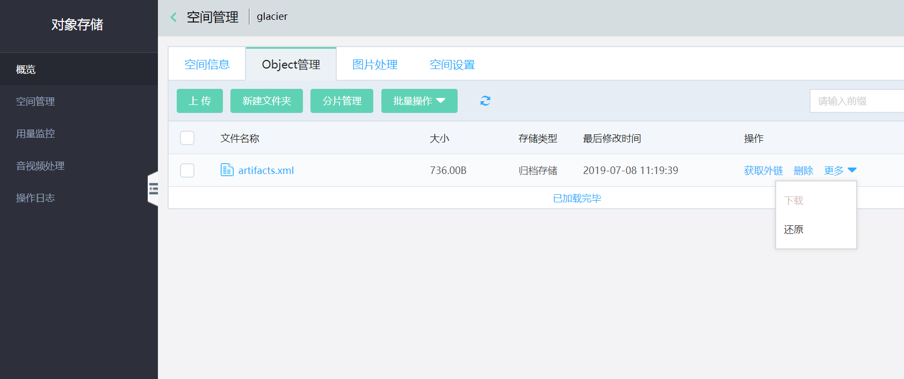
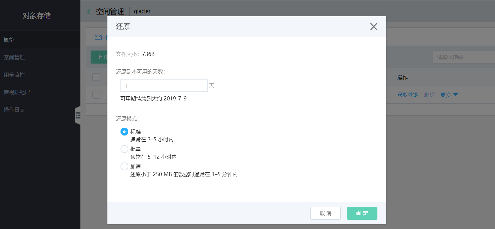
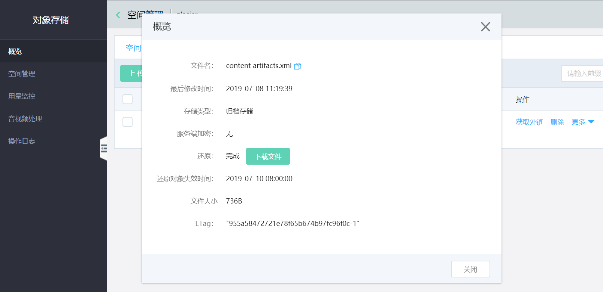

# Restore Archival Object

## Introduction

You can restore archived objects through the Object Storage Service Console so that objects can be accessed continuously or other operations can be performed. See [Object Storage Service Type Introduction](../../Introduction/StorageClass-Overview.md) if you need to understand Object Storage Type.

The restore operation adds a new replica of the object of the standard storage type, which can perform normal operations, including reading, downloading etc. on the object copy. The cost incurred by an object replica is billed according to standard storage. If you did not delete the source object, the source object continues to be billed by archival storage type. See [Billing Instructions](../../Pricing/Billing-Rules.md) for pricing details.

If API is required for restoring archival object, please see [Post-Object-Restore](../../API-Reference-S3-Compatible/Compatibility-API/Operations-On-Objects/Post-Object-Restore.md)

## Operation Steps

1. Log in the Object Storage Service Console, enter the Object management page, find the Object you need to restore, and click **Restore** under the right operation bar.

2. In dialog box of restoring archival object, configure the restore mode and the number of days that the replica is valid. The configuration descriptions are as follows.

Restore mode: standard mode, acceleration mode, batch mode:
- Acceleration mode: It takes the shortest amount of time, only 1 to 5 minutes to restore. Support fast reading of files below 256MB. When you need to get archival data urgently in a particular situation, using expedited mode can greatly reduce time and improve efficiency.
- Standard mode: Restoration can be completed in 3 to 5 hours using the standard mode.
- Batch mode: The cost is the lowest. If the acquisition of archival data is of low urgency, a large amount of archival data can be obtained at a very low cost by adopting the batch mode. Generally, the retrieval of archival data can be completed within 5 to 12 hours.

Note: After setting restore, click **Restore** again to modify restore mode in the popup box. Only upgrade restore mode is supported, such as upgrading standard mode to accelerated mode.

Replica Validity: Set the time of automatic deletion after the replica expires, set the range of the minimum 1 day, the maximum 365 days. When the restore is complete, click **Restore** again to change the validity of the copy in the popup.

3. View if restore is complete in the object overview popup box.

