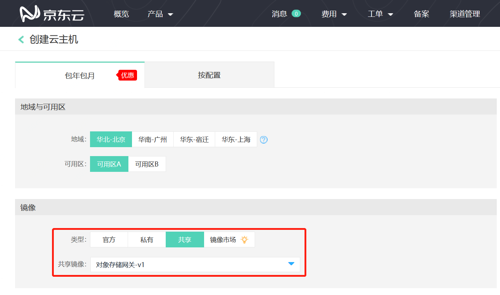
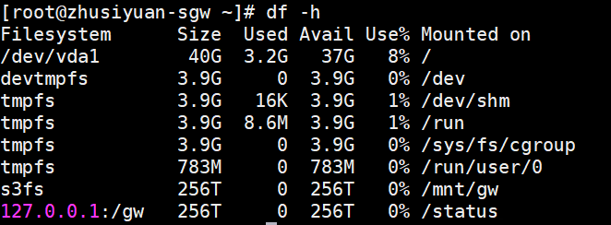

# Deploy Storage Gateway

## Precautions

1. The use of Storage Gateway depends on Virtual Machines and Object Storage Service Product, please ensure to enable Virtual Machines and Object Storage Service in advance.

2. The minimum configuration of the Virtual Machines for deploying the Storage Gateway: 4-core CPU/4GB memory/40G SSD Cloud Disk Service. You can configure the Cloud Disk Service of higher volume according to the data scale.

## Create Storage Gateway 

1. Now Storage Gateway is in the stage of Beta so that you shall submit [Open Beta Test Application](https://www.jdcloud.com/en/public/testApply/storagegateway) before creation. After Open Beta Test Application has been approved, you can view the image of Storage Gateway under the page of Control Console-Virtual Machines-Image-Shared Image.


2. You can click **Create Virtual Machines** to accomplish Virtual Machine creation under current image of Storage Gateway or set shared image on the page of **Create Virtual Machines** and select Storage Gateway Image. See [Create Linux Instance](https://docs.jdcloud.com/en/virtual-machines/create-linux-instance) for more help.



Notification: Bucket and Storage Gateway shall be in the same region so that you need select the region according to your business when creating Virtual Machines.

3. Login the Virtual Machines to conduct relevant configurations for the Storage Gateway after completion of creation.

## Configure Storage Gateway

After completion of VM instance creation, you need login the Virtual Machines to configure the Bucket connecting the Storage Gateway and start the Storage Gateway Service.

1. When you login a Virtual Machine deployed Storage Gateway, you are required to enter the following information as configuration items saving in the Storage Gateway configuration file `/etc/gateway/gw.conf`.

- accessKeyID: your accessKeyID

- accessKeySecret: your accessKeySecret

- endpoint: the Endpoint located in the Bucket

- bucket: the Bucket name connecting Storage Gateway

Notification: see [AccessKey Management](https://uc.jdcloud.com/account/accesskey) for obtaining aaccessKeyID and accessKeySecret; see [OSS server domain](https://docs.jdcloud.com/en/object-storage-service/regions-and-endpoints) for obtaining endpoint; single Storage Gateway only support one Bucket.

Configuration Example:

```
accessKeyID：xxxxxxxxxxxxxxxx
accessKeySecret: xxxxxxxxxxxxxxxx
endpoint：http://s3.cn-north-1.jcloudcs.com   //endpoint must begin with http:// or https://
bucket：bucketname
```

2. Initial Cloud Disk Service with the initial script path of `/root/bin/auto_fdisk.sh`, which the operation will initial the Cloud Disk Service and set it as the local cache of Storage Gateway. Execution command example is as follows:

```
auto_fdisk.sh /dev/vdb /cache ext4
```

Notification:

- `/dev/vdb`is the device name of your Cloud Disk Service, which can be initialed as the local cache of Cloud Disk Service by yourself as required; 

- Parameters such as `/cache ext4`shall not be modified. Please reference [Partition, format and attaching of Data Disk](https://docs.jdcloud.com/en/cloud-disk-service/linux-partition) for initialing Cloud Disk Service. Pop up `Warning: This directory exists, is this ok? [Y/N]`, please enter `Y`.

- The cache directory for the Storage Gateway is `/cache`, the data about your resent access is cached under such directory, and the cache can be manually cleared.
 
3. After completion of configuration, you can start NFS file system on the Storage Gateway with the starting script path of `/root/bin/gw ` that can be used for starting NFS service. Execution command example is as follows:

```
gw start
```

Note: After executing start command, when `Starting httpd... monitor` is displayed, it indicates the start is completed, execute `ctrl+c` to exit. After exiting, monitor will be running at the background as a service running monitoring module.

4. Execute `df -h` command to view whether the start is successful. As shown in the figure, 127.0.0.1:/gw is the NFS sharing file system that has been successfully enabled.



Notification: 127.0.0.1 the loopback address of local, i.e., Localhost.

5. The configuration file path of Storage Gateway is `/etc/gateway/gw.conf`and the relevant configuration items are accessKeyID, accessKeySecret, endpoint and bucket. Reconfiguration also can be conducted by executing `gw install`. After rebooting NFS service, new configuration items will take effect. The example of command for rebooting NFS service is shown as below:

```
gw restart
```

