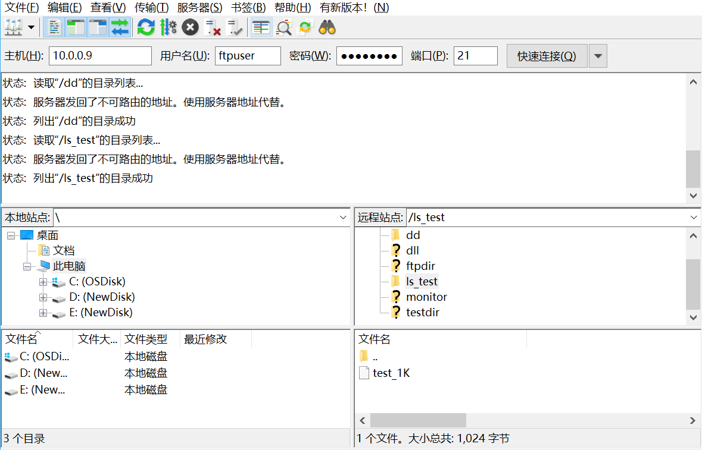

# Use FTP to access

Storage Gateway supports that the Bucket attach directory is accessed through the FTP protocol, and all the visiting FTP clients and Storage Gateways shall be deployed under one VPC.

## Start the FTP Server
It is required to deploy Storage Gateway in advance and start the FTP Server, before connection is carried out with FTP Client. The process is as follows:

**1. Deploy Storage Gateway**

Deploy Storage Gateway and start the Storage Gateway file sharing service. For details, refer to Storage Gateway [Deployment Description](https://docs.jdcloud.com/en/storage-gateway/installation-configuration).

**2. Start the FTP service**

The start script path of FTP service is `/root/bin/ftpgw`, and the start command is set below:
```
./ftpgw start
```

**3. Create the FTP login user**

During login with FTP Client, user verification is required, and access by anonymous users isn’t supported; therefore, it is required to create the FTP user in advance. The creation command example is set below:
```
useradd -s /sbin/nologin <username>
passwd <username>
```
Description:
- useradd: Create users, and log in the FTP with the user;
- /sbin/nologin: To guarantee safety, it is suggested to designate the parameter. The user is prohibited from logging in the Storage Gateway system through ssh.
- passwd: Set the password for the user.

Note:
- As FTP is transmitted as plaintext, use of public network may lead to safety risks; you are strongly suggested to deploy Storage Gateway and FTP Client under **one VPC** and access it by private IPs.
- FTP Server supports login and access by multiple Clients at the same time; when multiple Clients operate one file at the same time, the post-operation will replace the previous one.

## Use FTP to access Storage Gateway under Linux
**1. Install FTP Client**

You can use the following commands to install FTP Client.
```
yum install ftp
```
**2. Log in FTP**
```
ftp <IP>
```
Description:
 - IP: Private IP of Storage Gateway
 - User name and password: Enter the user name and password after connection (the user created by FTP Server) to complete login.

The FTP shared directory can be accessed after successful login, as shown in the figure below:


**3. Use FTP**

Supported FTP Command:
- put
- get
- rename
- delete
- mkdir
- ls
- cd
- bye
- quit
- size

Unsupported FTP Command:
- mput
- mget
- append

## Use FTP to access Storage Gateway under Windows

Provide various FTP clients under Windows. Next, FTP Server is accessed by taking FileZilla as an example.

**1. Installation FileZilla**

Download and install [FileZilla](https://filezilla-project.org/).

**2. Log in FTP**

It is required to configure the following contents, when logging in FTP with FileZilla:

- Virtual Machines: Private IP of Storage Gateway
- User name and password: FTP login user created on FTP Server
- Port: 21

Use FTP to conduct uploading and downloading after successful login, as shown in the figure below:



## Stop/Reboot the FTP service

The script path of FTP service is `/root/bin/ftpgw`, and the stop/reboot command is set below:
```
./ftpgw stop    #stop the ftp service
./ftpgw restart    #reboot the ftp service
```
