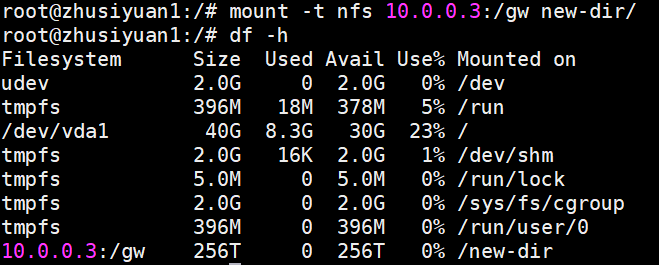

# Use Storage Gateway

After completion of Storage Gateway deployment and start, you can use a Linux instance as a NFS client to access Storage Gateway that shall be deployed with the accessing NFS client under the same VPC.

First, you need to attach one local file directory to the NFS file system of Storage Gateway. After successfully attaching, mapping will be established between the local directory and NFS file system on the Storage Gateway. You can implement operation of NFS file system on the Storage Gateway by operating the local directory. The read and write of data of NFS file system will be cached on the local of Storage Gateway first and transmitted to the Object Storage Service asynchronously.

**1. Install Dependences**

Before attaching, please ensure that nfs-utils or nfs-common has been installed in the system, the installation method is shown as below:

```
CentOS: sudo yum install nfs-utils
Ubuntu or Debian: sudo apt-get install nfs-common
```

**2. NFS Attaching**

You can use the following commands to execute the attaching:

```
mount -t nfs <IP>:/gw <local-directory> 
```

Note:

- IP: Private IP of Storage Gateway
- local-directory: local directory to be attached, which absent file directory cannot be designated

After executing the attach command, use `df -h` to view whether the attaching is successful.



**3. Access NFS File System**

After completion of attaching, you can carry out file read and write to the mapped local directory, which the operation will synchronize the NFS file system execution on the Storage Gateway. NFS file system will carry out data transmission with designated Bucket so that your operations to the local directory will finally be synchronized in the Bucket of the Object Storage Service.

**4. NFS Uninstall**

You can use the following command to execute uninstall, <local-directory> is the local attached directory.

```
umount <local-directory>
```

**5. Use Restrictions**

The Storage Gateway does not support file lock, soft link, hard link and the like now so that the NFS client needs to use root user other than other user to execute access operation temporarily.

Note: If the NFS Client is in CentOS 7.1/CentOS 7.2 system, it needs to upgrade system kernel manually. For relevant instructions, please refer to [Operation and Maintenance Guide](../Operation-Guide/Operation-Maintenance.md).
